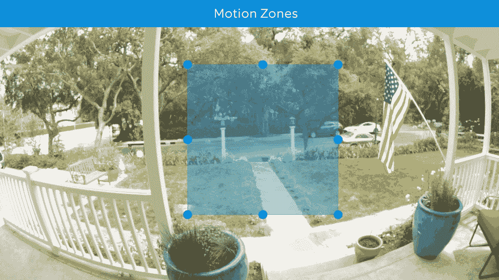
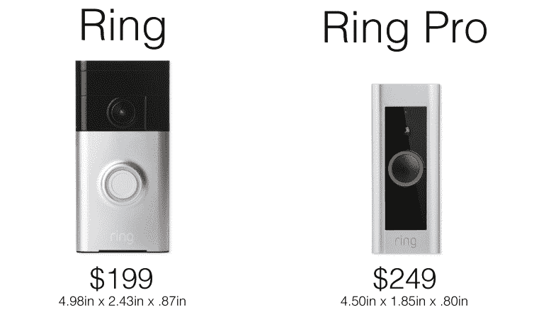

# Ring 的新视频门铃 Pro 抛弃了电池，在更小的封装中实现了更多智能技术

> 原文：<https://web.archive.org/web/https://techcrunch.com/2016/03/16/rings-new-video-doorbell-pro-ditches-the-battery-for-more-smarts-in-a-smaller-package/>

# Ring 的新视频门铃 Pro 抛弃了电池，在更小的封装中实现了更多智能

以自己的名字命名的环形视频门铃背后的人，今天早上有一个两击组合的新闻:他们推出了一款名为 Ring Pro 的新型号，并筹集了 6120 万美元的 c 轮融资。

售价 249 美元的 Ring Pro 几乎在所有重要的方面都超过了售价 199 美元的标准型号:摄像头为 1080p 对 720p，除了 2.4Ghz 外，它还有 5Ghz 的 WiFi，面板(以及铃声的整体颜色)是可更换的，而不是开箱后就锁定的，而且它比原来的小了一点。

当然，和它的前辈一样，它仍然有一个内置的双向扬声器，可以连接到一个配套的智能手机应用程序，允许你在任何有数据连接的地方用手机开门。不想从沙发上起来看看谁在门口吗？检查环。在地球的另一边，当某人可疑地按铃，并想让他们以为你在家，以避免非法闯入？通过戒指 app 回答，表现得像在家一样。

哦，专业版还有一个比原版更酷的技巧:你可以设置自定义运动区域。只关心发生在你家前廊的运动？只要在你关心的地方画个方框就行了。

较小的包装带有一个小挂钩，这取决于你如何使用它:与标准戒指不同，Ring Pro 没有电池。最初的戒指有一个内置的可充电电池，允许人们每次无线使用几个月，比如说，公寓租户，他们不能去把他们的旧钟从墙上扯下来。与此同时，*必须*接到你家的门铃电路上才能供电。

在很大程度上，这完全没问题——从长远来看，我想大多数人无论如何都会想给它装上电线，因为说“对不起，我的门铃坏了，我忘记充电了”会让你听起来像个疯子。如果你*需要*那块电池，标准戒指还是有的。

就像最初的戒指一样，如果一个小偷足够大胆地偷偷溜进你的房子并把它撬走，该公司将更换戒指 Pro。

与此同时，他们 6120 万美元的 C 轮投资由 KPCB 牵头，理查德·布兰森爵士追加了投资。该公司此前筹集了约 3900 万美元。

249 美元的 Ring Pro 今天早上开始接受预定，计划在 4 月份的某个时候发货。

