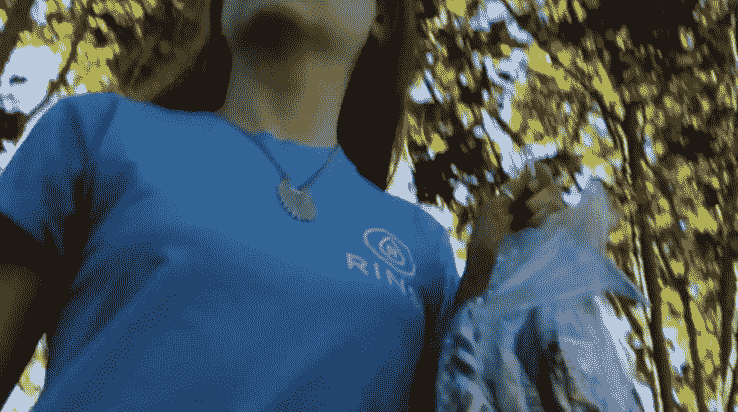

# Rinse 筹集了 350 万美元，因此千禧一代可以继续让其他人为他们洗衣服 

> 原文：<https://web.archive.org/web/https://techcrunch.com/2015/06/09/rinse-raises-3-5-million-so-sf-millenials-can-continue-getting-other-people-to-do-their-laundry-for-them/>

旧金山的千禧一代似乎可以按需提供一切，包括将脏衣服捡起来并洗干净的服务，这样他们就不用洗了。

基于 SF 的按需洗衣初创公司 Rinse 是最新加入按需洗衣服务行列的公司，如 [Washio](https://web.archive.org/web/20221206210235/http://www.getwashio.com/) 、[洗衣房](https://web.archive.org/web/20221206210235/https://laundrylocker.com/)、 [Instawash](https://web.archive.org/web/20221206210235/http://www.instawash.us/) 、 [SFWash](https://web.archive.org/web/20221206210235/http://sfwash.com/) 和[sud zee](https://web.archive.org/web/20221206210235/https://sudzee.com/sudzee.html)——更不用说他们只需走几步就可以清洗自己的衣服。

从列表中可以看出，按需洗衣几乎和按需送餐一样普遍。这是一个拥挤的空间。因此，这个主要靠自举的漂洗公司刚刚筹集了 350 万美元的种子资金，去给住在洛杉矶的任何一个男人的孩子洗衣服。

资金来自一大堆风投公司，包括 Arena Ventures、ff Venture Capital、Great Oaks Venture Capital、Accelerator Ventures、MESA Ventures、Expansion Venture Capital、Rothenberg Ventures、Base Ventures、Structure Capital、Otter Rock Capital，以及一些时尚行业的天使投资人。

许多按需洗衣服务都以类似的方式工作。你可以在应用程序或网上注册，告诉洗衣房的人什么时候来取你的衣服。“洗衣房”略有不同，如果你所在的大楼里没有寄存站，你就必须把一袋脏衣服拖到一个更衣柜里去取。

大多数服务的价格从 25 美元到 45 美元不等，取决于你衣服的重量和/或脏污程度，以及你是否需要高级洗涤剂和/或干燥床单，或者希望你的 Lululemon 裤子以特殊方式悬挂。

当我第一次被告知这个故事时，我刚刚洗完所有的衣服，包括床单、被套和毛巾，所以我让我的朋友 Chase Bowman 为我测试这项服务。

我注意到的第一件事是它有多贵。一堆衣服和一床被子花了他 68.45 美元。23 磅衣物的价格是 34.50 美元，被子是 30 美元，外加 3.95 美元的快递费用。所以大约每两周 40 美元，取决于你洗了多少衣服。

当然，与把两周的衣服拿到街上的洗衣店大约 7.5 美元的费用相比，所有这些服务似乎都很贵。Rinse 和我以前用过的 LaundryLocker 价格相当。

要记住的是，你是在花钱让别人来处理你的酒渍、汗渍和不可提及的东西。

虽然这是一项艰巨的工作，但 Rinse 的员工至少都是有福利的 W-2 员工，而不是行业标准的合同工。Rinse 的联合创始人 Ajay Prakash 也告诉我，他为员工提供了在公司晋升的途径。所以这很好。

Rinse 的联合创始人詹姆斯·约翰(James John)在旧金山的洗衣服务行业长大，因此他知道这个行业的一些痛点。他和普拉卡什研究了收取衣物的最佳时间，并确定这主要是在晚上 8 点至 10 点之间，这时人们最有可能在家。鲍曼对此并不热衷，但他说，如果你要求的话，时间是灵活的。

他也不确定当他的洗衣房服务员把衣服送来时，他整齐折叠、清洗过的衣服周围的塑料包装。

“衣服本身，它们装在这些很酷的重型袋子里，我想我现在拥有这些袋子。在里面，它们被包在塑料袋里，我敢肯定这是一个环境问题。但我很欣赏它把所有东西都放在一起(袜子和内衣放在一个包里，被子放在另一个包里，其他东西放在第三个包里)，”他告诉我。然后补充道，“我最喜欢的是折叠。它是如此紧凑和美丽。我永远也不会把衬衫叠得那么整齐。”

他还喜欢 Rinse 的网站用户界面，他可以与处理他的衣服的人来回发短信，而不必去找应用程序。

“我想我不认为价格高得离谱，只是可能超出了我目前的价格范围。我可以看到它很受技术人员之类的欢迎。总的来说，这是一个很好的服务，除了时间问题(如果我真的这样做，这个问题可以用一个带锁的箱子来解决)，我没有任何抱怨，”鲍曼说。

据普拉卡什称，Rinse 将继续扩展到更多的领域，雇佣更多的人来洗衣服，并增加更多的服务项目。他说，他仍在规划这些服务将是什么，但正在考虑可能增加修鞋服务。

