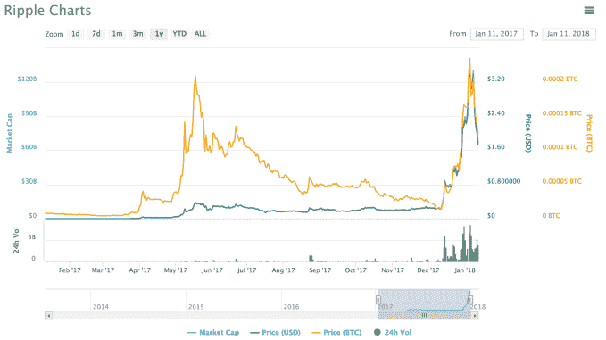

# Ripple 宣布与跨境汇款公司 money gram TechCrunch 进行 XRP 审判

> 原文：<https://web.archive.org/web/https://techcrunch.com/2018/01/11/ripple-announces-an-actual-customer-for-xrp-brackets-ok-its-a-trial/>

好，好，好。备受争议的 XRP 加密货币 Ripple 公司因混淆了其与金融机构的合作关系而受到批评，该公司宣布与全球支付网络 MoneyGram 建立合作关系。

由于美国政府的安全担忧，MoneyGram 从阿里巴巴旗下的蚂蚁金融子公司收购的 12 亿美元交易失败，money gram 表示，它已同意在使用 Ripple 的 xRapid 产品的支付流程中试点使用 Ripple 控制的加密货币 XRP。

本月早些时候，Ripple 达到了每枚硬币 3.65 美元的创纪录高点，这使其短暂地成为了世界上总硬币市值最大的两种加密货币。这个价格代表了一年前 0.006687 美元的大幅飙升，但对 XRP 实际使用情况的担忧导致其截至今天跌至 1.72 美元。

> 过去一年，[途经 Coinmarketcap.com](https://web.archive.org/web/20221025225742/https://coinmarketcap.com/currencies/ripple/#charts)XRP 的价格

这种担忧在《纽约时报》上周发表的一篇文章中得到了最好的表达——当时 XRP 的硬币市值达到了 1400 亿美元——他解释说有 100 多家银行使用 Ripple 的软件，但只有一家公开宣布的客户使用 XRP。那是墨西哥汇款公司 Cuallix。此外,《纽约时报》援引的金融业消息人士对任何银行会采用 XRP 表示怀疑。

Ripple 的首席执行官布拉德·加林豪斯(Brad Garlinghouse)在 Twitter 上与时报记者纳撒尼尔·波普(Nathaniel Popper)发生争执，声称波普在没有进行公司为他安排的两次采访的情况下撰写了他的故事。

显然，MoneyGram 可能是这两个采访之一。

MoneyGram 表示，它是世界第二大跨境支付公司，截至 2017 年第三季度，其服务的季度交易额达到 3.568 亿美元[。由于其最大市场美国的经济状况，该公司在此期间的支付量实际上同比下降了 5%。](https://web.archive.org/web/20221025225742/http://ir.moneygram.com/results.cfm)

“每天，区块链技术都在改变规范，鼓励创新。Ripple 处于区块链技术的最前沿，我们期待着试验 xRapid。我们希望这将提高效率，改善对速汇金客户的服务，”速汇金首席执行官艾利克斯·霍姆斯在一份声明中说。

重要的是要记住，这笔交易只是一个试验，速汇金承诺对 XRP 的部分交易进行测试，而不是所有交易。目前还不清楚 XRP 的确切使用量。

尽管如此，XRP 的信徒们还是会受到这一声明的鼓舞。

除了用法，XRP 还有很多其他的问题。与银行或金融机构可以使用的其他硬币不同，XRP 由 Ripple 集中控制，决定何时向市场发行更多硬币。这与包括以太坊基金会(Ethereum Foundation)在内的其他区块链组织的许多原则背道而驰，以太坊基金会强烈主张完全去中心化的系统，不受公司的潜在影响。

*披露:作者拥有少量加密货币，但没有 XRP*