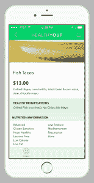

# 营养指导应用 Rise 收购 health yout 

> 原文：<https://web.archive.org/web/https://techcrunch.com/2015/08/19/rise-a-nutritional-coaching-app-acquires-healthyout/>

连接用户和饮食教练的服务公司 Rise T1 已经收购了健康餐厅食物推荐初创公司 T2 health yout T3。

HealthyOut 梳理附近餐馆的菜单，寻找健康食品，然后针对不同种类的饮食和饮食习惯给出最佳选择建议。它使用机器学习来处理餐厅，正在处理全国 14 万家餐厅。HealthyOut 已经被下载了约 73 万次，它帮助 Rise 提供了更多他们认为必要的东西，以帮助在一系列不同的情况下创造更健康的饮食，首席执行官 Suneel Gupta 说。

 Rise 为其会员提供每月 50 美元的专门节食教练，并表示在第一年的运营中就达到了 100 万美元的收入。它还提供由教练根据每个用户的喜好和饮食风格精心设计的食谱，并让营养师实时决定食物。

古普塔说:“许多会员都外出走动，想知道该做些什么。”“你和你的教练现在正在做一份适合你的资料，并推荐一些你应该远离的东西。你的教练将能够为你创建这个完美的个人资料，你所需要做的就是点击一个按钮，它会显示你所在区域的菜单项。”

交易条款没有披露。

这类收购有助于公司完成路线图，而不需要在生产类似产品上投入大量时间。这也确保了像 Rise 这样的初创公司在竞争中保持领先，尽管收购还处于相当早期的阶段(迄今为止，Rise 已经筹集了 430 万美元)。可以肯定的是，还有其他类似 MyFitnessPal 的健身追踪应用，但 Rise 的做法是更加个性化。

两家公司之间的整个对话始于一个电话，但也许最重要的一点是 HealthyOut 的联合创始人之一丹·迈尔斯(Dan Myers)和他的一些团队来到并参观了 Rise 办公室。古普塔说，团队成员坐在会议室里谈论如何帮助人们变得更健康，一件事接着一件事。

古普塔说:“有积极性的人平均一年要尝试四次节食，但都失败了。”。“因此，如果我们从那个人开始，从他们面临的挑战开始，我们真的会从产品的角度来看待这个问题。当你开始觉得你和你正在洽谈的公司的路线图有非常紧密的重叠时，你就会开始觉得这很有意义。”

古普塔崛起背后的故事是一个人的故事。在他成长的过程中，他的父母都在处理与健康相关的问题。他想到，如果有什么要改变的话，他和他的家人必须改变他们在家里做的事情——而正是营养师最终帮助他们走上了更健康的轨道。

“我们做了很多美国人做的事情，我们节食，”古普塔说。“我们尝试了一些不同的方法，我们尝试了南海滩，但没有什么真正奏效。对我们来说，真正有帮助的是，我们终于有了一个教练，一个注册营养师来让我们负责。”

还有其他一对一的饮食指导服务，比如慧俪轻体，但 Rise 的赌注是，通过 HealthyOut 和其他产品，该公司将提供一套更大的工具，使其成为饮食和营养指导的首选应用。“我们确实看到了他们所做的事情，就像一枚硬币的两面，”古普塔说。

[HealthyOut 在 TechCrunch Disrupt NY 2013](https://web.archive.org/web/20221006193053/https://beta.techcrunch.com/2013/04/30/healthyout/) 上推出，并入围了初创企业战场竞赛。