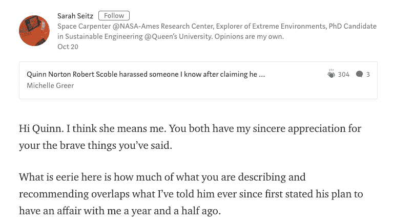
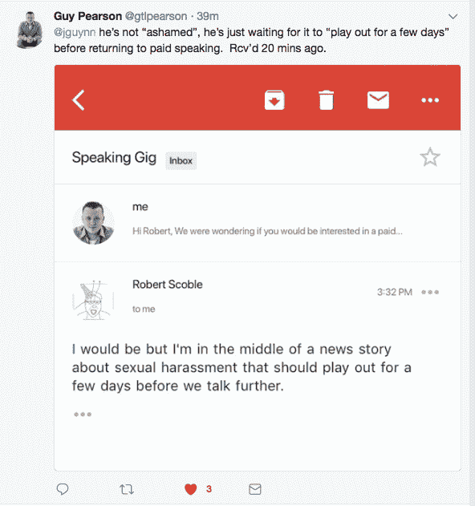

# 罗伯特·斯考伯据称在戒酒后继续性骚扰女性 

> 原文：<https://web.archive.org/web/https://techcrunch.com/2017/10/20/robert-scoble-has-allegedly-continued-to-sexually-harass-women-after-going-sober/>

风险投资家戴夫·麦克卢尔、贾斯汀·卡尔德贝克和克里斯·萨卡、SoFi 首席执行官迈克·卡格尼和一名优步顶级工程师在过去六个月中都被指控性行为不当，因为越来越多的女性站出来讲述她们遭受科技行业当权者的骚扰。

然而，罗伯特·斯考伯，这个曾经被指控性行为不端的人，到目前为止毫发无损。虽然[两名](https://web.archive.org/web/20230213101850/https://medium.com/@quinnnorton/robert-scoble-and-me-9b14ee92fffb) [女子](https://web.archive.org/web/20230213101850/https://www.buzzfeed.com/doree/woman-accuses-robert-scoble-of-sexual-harassment?utm_term=.arXwymMWL5#.grR39xNY1A)最近站出来，指控 Scoble 不恰当地抓住她们，但这两起事件都发生在 2015 年之前，当时 Scoble 公开承认自己是一名[酒鬼](https://web.archive.org/web/20230213101850/https://www.facebook.com/RobertScoble/posts/10153024619029655?fref=nf&pnref=story)。斯考伯说，当时他正在寻求帮助，并加入了匿名戒酒会。

今天下午早些时候，在接受《今日美国》采访时，斯科博为他的过去道歉，重申他的不良行为发生在他酗酒的时候。

此后，许多人对斯考伯过去的行为不屑一顾，认为那只是过去的事。

但据 TechCrunch 采访过的几位女性称，事实并非如此。

两名妇女说，尽管斯考伯公开道歉，但据称他仍继续喝酒、抽大麻，并一再勾引妇女，甚至在她们说让他停止后也是如此。

在记者奎恩·诺顿最近发表了她的[媒体帖子](https://web.archive.org/web/20230213101850/https://medium.com/@quinnnorton/robert-scoble-and-me-9b14ee92fffb)指责斯考伯抓住她之后，美国宇航局分析师莎拉·塞茨在帖子的评论部分说[斯考伯在一年半前向塞茨提出婚外情——在他公开声明他正在清理自己的行为之后。](https://web.archive.org/web/20230213101850/https://medium.com/@sarahjoeys/hi-quinn-i-think-she-means-me-ac6ccaf8ea6b)

赛兹后来告诉 TechCrunch，她拒绝了斯考伯，但他还是继续追求她。

另一位不愿透露姓名的女性告诉 TechCrunch，Scoble 对她大献殷勤，告诉她在今年早些时候的一次技术会议上喝醉后，他多么想和她亲热。她说，斯考伯后来为自己的行为道歉，并对她大加赞赏；他还将她与她需要的人联系起来，以帮助她进一步发展事业，她说这实际上让她沉默了。

“和他一起工作让我感到恶心，但他也提供了很多帮助，”她告诉 TechCrunch。“作为女性，我们有时不得不做出艰难的选择。我是想把他叫出来，还是想推进自己的事业？”

对于科技行业的许多人来说，斯考伯处于一个有权力的位置——这一点在我们对他所在领域的女性的采访中反复出现。他们说，因为这个原因，他过去和现在的行为都被保密了。

事实上，另外两名女性告诉 TechCrunch，在 Scoble 公开表示他要戒酒后，他仍在进行不适当的挑逗，但由于害怕后果，她们都不想公开。

到目前为止，Scoble 拒绝回答 TechCrunch 关于这些指控的众多问题。他昨天告诉 TechCrunch，他将做一个直播节目，向两位站出来讲述自己过去的女性发表讲话；这还没有发生。斯考伯还说，他会就最近的指控发一份声明，但在撰写本文时还没有这样做，尽管他现在说这份声明将在本周末公布。 *****

根据他发给 Redesk 高管盖伊·皮尔森(Guy Pearson)的一封电子邮件，在让这些指控“上演”的同时，他可能在等着做任何事情:

长期以来，斯考伯一直被视为硅谷最受欢迎的自恋狂——一个如此明显地自我陶醉以至于经常接近喜剧的人。(谁能忘记一个红色湿漉漉的 T2 戴着谷歌眼镜从浴室出来的画面？)

当人们和初创公司寻求他的关注时，他也会对他们有所帮助。他的庞大关系网似乎不太可能继续将他的自我参与视为如此滑稽可笑。

****** 更新:*发表这篇文章几分钟后，Scoble 在他的脸书个人资料上[为他过去和最近的行为道歉](https://web.archive.org/web/20230213101850/https://www.facebook.com/RobertScoble/posts/10155785962004655)，他说:“我损害了许多人对我的信任。我在生活中采取了很多措施来改善自己，包括两年多前戒酒。我承诺在适当的时候做出弥补，并过上透明、正直和诚实的生活。”

斯考伯没有具体说明最近的这些指控，而是承诺通过未来的行为证明自己。现在的问题是，他是否真的是这个意思，而且，他是否可信。

*更新:* Scoble 已经删除了他最初的道歉，现在在他的个人网站上发布了一篇[冗长的反驳文章](https://web.archive.org/web/20230213101850/https://scobleizer.blog/2017/10/25/no-of-that-im-innocent-sexual-harassment-assault-accusations/)来反驳 TechCrunch 和其他出版物的报道。