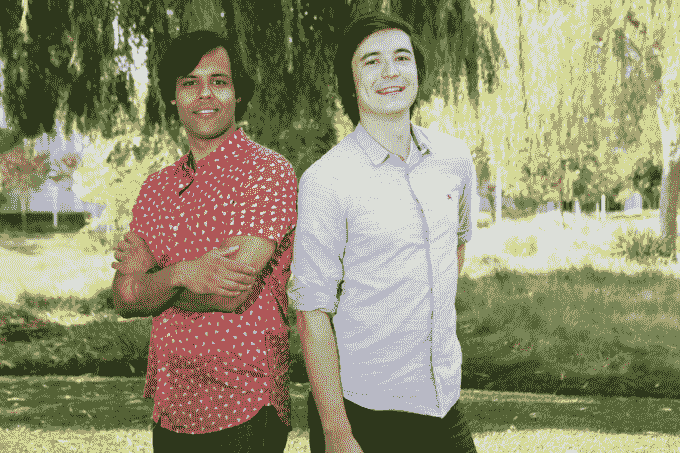
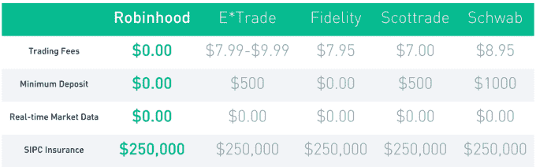
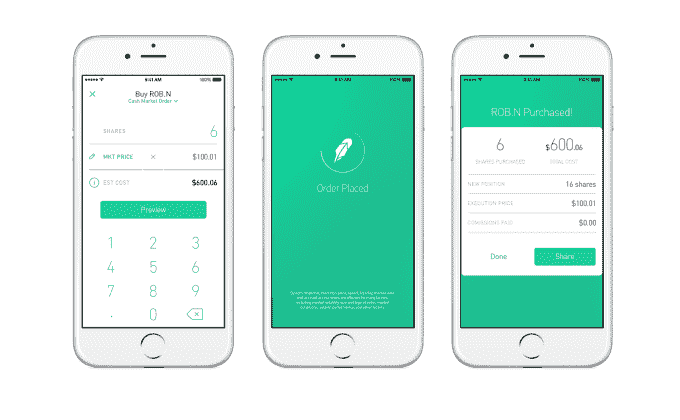
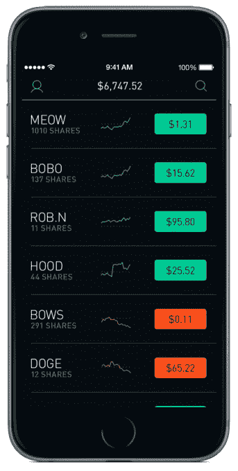

# Robinhood 推出零手续费股票交易应用 

> 原文：<https://web.archive.org/web/https://techcrunch.com/2014/12/11/robinhood-free-stock-trading/>

当你可以在 Robinhood 上[免费交易时，为什么要支付 E * Trade 8 美元来买卖股票呢？经过两年的发展，](https://web.archive.org/web/20230205201117/https://www.robinhood.com/)[、1600 万美元的资金](https://web.archive.org/web/20230205201117/https://techcrunch.com/2014/09/23/robinhood-stock-app/)和 50 万等待注册，[罗宾汉今天终于登陆 iOS 应用商店](https://web.archive.org/web/20230205201117/https://itunes.apple.com/us/app/robinhood-%240-commission-stock/id938003185?ls=1&mt=8)。Robinhood 可以让你跟踪股票的表现，只需轻点几下就可以免费买卖。

这款应用可以吸引更年轻、更不富裕的人群进入股市，因为人们可以进行小额交易，而不会被大多数经纪公司收取的费用吞噬掉他们的潜在收入。相反，Robinhood 通过你持有的资金的利息或当你进行保证金交易时，再加上向证券交易所出售交易量来赚钱。

在我的演示过程中，我发现 Robinhood 很时尚，也很容易使用——对于金融应用程序来说，这是不常见的特征。Robinhood 希望在两个月内登上候选名单，然后开始添加今天注册的人。但在此之前，任何人都可以使用该应用程序来监控股票。

这是我的应用程序的快速演示视频:

金融科技系列企业家弗拉德·特涅夫和拜朱·巴特希望第三次是罗宾汉的魅力。两人在斯坦福相遇(披露:我和他们是那里的朋友，也是 Tenev 的兄弟会成员)，之后两人都进入了著名的数学研究生项目。他们创办了一家名为 Celeris 的算法交易技术初创公司，然后又开始为大型投资银行开发软件。两个都没有成功，但同时他们注意到没有一个好的股票交易移动应用程序。

然而，让他们感到惊讶的是，除了自身效率低下之外，E*Trade 和 Scottrade 收取过高费用的借口并不存在。通过用少数工程师和移动病毒取代实体分支机构和电视营销预算，罗宾汉能够放弃佣金。

Robinhood 创始人 Baiju Bhatt(左)和 Vlad Tenev(右)

但那是一年前的事了。为什么这么久才发射？因为 Tenev 和 Bhatt 知道，如果他们在安全性或可靠性上搞砸了，乱用人们的钱，没有人会信任 Robinhood 来保管他们的资金。

因此，这家初创公司变得严肃起来，并从顶级投资者那里筹集了 1600 万美元，这些投资者包括谷歌风险投资公司、安德森·霍洛维茨基金、指数风险投资公司以及精明的新贵，如罗森伯格风险投资公司和慢速风险投资公司。这笔钱让来自斯坦福、麻省理工和加州理工的顶级安全和基础设施专家在谷歌、脸书和 Palantir 工作。“安全基本上是一个计算机科学问题。我们的解决方案是雇佣最聪明的人，”Tenev 告诉我。

自从获得资本以来，两位创始人花了很多时间来弥补他们所能弥补的每一个安全漏洞，并且[用几千名用户测试这个应用](https://web.archive.org/web/20230205201117/https://techcrunch.com/2014/02/27/trade-stocks-free-robinhood/)。指标显示，平均每周至少进行一次交易的人查看该应用 20 次，第一个月进行四次交易，90%的人可能会向朋友推荐罗宾汉。这些指标告诉团队，该应用程序终于为公众做好了准备。

当你注册时，你将设置一个应用内密码或触控 ID，以确保没有你的同意没有股票被交易。为了方便添加资金，你可以用你的名字和密码登录 9 家顶级银行中的任何一家，而不必摆弄检查账号和多天的验证过程。为了增加保险，您价值高达 50 万美元的资产受到证券交易委员会的保护。而且没有最低金额的限制。如果你愿意的话，可以交易 2 美元的 Zynga 股票。

一旦进入 Robinhood，你就可以将股票添加到你的主页观察列表中。快速浏览一下就能知道它们是涨了还是跌了，以及跌了多少，同时点击会显示详细的统计数据和价格时间表，你可以随意浏览。

如果你想买一个，只需点击“购买”，然后向上滑动进行确认。出售和兑现也是如此简单。整个应用程序使用颜色来快速传达概念，例如当市场开放交易时使用白色背景，当市场关闭时使用黑色背景，或者当天赢家使用绿色股票名称，输家使用红色名称。

当我问 Robinhood 如何赚钱的具体细节时，创始人笑着说，当你四处转移资金时，为自己赚点钱似乎从来都不困难。问问华尔街就知道了。[但答案是](https://web.archive.org/web/20230205201117/https://robinhoodapp.zendesk.com/hc/en-us/articles/202853769-How-does-Robinhood-make-money-)首先，也是最重要的是，罗宾汉将从你存入账户的资金中赚取标准利息。如果你在等待你卖出股票的现金进入你的账户时用保证金购买，或者从 Robinhood 赊购，它也会收取自己的利息。

最终，这家初创公司可以出售其系统的 API 访问权。如果它能够聚集足够多的交易，证券交易所将为其交易量付费，以增加其市场的流动性。不过现在，Bhatt 说公司最大的担忧是尽快让那些已经等了一年的人加入，不要出现任何可能损害其信誉的混乱。

[雅虎的金融应用](https://web.archive.org/web/20230205201117/https://techcrunch.com/2013/11/06/yahoo-refreshes-its-finance-service-with-updated-ios-apps-and-a-new-website/)、 [Scutify](https://web.archive.org/web/20230205201117/http://www.scutify.com/) 、 [StockTouch](https://web.archive.org/web/20230205201117/https://itunes.apple.com/us/app/stocktouch/id445170859?mt=8) 以及谷歌金融等网站是罗宾汉在监控方面最大的竞争对手。但至于移动优先的股票交易，Bhatt 和 Tenev 是唯一成功跳过监管圈并经受住工程挑战进入市场的人。

如果 Robinhood 流行起来，它不仅可以让年轻一代参与市场，还可以让他们走上金融专业知识的道路，这将使他们受益终生。谈到学习金钱，Tenev 说“越早开始越好。”与 E*Trade 的 55 岁相比，Robinhood 的平均用户年龄为 27 岁，这一点很有帮助。它的客户不会很快消失的想法肯定会让这家初创公司放心。

巴特还认为，“通过股票所有权参与经济是防止贫富差距扩大的一个非常重要的方式。”

技术已经使出版、融资和许多其他行业民主化。现在罗宾汉想把富人的股票交易偷出来给穷人。

[*iOS 版下载罗宾汉*](https://web.archive.org/web/20230205201117/https://www.robinhood.com/)