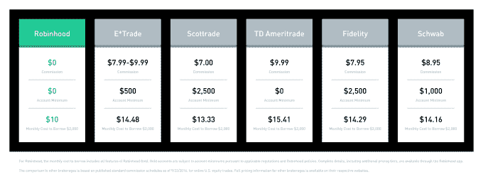
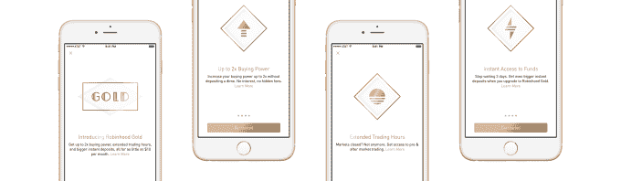
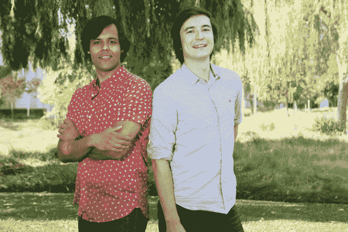
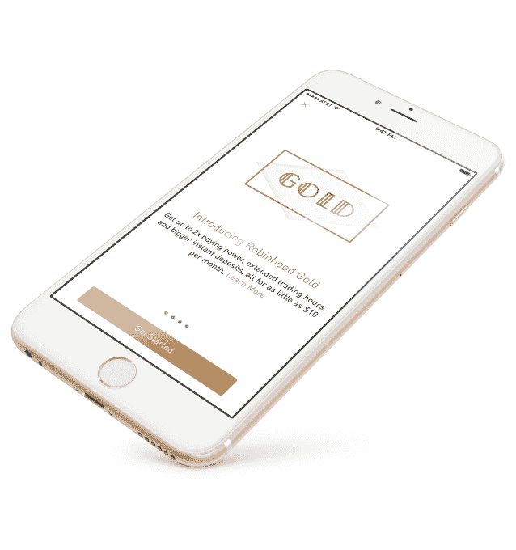

# 免费股票交易应用程序 Robinhood 以每月 10 美元的价格赊购 

> 原文：<https://web.archive.org/web/https://techcrunch.com/2016/09/29/robinhood-premium/>

Robinhood 表示，它永远不会对股票交易收取佣金，但这家获得 6600 万美元资助的初创公司终于通过推出[“robin hood Gold”](https://web.archive.org/web/20221128094432/http://blog.robinhood.com/news/2016/9/28/robinhood-gold)高级功能来加速货币化。对于每月 10 美元的，用户可以通过即时存款和再投资跳过三天的等待期，在开市前 30 分钟和开市后 2 小时进行交易，并借入高达两倍的账户资金进行杠杆保证金交易。

[的基本零费用交易](https://web.archive.org/web/20221128094432/https://beta.techcrunch.com/2014/12/11/robinhood-free-stock-trading/)吸引了年轻、不富裕、经验不足的交易者，他们进行小额投资，而像史考特和 E*Trade 这样的竞争对手收取的 7 美元以上的佣金可能会抵消他们的潜在收益。

这几乎相当于 Robinhood 对其黄金订阅的收费，这可能会从这些服务中吸引资深交易员。这反过来会带来更大的余额，推动罗宾汉最初的赚钱方式——人们存入账户的现金的利息。

Robinhood 联合首席执行官 Baiju Bhatt 说:“Robinhood Gold 是我们的核心产品，就像 Amazon Prime 是 Amazon 的核心产品一样。”。“它以一致的方式为经常使用该产品的人提供更好的服务。”起初，Robinhood Gold 将推广到该应用 15%的用户群，并在测试后扩展到其他合格用户。

当黄金用户从他们的银行账户中为他们的 Robinhood 余额提供资金时，或者当他们出售股票并希望用收益购买更多股票时，他们不必等待三天才能处理 ACH 转账。盘前和盘后交易为小投资者提供了一个选择，让他们可以在盘后交易，比如收益报告。开市时上午 9 点到 9 点 30 分以及闭市后下午 4 点到 6 点的交易通常是为大型机构投资者准备的。

然而，最重要的溢价特征是[额外的购买力](https://web.archive.org/web/20221128094432/https://support.robinhood.com/hc/en-us/articles/213262686)。巴特称之为“股票市场的基本信用卡”只要用户的账户中至少有 2000 美元，他们就可以以每月 10 美元的价格借入两倍于此数额的资金，并进行交易。

Robinhood 也在销售更高价格的订阅，购买力更强:20 美元/月 4000 美元，30 美元/月 6000 美元，50 美元/月 10000 美元，5%利率的购买力高达 50000 美元。对高风险的购买行为有一些限制，所以你不能把成千上万的资金投入一家新上市的公司、杠杆 ETF 或价格低于 3 美元的股票，因为它们太不稳定了。

现在的问题是，对这些高级期权感兴趣的交易者是否准备好使用一款只支持移动端的交易应用。Bhatt 预计 Robinhood Gold 将成为初创公司的主要收入来源。

这笔收入可以帮助 Robinhood 获得 6600 万美元的资金，这些资金来自安德森·霍洛维茨、NEA、GV(谷歌风投)、Index、Slow Ventures 以及 Nas、Snoop Dogg 和杰瑞德·莱托等名人。Robinhood 看起来是 Rothenberg Ventures 的顶级投资组合公司之一，[声名狼藉的基金](https://web.archive.org/web/20221128094432/https://beta.techcrunch.com/2016/08/18/at-rothenberg-ventures-the-rise-and-fall-of-a-virtual-gatsby/)最近更名为[前沿科技风险投资](https://web.archive.org/web/20221128094432/https://beta.techcrunch.com/2016/09/20/mike-rothenberg-allegedly-wired-5-2-million-from-silicon-valley-bank-without-investor-permission/)。

Robinhood 创始人 Baiju Bhatt(左)和 Vladamir Tenev(右)

[Robinhood](https://web.archive.org/web/20221128094432/https://www.robinhood.com/) 于 2013 年由两名斯坦福大学毕业生创立，他们曾为大型对冲基金开发高频交易技术，现在已经拥有超过 100 万注册用户。它处理了 120 亿美元的交易，并为人们节省了超过 2 亿美元的佣金。这款应用非常吸引人，自 6 月以来交易量翻了一番。

然而巴特笑着说“人们对罗宾汉最古老的疑问是什么？“你打算怎么赚钱，”“这家初创公司到目前为止一直专注于通过让每个人都能负担得起股票交易来实现股票交易的民主化，而不是为自己赚钱。

罗宾汉的流动性使得人们很容易冲动购买股票，如果他们通过黄金借入信贷进行交易，这可能会给他们带来麻烦。巴特意识到了这种风险，他说:“我们希望帮助人们做出他们能接受和理解的决定。”否则，谁会愿意回到一个损失了很多钱的应用上呢？

由于 Robinhood 存储着人们的钱，这家初创公司在安全方面必须格外警惕。一个漏洞可能会把客户吓跑到更成熟的经纪公司。

接下来，Robinhood 计划建立一个网络产品来补充其移动优先的应用程序，并将继续向 Robinhood Gold 添加功能。目前，它的软件将继续蚕食股票交易，用应用程序取代实体经纪事务所，并与其用户分享节省的资金。