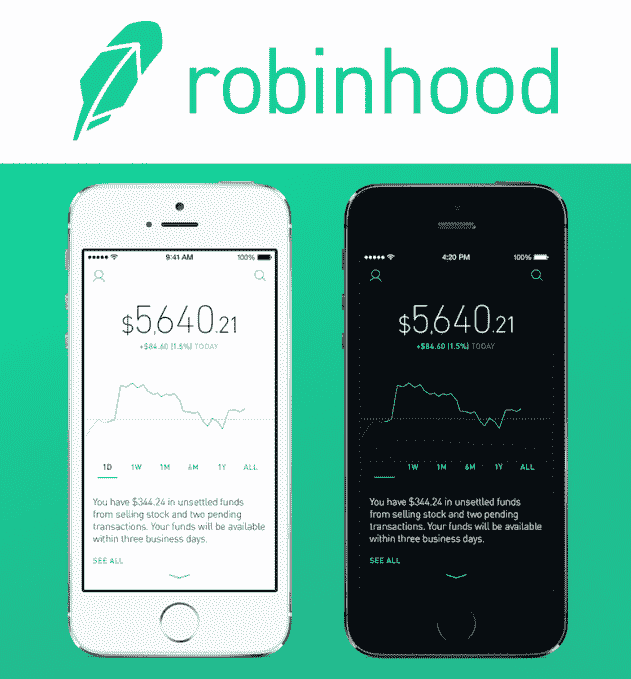

# Robinhood 通过零佣金交易应用程序 筹集了 1300 万美元用于股票市场民主化

> 原文：<https://web.archive.org/web/https://techcrunch.com/2014/09/23/robinhood-stock-app/>

50 万人已经注册了 Robinhood 在 T2 推出的零费用股票交易服务 T3。现在，这家初创公司已经筹集了[1300 万美元](https://web.archive.org/web/20230328034353/http://blog.robinhood.com/news/2014/9/22/a-new-way-to-invest-for-a-new-generation)来雇佣人才，以使其应用程序完全安全，这样它就可以开始从其私人测试候选名单中添加人员。

与竞争对手 E*Trade 和 Scottrade 每次向人们收取 7 至 10 美元的交易费用不同，Robinhood 不需要在华尔街的实体前哨和一些花哨的城堡上花钱。相反，人们希望由 Index Ventures 牵头的[A 轮融资将取代罗宾汉的长寿，成为人们对罗宾汉的信心来源。Robinhood 希望在 2015 年初公开发布这款应用，让人们能够放心地存钱和交易股票。](https://web.archive.org/web/20230328034353/http://indexventures.com/news-room/blog/from-seed-to-a-robinhoods-aim-is-right-on-target)

“我们让年轻人也能投资，”联合创始人弗拉德·特涅夫(弗拉德和他的联合创始人拜朱·巴特是大学时的朋友)说。“大多数股票经纪公司已经存在了 30 年，它们的界面很笨拙，而且它们的目标是年长的专业人士和活跃的交易员。他们不是首次投资者的地方，这是我们关注的事情之一。让它变得触手可及。让它变得移动友好。”



Tenev 和 Bhatt 是一系列金融技术企业家，他们已经在算法交易和投资银行软件方面建立了公司。2011 年在华尔街工作时，他们亲眼目睹了 99%的运动，并设计了一款允许任何人参与股票交易的应用程序。“这一切都要追溯到名字，”巴特说，他的声音里充满了真实的情感。“我们问自己，‘如果我们要使用一个自称 Robinhood 的金融服务，我们希望它做什么？’"

他们在 2013 年 4 月让 Robinhood 走出了秘密，看看他们能否通过用精益软件和移动应用程序取代昂贵的 meatspace 办公室和营销支出，来减少股票交易的佣金费用。

这释放了年轻得多、不太富裕的人群，他们历来不愿炒股，因为 10 美元的费用占他们总投资的很大一部分。如果你有足够的钱可以挥霍，这没什么大不了的，但如果你只想买价值几百美元的股票，预先支付 10 美元会让你更难获得回报。开沟费导致 80%的测试用户年龄在 30 岁以下。

Robinhood 仍处于朋友和家人私人测试阶段，但[其应用程序允许人们免费买卖、研究和监控股票](https://web.archive.org/web/20230328034353/https://techcrunch.com/2014/02/27/trade-stocks-free-robinhood/)。订婚看起来很有希望。50%的交易客户每天都会回来，90%的客户每周都会回来。

## 筹钱搬钱挣钱

2013 年 12 月，Robinhood 从 Index 和 Andreessen Horowitz 筹集了[300 万美元。今天的首轮融资由金融科技基金 Ribbit Capital、StockTwits 的 Howard Lindzon、Path 创始人 Dave Morin 的 Slow Ventures、Box 的 Aaron Levie、Snoop Dogg、杰瑞德·莱托和 Queensbridge Venture Partners 的 Nas 加入，为 Robinhood 带来了 1600 万美元的资金。Bhatt 告诉我“Robinhood 作为一家公司有很好的资本，我们有世界级风险投资公司的支持，这些公司将为产品提供支持，这很重要”，这样用户就知道公司不会突然倒闭。“金融机构通过把自己的名字刻在华尔街的大理石建筑上来传达他们的可信度，”巴特说。“但这不再能引起人们的共鸣。”](https://web.archive.org/web/20230328034353/https://techcrunch.com/2013/12/18/zero-commission-stock-trading-robinhood/)


Robinhood 创始人 Vlad Tenev(左)和 Baiju Bhatt(右)

Index Ventures 合伙人简·哈默(Jan Hammer)将加入罗宾汉的董事会。Bhatt 解释说，Robinhood 选择 Index 退出竞争是因为他们经常投资 WealthFront 和 SigFig 这样的金融初创公司。“对他们来说，投资一家像我们这样受到监管的金融公司并不陌生。他们致力于帮助我们渡过难关。哈默告诉我，Index 追逐 Robinhood 是因为“该产品是创始人为他们这一代人开发的——这是一款智能、流畅且易于使用的移动应用程序，彻底改变了进入公共市场的体验。”他还提到了创始人的素质，以及这家 20 人公司吸引新一批人投资的机会。

你可以从这个小视频中了解更多关于 Robinhood 的信息，这个视频是它与硬币演示名人[三明治](https://web.archive.org/web/20230328034353/http://sandwichvideo.com/)一起拍摄的。

```
1300 万美元的计划是什么？Bhatt 告诉我“我们是一家技术公司，所以我们正在与来自麻省理工学院和斯坦福大学的顶级工程师和设计师一起发展团队，他们以前在脸书、谷歌和 Palantir 工作过。”他们的目标是让 Robinhood 100 安全可靠，这样它就可以扩大其公共测试版，并为全面推出做好准备。巴特承认“不存在出错的余地。”如果人们的交易没有通过或存在安全漏洞，怀疑可能会波及其用户群，并在创业开始前扼杀它。尽管如此，它的一些用户已经在它的等待名单上 9 个月了(自从它退出 stealth 以来已经 18 个月了)，所以它应该尽最大努力让人们在烦恼的时候开心和知情。
尽管 Robinhood 对用户是免费的，但如果它能严格管理，它就能赚到华尔街那么多钱。这种模式是向其他创业公司收取费用，让他们在精益交易的 API 基础上开发应用。它还可以收费，让用户用借来的钱进行保证金交易，而他们自己的钱在你卖出股票后的标准 3 天等待期内被锁定。它还可以从希望增加交易量的证券交易所获得报酬，罗宾汉希望能够实现这一点。如果该公司真的能让人们把钱托付给它，罗宾汉就能从其持有的资产中赚取利息。
 [Robinhood](https://web.archive.org/web/20230328034353/https://www.robinhood.com/) 的成功将归结于让像股票交易这样重大而可怕的事情从手机上变得轻松。Bhatt 总结道“传统的恐惧是‘我以为我需要几百万美元投资股票市场。’甚至不需要几千块钱。"

```