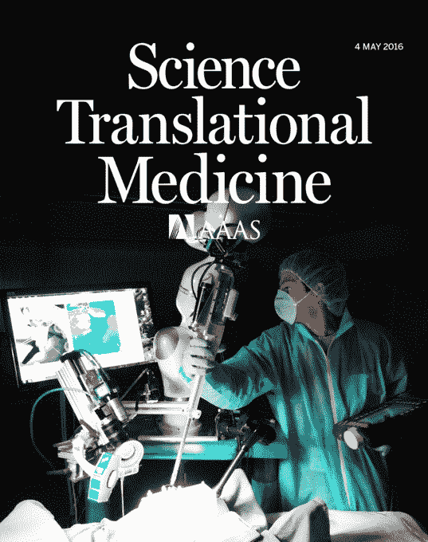

# 机器人外科医生在做同样的手术时胜过人类同事 

> 原文：<https://web.archive.org/web/https://techcrunch.com/2016/05/04/robot-surgeon-outperforms-human-colleagues-doing-same-procedure/>

这是机器的又一次胜利:[一个机器人手术系统在软组织手术中胜过了人类](https://web.archive.org/web/20221005163226/http://www.eurekalert.org/pub_releases/2016-05/aaft-rsj050216.php)和机器人辅助人类操作员，让我们更加接近自动化医疗护理(以及[机器人腹腔镜](https://web.archive.org/web/20221005163226/https://beta.techcrunch.com/tag/robocalypse/))。

 智能组织自主机器人(STAR)是在儿童国家医疗中心设计的，旨在将自动化引入软组织手术，在这个领域，人类外科医生的多功能性和空间技能长期以来一直是必不可少的。

“作为外科医生，我们通常做三件事，”谢赫·扎耶德研究所的首席研究员彼得·金在一次新闻发布会上说，“我们用我们的视觉，用我们的手灵巧，然后用我们的思维作为认知来做出判断，然后执行它。我们在所有这些方面都有所改进。”

STAR 使用先进的计算机视觉技术，该技术使用荧光标记和 3D 摄像机来获得手术部位的详细视图。然后，它从编入其数据库的各种手术技术中进行选择，并自然地以机器般的精度、速度和效率执行手术。

如果你不介意暴露的内脏，你可以在这里观看它的运作。

在实验中，由 STAR、人类专家和由阿达·芬奇手术机器人协助的人类执行了相同的程序(对猪的肠道手术——并不迷人，但却是对人类手术的代表性试验台)。结果是:在许多指标上取得了胜利。

> 尽管在手术过程中会出现动态场景变化和组织移动，但我们证明了自主手术的效果优于专业外科医生和 RAS 技术进行的手术。(摘自摘要)

应该指出的是，人类不得不在某些地方协助机器人完成某些任务，但这是意料之中的；毕竟，这是受监督的自治——人类需要在出现技术困难的情况下在场，比如电源故障或部件故障。

换句话说，你还需要一段时间才能坐上普罗米修斯式的手术舱(感谢上帝，原因有几个)。未来，或者至少是这里设想的未来，是人类和机器人之间和谐与合作的未来。

“尽管我们为自己在外科手术方面的技术感到自豪，但拥有一台机器或工具与我们合作，以确保更好的结果安全性并减少并发症，将是一个巨大的好处，”Kim 说。

“有了合适的合作伙伴，”他后来在一次问答中补充说，“这项技术的部分或全部可以整合到商业上可用的临床应用工具中——可能在未来两年内，不超过三年。”

描述 STAR 成功的论文于今天发表在[科学转化医学](https://web.archive.org/web/20221005163226/http://stm.sciencemag.org/)杂志上[。](https://web.archive.org/web/20221005163226/http://stm.sciencemag.org/content/8/337/337ra64.full)