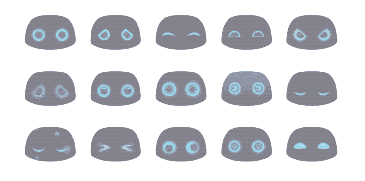
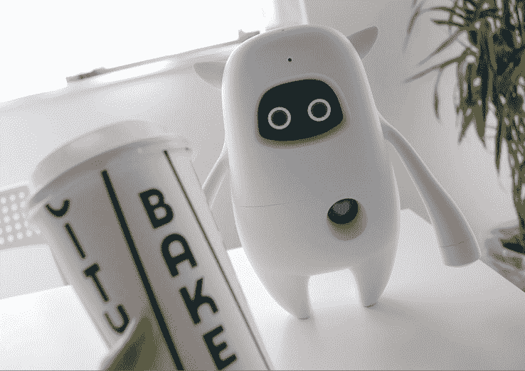

# 机器人导师 Musio 在日本首次亮相零售

> 原文：<https://web.archive.org/web/http://techcrunch.com/2017/04/14/robot-tutor-musio-makes-its-retail-debut-in-japan/>

一个可爱的机器人语言导师叫做 [Musio](https://web.archive.org/web/20230403082522/https://themusio.com/) ，已经从[众筹活动](https://web.archive.org/web/20230403082522/https://techcrunch.com/2015/05/31/meet-musio/)成为成熟产品，本周在日本商店首次亮相。Musio 的定价为 9.8 万日元(约合 900 美元)，现在通过软银的 marketplace 和亚马逊日本以及一些实体店在线销售。

Musio 的母公司 AI venture [又名 Study](https://web.archive.org/web/20230403082522/http://www.akastudy.com/) ，是 Raymond Jung 的最新创业公司，Raymond Jung 是韩国非常成功的备考企业[黑客教育集团](https://web.archive.org/web/20230403082522/http://www.hackers.com/foreign_recruiting/pages/page1.html)的联合创始人。AKA 目前有大约 50 名全职员工，大部分在首尔，在加州圣莫尼卡有一个小办公室。严格来说，该公司总部位于美国，但目前还没有为美国市场生产任何消费电子产品。

TechCrunch 问 Jung 为什么他认为 AKA 的 Musio 是一个机器人，因为它不能走动，也不能做任何事情。“我们在里面放了一个运动系统。如果你需要一个动态的部分，你可以在未来添加，”首席执行官解释道。该公司正计划让下一代 Musio 机器人能够用胳膊和腿行走或指点。

如今，Musio 与用户进行闲聊，以亲切的语气回答他们的琐事问题，承认它不知道什么，并可以纠正用户的语法。该机器人与教育出版商 Gakken 开发的课程配合使用，包括印刷书籍和游戏，这些书籍和游戏可以单独购买或作为高级 Musio 套装的一部分。

Musio 的脸和心是触摸屏。他们展示了一系列的表情，意在让用户喜欢。栩栩如生的眼睛和心脏并不是 Musio 独有的特征。其他社交机器人如[艾米斯、](https://web.archive.org/web/20230403082522/http://www.emys.co/)和 ROOBO 的[多姆吉](https://web.archive.org/web/20230403082522/https://techcrunch.com/2016/06/16/meet-domgy-an-ai-pet-robot-from-beijing-startup-roobo/)都有一双充满活力、富有感情的眼睛。阿鲁迪巴的[人形胡椒机器人](https://web.archive.org/web/20230403082522/https://techcrunch.com/2017/01/25/pepper-robot/)通过其胸部的平板电脑和眼睛显示动画。但用户也可以使用 Musio 面部和心脏上的屏幕来导航不同的菜单。

像苹果、亚马逊、百度、谷歌、IBM 和腾讯这样的人工智能巨头将他们的大量技术提供给那些想要提供语音控制、T2、自然语言处理或 T4 情商的开发者。但 AKA 正在开发一系列专有的人工智能引擎。这使得该公司及其 Musio 机器人能够识别并记住特定用户，随着时间的推移与他们建立融洽的关系，并参考过去的对话。

这种机器学习也使 Musio 能够识别学习者在哪里需要帮助来提高他们的语言技能。例如，如果 Musio 回忆起一个用户以前在一个涉及恐龙的词汇模块中答错了问题，它可以建议用户在下次聊天时复习这些材料。

Jung 解释说，“Musio 也会回答你的问题，但我们的竞争优势是自然地与你交谈。”当用户问 Musio 一个问题时，它的回答听起来更像是一个朋友的回应，而不是一个热门搜索结果的朗读。

Musio 是 AKA Study 制造的便携式社交机器人。

Jung 的宏伟愿景是开发 Musio 和其他人工智能设备和应用程序，用于教育以外的领域。例如，Jung 设想 Musio 进化成一种“伴侣”，可以帮助老年人保持社会联系，过上健康、独立的生活。他说，日本对社交机器人的需求很大，这也是他的公司关注这个市场的一个原因。这位首席执行官还表示，汽车公司已经表示有兴趣在公司的 MUSE 平台上添加友好的交互性。

现在 Musio 已经上市，AKA Study 还计划让其他开发者也能使用其专有的人工智能引擎，这些开发者发现苹果的 Siri 或亚马逊的 Alexa 等系统缺乏某种人性化的品质。

到目前为止，AKA Study 已经筹集了 1070 万美元的种子资金和首轮融资。[组建 8](https://web.archive.org/web/20230403082522/http://formation8.com/) 领投其 A 轮，SV 天使创始人李尚义是该公司最早的天使投资人。支持 AKA 和 Musio 品牌的其他公司包括日本教育集团 [Gakken](https://web.archive.org/web/20230403082522/http://ghd.gakken.co.jp/english/) 、 [LG UPlus](https://web.archive.org/web/20230403082522/http://www.uplus.co.kr/) 、韩国私募股权基金 DS 和游戏公司 [Nexon](https://web.archive.org/web/20230403082522/http://www.nexon.net/) 的联合创始人。