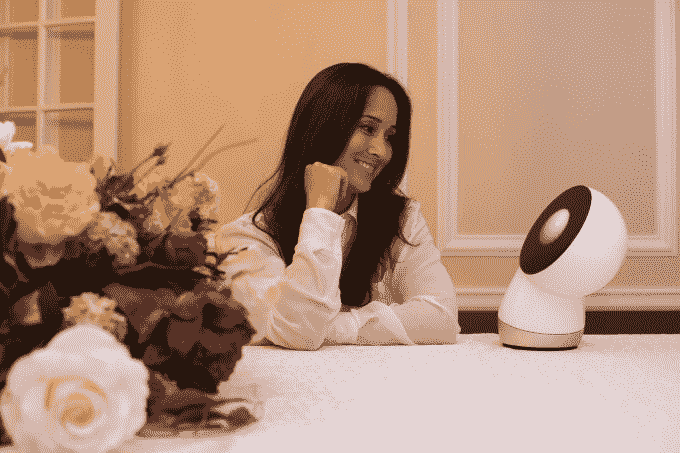

# 机器人公司 Jibo 称 Domo Arigato 获得 2530 万美元现金 

> 原文：<https://web.archive.org/web/https://techcrunch.com/2015/01/21/robotics-co-jibo-says-domo-arigato-to-25-3-million-in-cash/>

Jibo 是一家通过其同名的家庭友好型机器人在人工智能和自动化家庭的交叉领域运营的公司，该公司表示，它在最新一轮融资中筹集了高达 2530 万美元的资金。

自去年推出以来，Jibo 一直被吹捧为机器人技术的家庭友好型面孔，它经历了大规模的媒体宣传和巨大成功的 T2 Indiegogo 活动。

该公司的最新一轮投资(A 轮融资，如果你关心的话)由 RRE 风险投资公司牵头，包括主要种子投资者 CRV。其他投资来自之前的投资者 Fairhaven 和 Osage University Partners，以及新投资者 Flybridge Capital Partners、两家适马风险投资公司、Formation 8、三星风险投资公司和几个天使投资人。

根据一份声明，Jibo 将利用这笔融资来完成其 Indiegogo 活动的订单，该公司已收到 4800 份小机器人订单；以及积极雇佣更多的员工，开发新的原型，并鼓励开发人员社区为公司的第一款产品开发新的应用程序(在其创始人看来，这仍然只是一个梦想)。

有了新资本，该公司也在提升其领导团队。公司创始人和现任首席执行官[Cynthia breaze al](https://web.archive.org/web/20221005154329/https://www.crunchbase.com/person/cynthia-breazeal)博士将担任首席科学家，执行主席 Steve Chambers，语音识别和人工智能先驱 Nuance Communications 的前总裁，将担任首席执行官。

Jibo 在众筹活动中筹集了 230 万美元，有 5000 人承诺为该项目提供资金，

根据钱伯斯的说法，Jibo(该公司)在 10 月份开始为首轮融资筹集资金，融资相对较快。

“社交机器人与其他任何技术都不一样，”Breazeal 说。“你把 Jibo 看成一个人，而不是一个东西。我们生活在一个设备为我们提供大量数据的世界，而人类参与的一面正在消失。”

这就是两位创始人打算通过 Jibo 带来的东西，Jibo 是一个围绕着他们的小机器人人工智能的家庭社交中心，将人们与他们周围的数字世界联系起来。Breazeal 说:“我们不要再把机器人看作是一种劳动设备，而是要把它看作是一个真正强大的数据平台。”

基于她自己在麻省理工学院对机器人的研究，Jibo 的论点在于它的个性化。“这些年来，我的工作所播种的许多东西是，物理存在不仅对机器人很重要，”Breazeal 说。“如果你看看具体的使用案例，比如学习，或者饮食和锻炼计划的行为变化，那么某些东西的物理体现是至关重要的。”

最初的应用包括视频聊天，这是该公司目前正在开发的一项安全功能，还有一个用于家庭的提醒和列表制作应用程序，以及一个讲故事的功能，这将 [Teddy Ruxpin](https://web.archive.org/web/20221005154329/https://www.youtube.com/watch?v=8EshrR-xk2E) 带入了 21 世纪。

在某些方面，消费者可以将 Jibo 视为又一个进入他们互联家庭的高科技产品。这将使该公司面临一些大型公开竞争对手，如谷歌、三星、通用电气……实际上几乎任何消费电子产品制造商([和一些没有](https://web.archive.org/web/20221005154329/https://www.life360.com/))。把 Jibo 想象成杰森一家的未来对谷歌的巢穴(这让我想起了 2001 年《T5》中的[哈尔)。](https://web.archive.org/web/20221005154329/https://www.youtube.com/watch?v=HwBmPiOmEGQ)

钱伯斯说:“在社交机器人领域，有一个类别我们觉得我们是先锋。“我们认为 Jibo 将会建立并取得突破。它不同于玩具，不同于工业应用，也不同于家用机器人。”

为了对 Jibo 有所了解，这里有一个我们去年亲自动手制作的原型的片段: