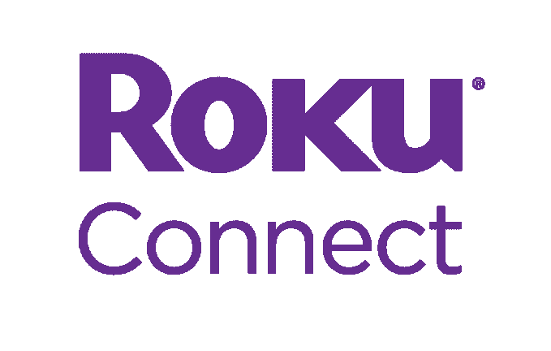
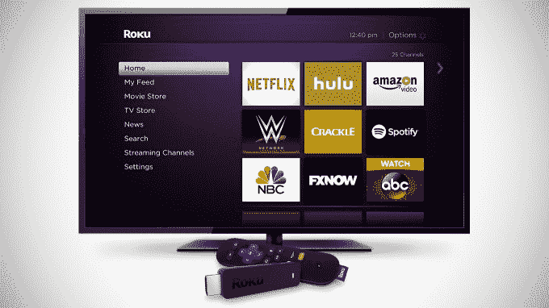
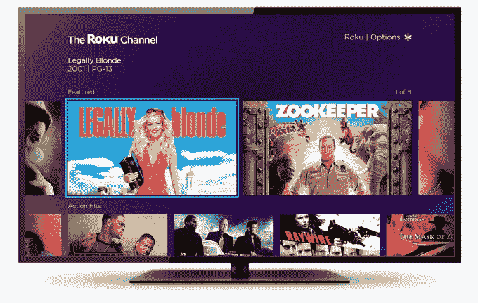

# Roku 凭借合作伙伴打造的智能条形音箱、扬声器等产品加入语音计算市场 

> 原文：<https://web.archive.org/web/https://techcrunch.com/2018/01/03/roku-joins-the-voice-computing-market-with-smart-soundbars-speakers-and-more-built-by-partners/>

Roku 在美国销售[流媒体播放器](https://web.archive.org/web/20221205213507/https://qz.com/1039335/chromecast-gains-fans-but-rokus-devices-are-still-the-most-popular-for-cord-cutters/)的[最受欢迎品牌](https://web.archive.org/web/20221205213507/https://beta.techcrunch.com/2017/08/23/roku-is-the-top-streaming-device-in-the-u-s-and-still-growing-report-finds/)，它现在的目标是为自己开辟一个利基市场，成为家庭娱乐的语音控制平台。今天，Roku 将为制造合作伙伴推出一项许可计划，包括智能扬声器、智能条形音箱、环绕声和多家庭音频系统的参考设计，这些系统使用新的 Roku Connect 软件进行无线通信，并由语音控制。

与语音控制智能设备市场的竞争对手不同，如亚马逊和谷歌，Roku 只会自己开发语音助手软件。它将把硬件设计和集成留给其 OEM 合作伙伴——包括其现有的 Roku 电视合作伙伴——来实施。第一家致力于此的 OEM 是 TCL，它将在 1 月 8 日的 CES 上推出其首款 Roku Connect 驱动的设备。

 Roku 的语音计算计划承认，消费者可能已经采用了 Echo 或 Google Home 设备。它不一定要取代其他智能扬声器，而是希望成为你可以与这些设备一起使用的语音系统。

这个想法是，Roku 的语音助手将专门针对家庭娱乐进行优化——不是智能家居，不是视频通话，也不是语音应用生态系统，像亚马逊的技能商店或谷歌 home 的行动。(至少一开始不是。虽然 Roku 的语音助手可能会提供一些基本的语音问答功能，如新闻和天气，但它的主要功能将是为你的 Roku 电视、Roku 播放器和该公司合作伙伴制造的其他 Roku 音频设备提供语音控制。

例如，你可以说“嘿，罗库，在客厅玩爵士乐，”或“嘿，罗库，打开罗库频道，”或“嘿，罗库，30 分钟后关掉电视。”(命令“嘿 Roku”将出现在任何语音交互之前，类似于谷歌的“嘿谷歌”。)

这款语音助手名为 Roku Entertainment Assistant，它还可以让你语音控制媒体播放，比如播放或暂停你正在 Roku 设备上观看的节目。

该公司解释说，愿景是一个完整的家庭许可计划，以 Roku 设备和其他与 Roku Connect 平台配合工作的设备为特色。希望这将吸引已经使用 Roku 语音控制操作其媒体播放器或电视的客户，并鼓励他们使用更多 Roku 连接设备来扩展他们的家庭媒体系统。

Roku 认为，其互联生态系统可以帮助消除目前存在的复杂系统，如条形音箱、环绕声和多房间音频扬声器。

“消费者很难成立。它基于互联社区时代之前设计的现有标准，限制了功能、保真度和易用性，”Roku 产品管理副总裁 Mark Ely 解释道。“你不能使用现代的便利设施——比如你的声音——来让它自动工作，”他继续说道。“我们认为消费者真正想要的是一个家庭娱乐网络。”

对于 Roku 来说，该计划也是吸引更多客户和增加收入的一种方式。

“我们的授权平台是我们在 Roku 获得活跃账户的增长最快的方式，”Ely 补充道。

例如，当 Roku 开始与 TCL 合作时，这家电视制造商在美国的市场份额是第 19 位，今天他们是第 4 位。伊利指出，他们销售的每台智能电视都是 Roku 电视。因此，毫不奇怪，TCL 是第一个抓住机会制造更多 Roku 设备的公司。

截至 2017 年第三季度，该公司在 Roku 播放器和 Roku 电视方面的用户基数自去年以来增长了 47%，达到 1670 万活跃账户。这些用户在本季度的流媒体时长为 38 亿小时，同比增长 58%。2017 年前 9 个月，美国每 5 台智能电视中就有 1 台是 Roku 电视。(由于船井电气决定在与飞利浦现有协议的基础上延长其 Roku 电视授权协议，今年春天，该公司还将增加其第九个品牌 Magnavox。)

Roku 表示，它将免费向 OEM 品牌授权 Roku Connect 软件，并且不打算从这些新的智能扬声器或智能条形音箱中收取授权收入。相反，该公司的目标是利用这些设备带来的活跃用户账户赚钱，因为消费者会接触 Roku 平台上的内容和广告。这包括在[更新的、由广告支持的 Roku 频道中，](https://web.archive.org/web/20221205213507/https://beta.techcrunch.com/2017/09/06/roku-launches-its-own-channel-featuring-free-ad-supported-movies/)Roku 已经将来自频道合作伙伴的免费内容与电影聚合在一起，并展示其授权内容。

Roku 将在 2018 年秋季推出语音助手，以及合作伙伴的第一批硬件设备，如智能扬声器和条形音箱。但是，随着 OEM 合作伙伴加入该计划，在这些设备到来之前，将会发布一些公告。

我们被告知，目前 Roku 的客户不需要购买新的硬件来利用语音助手。它也将作为软件更新提供给现有的 Roku 电视和 Roku 播放器(那些带语音遥控器的)，并将集成到 Roku 的移动应用程序中。这些系统今天有一个基本的语音搜索功能，但新的娱乐助手将更加强大。它还会随着时间的推移变得更加强大，就像今天谷歌和亚马逊的语音助手一样。

如果除了 Roku 之外的另一家家庭娱乐公司试图进入语音计算市场，这可能是一场艰苦的战斗。

但是 Roku 的设备[越来越受欢迎](https://web.archive.org/web/20221205213507/https://beta.techcrunch.com/2017/07/26/emarketers-2017-forecast-puts-roku-ahead-of-chromecast-fire-tv-and-apple-tv/)，因为它们不像 Apple TV、Android TV、Chromecast 和 Fire TV 那样隶属于内容平台。这意味着他们可以保持中立，而像谷歌和亚马逊这样的公司陷入争斗[看到谷歌从 Fire TV 中撤出 YouTube】，或者不得不花数年时间来达成协议，就像能够在 Apple TV 上观看亚马逊 Prime 视频](https://web.archive.org/web/20221205213507/https://beta.techcrunch.com/2017/12/28/amazon-updates-fire-tvs-youtube-app-to-redirect-users-to-a-web-browser-instead/)这样简单的事情。

与此同时，Roku 从这一地位中受益——超出销售预期，广告收入增长，活跃用户数量增加，正如它在第一次收益中所做的那样。