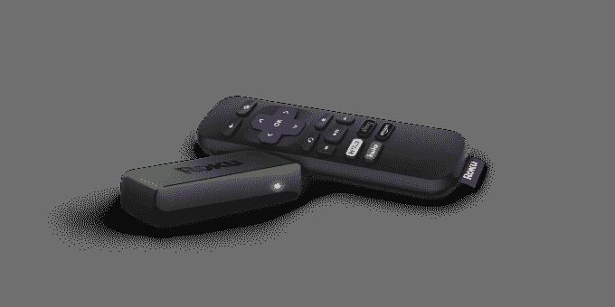
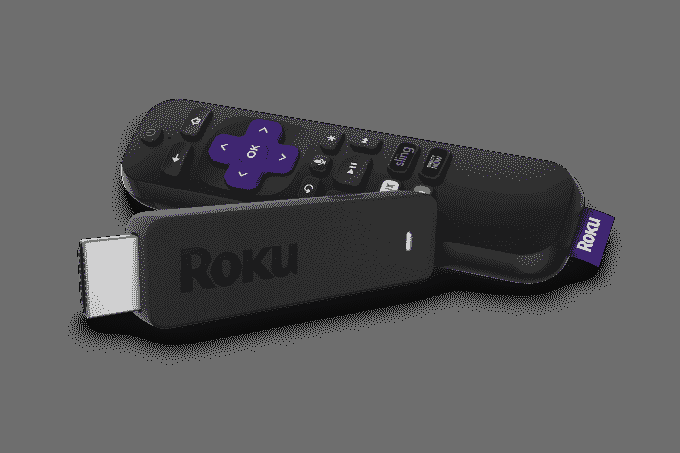
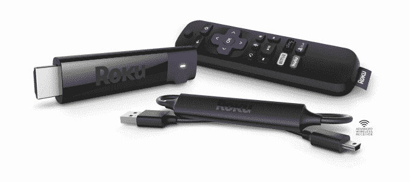

# Roku 推出更快的媒体播放器、通用遥控器和新操作系统 

> 原文：<https://web.archive.org/web/https://techcrunch.com/2017/10/02/roku-unveils-faster-media-players-universal-remote-and-a-new-os/>

在对其产品线进行重大改革一年后，今天[新上市的 Roku](https://web.archive.org/web/20221209204620/https://beta.techcrunch.com/2017/09/28/roku-surges-30-in-stock-market-debut/) 宣布再次调整其流媒体设备阵容，这一次推出了五款新的播放器，具有更高的性能、无线接收和其他功能。这些变化将影响中低端设备，如 Roku Express 和 Roku Streaming Stick，以及 Roku 的高端播放器 Roku Ultra。

另外，该公司宣布推出新的操作系统 Roku OS 8，其中包括几个主要针对 Roku 电视用户的新功能。

当 Roku [去年重塑其设备品牌时，](https://web.archive.org/web/20221209204620/https://beta.techcrunch.com/2016/09/26/roku-unveils-its-new-line-of-streaming-players/)更大的目标是堵住流媒体市场的每一个漏洞，而不会让用户觉得他们购买了一个旧产品，因为他们有一个“Roku 1”而不是“Roku 4”。

这导致了 Express、Premiere 和 Ultra 播放器的[推出，包括普通版和增强版(“+”)，提供了扩展的选项，如复合连接或更好的遥控器。这些加入了 Roku 的流媒体棒，它是 Chromecast 和 Fire TV Stick 的竞争对手。](https://web.archive.org/web/20221209204620/https://beta.techcrunch.com/2016/09/26/roku-unveils-its-new-line-of-streaming-players/)

如今，Roku 正在淘汰其中端播放器 Premiere 和 Premiere+，发现客户要么被价格实惠的 Express 或便携棒所吸引，要么全力以赴选择顶级的 Roku Ultra。

首映式过去坐的地方，现在有了一个新的更高端的棍子。

**快递和贴吧拿得更快**

今天，29.99 美元的 Roku Express 和 39.99 美元的 Express+(除了 HDMI 之外，还提供复合 A/V 端口)正在升级。

Roku 声称，由于一种新的芯片，这些设备现在的功能是以前的五倍，这意味着它的软件加载更快，视频播放更快，导航也更快。

早在 2012 年首次推出的 Roku 流媒体棒也在改进，以更好地与 Chromecast 和[新的类似加密狗的 Fire TV](https://web.archive.org/web/20221209204620/https://beta.techcrunch.com/2017/09/27/this-is-amazons-new-70-fire-tv-with-4k-and-hdr-support/) 等竞争对手竞争。

该公司指出，选择拐杖的人喜欢随身携带——36%的人在旅行时使用它，59%的人在自己家里从一个房间搬到另一个房间。但 Roku 不希望客户必须在便携性和功能或功能集之间做出选择。

Roku 表示，升级后的 49.99 美元流媒体棒采用四核处理器，802.11 AC 双频 MIMO 无线，但现在比上次的型号强大 50%。

然而，更大的变化是，这款手杖现在包括一个语音遥控器，可以控制电视功率和音量。这也是为什么流媒体棒的价格比谷歌 35 美元的 Chromecast 要高一点。

但与标准的通用遥控器不同，后者通常包括一个烦人的设置过程，Roku 的 Stick 通过分析你的电视，然后访问可能的配置代码数据库，并将它们下载到遥控器，使这一部分变得更容易。用户不必自己查找或输入代码。

该公司还通过其新的流媒体棒+与谷歌 69 美元的 Chromecast Ultra 竞争，该流媒体棒+也支持 4K 超高清和 HDR 画质。如果你能承受价格的上涨，这实际上是更好的交易。Chromecast Ultra 迫使你将移动设备用作遥控器，而 69.99 美元的流媒体棒+(是的，比 Chromecast Ultra 贵 1 美元)，配有语音遥控器，并升级了无线接收。

该公司将其先进的无线接收器集成到电源线中，以提高其性能。

“这有助于让它远离电视——因为所有的电视都会产生干扰，”Roku 的产品管理总监 Lloyd Klarke 解释道。“它还允许我延长天线之间的距离，以便获得更好的接收效果。结果是我们以前的流媒体棒的无线范围的 4 倍，”他说。“这对 4K 尤其有帮助——4K 和 HDR 将需要更多的带宽——这将有助于这一点，”Klarke 补充道。

但是有了这个更贵的流媒体棒+，Premiere(79.99 美元)和 Premiere+(99.99 美元)就会有太多的重叠，所以这两个 Premiere 现在都要走了。

**超便宜了**

与此同时，Roku 的高端 Ultra 去年 9 月定价为 129.99 美元(尽管最近在 T2 网上以更低的价格出售)，现在降到了 99.99 美元的建议零售价。与[流媒体市场的另一款高端设备](https://web.archive.org/web/20221209204620/https://beta.techcrunch.com/2017/09/12/the-new-apple-tv-gets-a-4k-upgrade/)、[苹果电视 4K](https://web.archive.org/web/20221209204620/https://www.apple.com/apple-tv-4k) 相比，这是一个非常有吸引力的价格点，其起价为 179 美元。

与苹果的设备一样，Roku Ultra 专注于 4K 流媒体，支持高清、4K 和 4K HDR，最高可达 60 fps。它还有一系列端口，包括以太网、USB 和 micro SD，并配有一个语音遥控器，可以控制电视电源和音量。遥控器还提供了一个耳机插孔，供私人收听。

Roku Ultra 上还有“丢失遥控器寻找器”功能，可以帮助您在沙发垫中找到丢失的遥控器。

Roku 在脐带切割业务方面一直表现良好，领先于苹果、谷歌和亚马逊，成为美国最大的流媒体设备制造商。它最近以每股 14 美元的发行价筹集了 2 . 19 亿美元，使其公司估值超过 20 亿美元。

该公司的播放器定价适中——正如首席执行官安东尼·伍德最近告诉 TechCrunch 的那样，这意味着收入增长也很温和。但该公司一直在通过与电视制造商合作运行其软件来增加其操作系统的使用。这一点，加上其整体不断扩大的足迹，导致其收入中有越来越多的部分来自其平台，而不是其低利润的玩家。

所有新的 Roku 设备今天都可以在 Roku.com、沃尔玛、百思买和亚马逊上预购，并将于 10 月 8 日左右在零售店上市。(不过 Roku Express+是沃尔玛独有的)。

[gallery ids="1549208，1549209，1549211"]

**Roku OS 8**

除了升级的球员，Roku 还宣布了 Roku OS 8。

主要针对 Roku 电视用户的改进，新的操作系统现在可以让用户通过语音命令启动 Roku 电视用户打开电视。

也就是说，你可以一边按遥控器上的语音按钮，一边说“Launch Vudu”或“Tune to ABC”之类的话。和 Siri 或 Alexa 一样，你不需要先使用关键词或短语——触发器就是按钮。

Roku OS 8 还可以让你通过语音切换输入源，使用约 30 家电视提供商的单点登录(SSO)，通过广播频道访问 Roku 的私人收听模式，并包括一个新的“智能指南”，在一个界面中集成了流媒体内容和线性电视节目。

这样，你就可以看到电视上的节目是否也可以点播、出租或购买。

Roku OS 8 将于 10 月在流媒体播放器上推出，11 月在电视上推出。