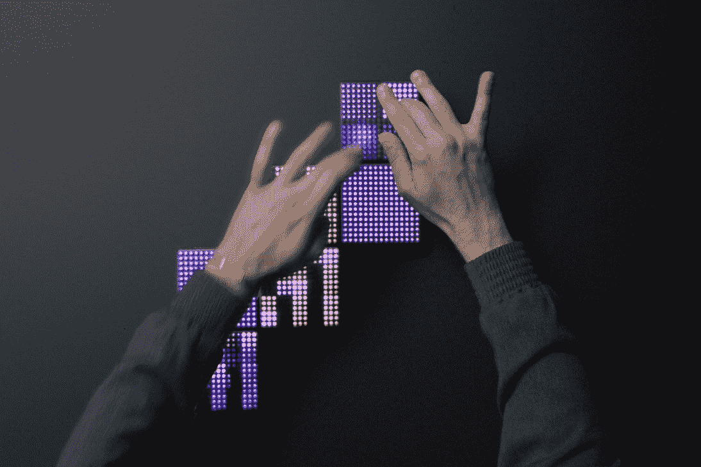

# 花小蕾在其 Blocks 模块化音乐系统 TechCrunch 中添加了新的 Lightpad

> 原文：<https://web.archive.org/web/https://techcrunch.com/2017/09/28/roli-adds-a-new-lightpad-to-its-modular-blocks-musical-system/>

# 花小蕾在其 Blocks 模块化音乐系统中添加了新的 Lightpad

[花小蕾的积木](https://web.archive.org/web/20221206151443/https://beta.techcrunch.com/2016/11/01/roli-blocks/)是我在过去一年里看到的硬件创业公司最引人注目的产品之一。模块化系统是该公司在音乐制作上的独特表现，该公司为世界提供了橡胶键 Seaboard 键盘。该系统在价格和灵活性方面都比该公司最初的产品更加用户友好，模块可以换进换出。

在推出第一个系统不到一年后，花小蕾提供了 Lightpad 的更新，Lightpad 是该系统的核心输入设备。Lightpad Block M 主要是对其前身的改进。主要的变化是受海岸的启发，街区顶部有一个新的波浪表面，给以前的平坦表面带来了一点触觉指导。

硅胶本身也发生了变化。这次更软了，更容易操控。这是我对上一个版本的要求。在玩了容易弯曲的海岸板之后，Lightpad 的顶部感觉非常僵硬。表面灯也有所改进，应该比以前的更亮，对比度更高。

Lightpad M 的售价为 200 美元——比原价高出 20 美元，但价格不变。和早期的 Blocks 一样，M 也可以通过苹果零售渠道买到。该公司一直非常看好这条产品线，吴唐的 RZA(音)等人在店内展示和表演，他是为该系统设计定制声音包的众多音乐人之一。

Blocks 是一个有趣的产品，但花小蕾可能夸大了该系统的用户友好性。和任何其他乐器一样，有一个小小的学习曲线，所以当你学习的时候，准备好有点沮丧吧。

也就是说，该公司在软件方面也做了很多工作。今天的新闻伴随着许多新产品而来，包括新的声学  乐器声音包和用于 GarageBand 和 Ableton 的插件，适用于那些希望在更强大的软件上制作音乐的人。