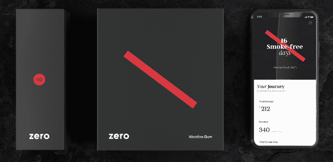
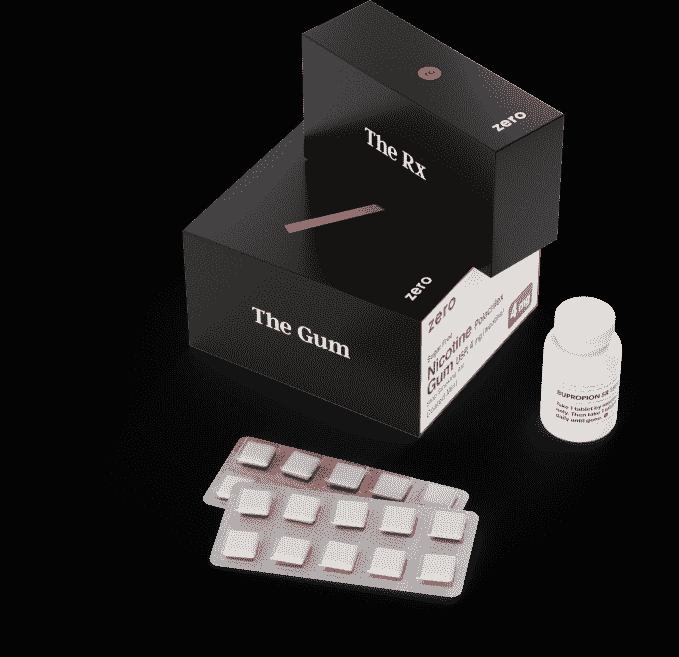

# 勃起药物应用程序 Roman 筹集 8800 万美元推出“戒烟”套件 

> 原文：<https://web.archive.org/web/https://techcrunch.com/2018/09/18/roman-zero-quit-smoking/>

Roman 是一艘火箭船，我不是在说它如何销售伟哥和西力士。在用 300 万美元的资金和一个五人团队推出治疗勃起功能障碍的云药房不到一年后，Roman 的团队成员已经增加到 70 人，收入增长率为 10 多亿美元——自 1 月份以来增长了 720%。它通过其远程医疗门户网站引发了 100 多万次患者-医生访问、电话和文本对话，以获得诊断和处方。

现在罗曼准备扩展到男人之外，所以他放弃了男人。

今天，[新更名的](https://web.archive.org/web/20221210065936/https://ro.co/)推出了它的下一款产品， [Zero，一套 129 美元的“戒烟”套装。](https://web.archive.org/web/20221210065936/https://quitwithzero.com/)它包含一个月的处方停药药物安非他酮和尼古丁口香糖，以及一个用于跟踪进展和学习如何在饥饿、恶心和渴望中保持动力的应用程序。[今天开放预购](https://web.archive.org/web/20221210065936/https://quitwithzero.com/)。

“勃起功能障碍药物是一种护膝。它可以帮助你再次行走，但目标是不需要膝盖支架，”Ro 的联合创始人 Zachariah Reitano 说，他创办了这家公司，因为由于心脏药物的副作用，他自己与 ed 住在一起。"有些人将需要 ed 药物，但我们希望许多人通过生活方式的改变或戒烟，不再需要我们了。"

为了让女性和男性都了解零，并建立一个医生的电子医疗记录系统，ro 还筹集了令人瞠目结舌的 8800 万美元首轮融资。它由 FirstMark Capital 牵头，并由 SignalFire、Initialized Capital、General Catalyst、Slow Ventures、Sinai Ventures、Torch Capital、BoxGroup 和 Tusk Ventures 参与。Initialized 和 Reddit 的联合创始人 Alexis Ohanian 和 FirstMark 的董事总经理 Rick Heitzmann 都将加入 Ro 的董事会，管理这笔大规模的资本注入。

罗马董事会成员亚历克西亚·奥哈尼安戴着一顶罗马零号帽子，为他的妻子、网球明星塞雷娜·威廉姆斯加油

“这笔钱的计划是继续建立我们自己的药店”以及“许多我们称为‘Ro’的后端基础设施，这将使我们能够在未来两到三年内推出这些其他产品和垂直市场，包括女性健康产品，”Reitano 告诉我。Ohanian 写道“迄今为止，唯一超越 Ro 执行力的是他们对医疗保健未来的愿景。与该领域的其他公司不同，Ro 是全栈式的，实际上是从头开始重建医疗保健体验，这意味着他们能够为全国各地的患者提供无与伦比的护理。"

Ro 的零工具包

直到最近，网上销售的 80%的伟哥都是假冒的。这不仅让购买治疗勃起功能障碍的药物变得很困难，而且很危险。然而，由于 Roman 以及直接面向消费者的男性健康创业公司 Hims 的人气激增，这一数字开始下降。“Roman 不适合典型的 Instagram 拆箱体验，但我们得到了很多一对一的口碑，”Reitano 笑着说。搜索引擎优化也是收入增长的关键，因为它是“购买伟哥”的第一个有机搜索结果。

" 我分享了我的故事(他从 17 岁起就和 ed 打交道)，以及“检查引擎灯”的概念，这种概念“将勃起视为男人身体处于正常工作状态的指标”。Roman 甚至开发了一个有点傻的应用程序，叫做牵牛花，来帮助男人追踪早晨的勃起。Roman 的整个体验旨在让患者对一个从根本上令人不舒服的话题感到舒服。“这种耻辱感的存在是人们不与他们的医生或伴侣交谈的原因，”雷塔诺说。

罗马联合创始人扎卡里亚·雷塔诺

现在，Ro 希望采取同样清晰的方法来帮助人们戒烟，[首先让你与它的“远程健康助手”](https://web.archive.org/web/20221210065936/https://start.ro.co/zero/smoking/)聊天，在你与 Ro 医生交谈之前整理好文书工作。这家初创公司表示，在美国 3750 万吸烟者中，每年有 70%的人想要戒烟，50%的人试图戒烟，但只有 3%至 5%的人在六个月后戒烟。但是通过药物治疗、口香糖等尼古丁替代疗法、戒烟前逐渐减少吸烟量以及咨询，戒烟率在六个月后大幅提高到 33%。

你每个月花 129 美元就可以从 Zero 的工具包中得到所有这些，相比之下，亚马逊上仅尼古丁口香糖就要花 120 美元。雷塔诺承认，“利润实际上并不是一个好的开始。比方说，这比典型的商业采购价格略低。”但这个想法是，如果 Ro 和 Zero 可以帮助某人戒烟，患者就会转向它来满足他们更多的在线药房需求。

Ro 面临的一个障碍是，它目前不接受 15 美元的远程医疗预约、罗马药丸或零工具包的保险。最终，它希望接受 FSA 卡用于税收优惠支出，希望降低一些患者的费用，但否则 Ro 将要求人们自掏腰包，将其限制在较富裕的人群中。雷塔诺承认，“在任何竞争激烈、监管严格的领域，都有你无法控制的事情。在我们的控制下，有一个难以置信的机会来确保我们利用现有的基础架构。”

雷塔诺总结道，“老实说，  我希望我们能够实现我们想要建造的东西。”