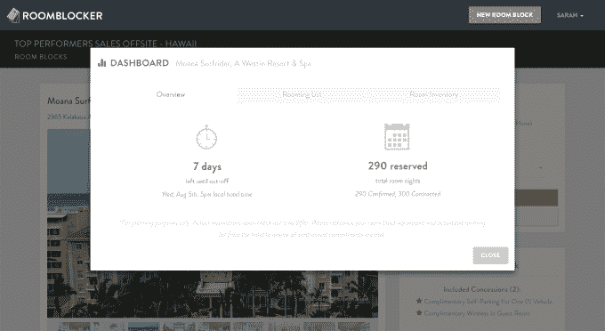

# Roomblocker (YC S15)正在实现集团酒店预订的现代化 

> 原文：<https://web.archive.org/web/http://techcrunch.com/2015/07/06/roomblocker-yc-s15-is-modernizing-group-hotel-reservations/>

# Roomblocker (YC S15)正在实现团体酒店预订的现代化

如果你曾经不得不为会议或婚礼预订酒店房间，你就会知道这个过程有多复杂。YC 支持的 Roomblocker 是一项处理整个团体预订过程的服务，从收集出价到接受团体成员的预订。

Roomblocker 的工作方式是这样的:首先，该公司将每个团队组织者分配给一名专门的礼宾员，陪同他们完成整个预订过程。

礼宾部将邀请一组经过预先批准的酒店提交投标和优惠(如免费无线或房间升级)，这些都将在一个在线仪表板上呈现给组织者。

让客房管理员为团队谈判意味着他们通常会获得比自己预订更好的价格和优惠。

组织者然后选择一家酒店，Roomblocker 创建一个团体预订页面，客人可以在那里在线预订房间。虽然看起来是一个简单的功能，但为客人提供定制预订页面对团队组织者非常有帮助，他们通常会跟踪每个客人以获得预订信息。

现在，组织者可以访问一个仪表板，上面有实时房间列表、可用房间清单和自动提醒客人预订房间的功能。

Roomblocker 完全免费供团体使用。该公司通过向通过该平台预订的酒店收取佣金来创收。该公司由前销售人员戴夫·延和迈克尔·汪创建，早期客户包括 Salesforce 和 Dropbox，以及很大一部分婚礼和个人旅行。

据该公司称，25%的酒店预订属于一个房间区块，而团体酒店预订现在是全球 1370 亿美元的市场。Roomblocker 的目标是占领这个市场的绝大部分，因为该公司可以安排每晚几十到几百个房间的房间。

Yen 和 Wang 解释说，一个重要的优先事项是通过现代化传统上过时的团体预订流程来改善客户体验。例如，大多数酒店需要传真的签名页，Roomblocker 现在以电子签名格式提供给小组组织者。该公司还计划最终处理来自客人的付款，这是酒店和团体组织者都要求的功能。