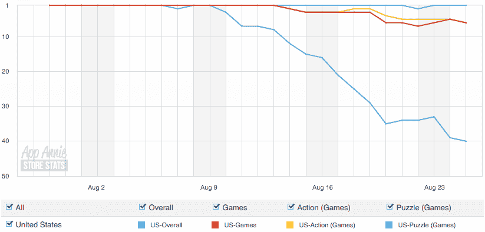
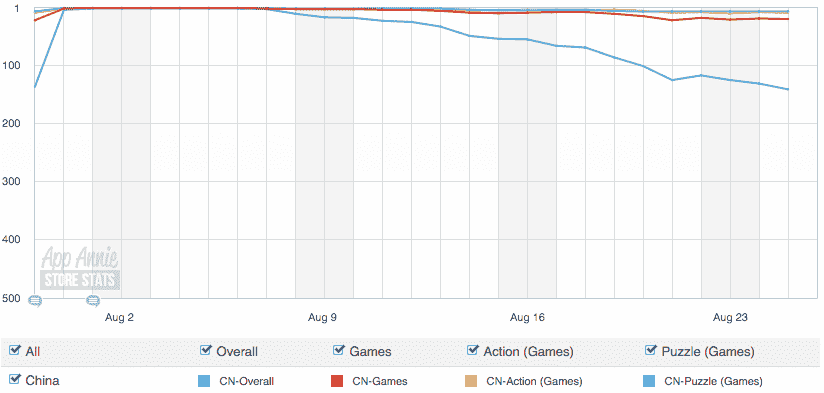
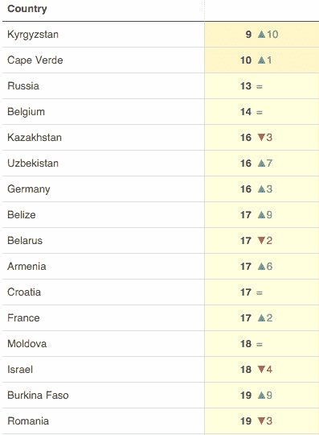

# Rovio 将裁员 260 人，因为《愤怒的小鸟》系列变得无关紧要

> 原文：<https://web.archive.org/web/https://techcrunch.com/2015/08/26/rovio-to-cut-260-jobs-as-the-angry-birds-franchise-becomes-irrelevant/>

# 由于《愤怒的小鸟》系列变得无关紧要，Rovio 将裁员 260 人

看起来《愤怒的小鸟》的制作人 Rovio 在支付账单方面遇到了一些麻烦。这家芬兰公司在 2014 年 10 月裁员 [110 人](https://web.archive.org/web/20230308041215/http://www.rovio.com/en/news/press-releases/587/rovio-employee-negotiations-concluded/2014)后，即将裁员 260 人。2013 年底，公司共有 [800 名员工](https://web.archive.org/web/20230308041215/http://www.rovio.com/en/news/press-releases/495/rovio-entertainment-reports-2013-financial-results)。

这一消息令人惊讶，因为 Rovio 的最新游戏取得了巨大成功。《愤怒的小鸟 2》仅一个月就被下载了近 5000 万次，高居排行榜榜首…

*   在美国(至少几周内)，主要的应用商店市场之一:

*   在特许经营非常成功的中国:

但是创造数百万的下载量只是挑战的一部分。《愤怒的小鸟 2》在世界各地的排行榜上已经开始下滑，它的免费增值模式似乎并不是很成功。在美国,《愤怒的小鸟 2》在上映后不久就登上了票房排行榜的第 42 位。虽然这不是一个小壮举，但它远不及《战争游戏》(排名第一)、《部落冲突》(排名第二)、《糖果粉碎传奇》(排名第四)和《糖果粉碎苏打传奇》(排名第七)——这些游戏几个月来一直稳居票房榜首。

换句话说，《愤怒的小鸟 2》很可能不够给几百名员工发工资。Rovio 在埃斯波、斯德哥尔摩、伦敦、纽约、洛杉矶、温哥华、上海、首尔和东京都设有办事处，这可不是一般的独立游戏开发店。

《愤怒的小鸟》系列是 App Store 和 Play Store 上第一批取得突破性成功的游戏之一。数百万人花了几美元下载了这个系列的最新版本。然而，这是一个全新的手机游戏世界。现在都是免费玩游戏，微交易，等待时间。愤怒的小鸟不是为这种型号设计的。

Rovio 还拥有强大的商品业务——该公司一直在授权其品牌销售大量愤怒的小鸟泰迪熊、笔记本和钢笔。但随着游戏系列变得不那么受欢迎，这些项目也可能变得无关紧要。

Rovio 还有最后一个希望——愤怒的小鸟电影。该公司已经制作了一部电影，预计将于 2016 年 5 月[日](https://web.archive.org/web/20230308041215/http://www.imdb.com/title/tt1985949/)上映。Rovio 表示，裁员将影响整个公司，除了美国和加拿大的电影制作团队。将公司的预算和精力集中在这部电影上是一个很大的赌注，它将决定游戏公司的命运。