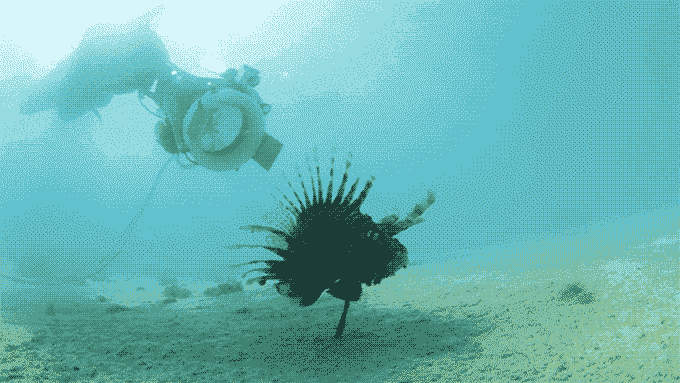
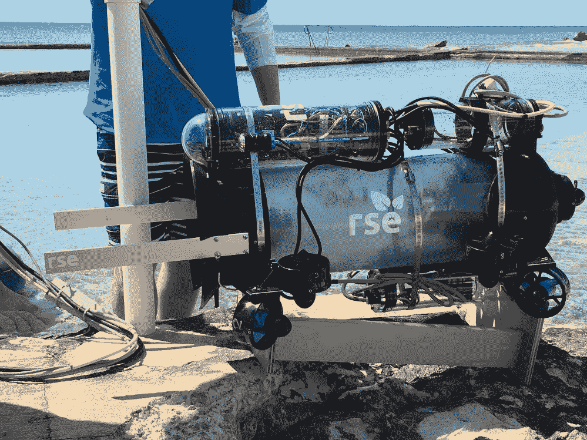

# iRobot 的首席执行官共同创建了一个非盈利组织，该组织制造机器人，旨在为狮子鱼吸尘

> 原文：<https://web.archive.org/web/https://techcrunch.com/2017/04/19/rse-guardian-lf1/>

在早期的演示视频中，Guardian LF1 在浅水中上下摆动，这是一个奇怪的透明圆柱体，由电缆牵引，下面有一对风扇。在昏暗的水中，当它小心翼翼地接近一条华丽的狮子鱼时，一对金属铲臂伸出前方。

当它把鱼放在靠墙的一侧时，这种动物似乎没有怎么反抗。当机器迅速将鱼吸进去时，齿轮的呼呼声被真空吸尘的噪音所取代。至此，机器人完成了它唯一的设计任务:吸食狮子鱼。

ROV 是[环境服务机器人(RSE)](https://web.archive.org/web/20230327235526/https://robotsise.com/) 的第一个设备，这是一个由 iRobot 首席执行官 Colin Angle 和 Science from Scientists 创始人 Erika Angle 组建的新的非营利组织。

“他们都是潜水高手，大约 18 个月前，他们和一些朋友去百慕达潜水，”RSE 执行董事约翰·里齐告诉 TechCrunch。“在潜水时，他们遇到了狮子鱼，这是一个相当大的问题。潜水休息时，他们回到船上，其中一个人说，'你是机器人学的，对吗？'你能造一个机器人来抓狮子鱼吗？"

原产于印度-太平洋地区，这种美丽的鱼已经成为世界各地海洋中不断增加的入侵物种，其中最有问题的是大西洋。“在大西洋这里，它们是在大约 25 年前被偶然引入的，而且它们没有其他捕食者，”里齐说。“它们是顶级掠食者。它们身上有 18 根毒刺。它们是贪婪的食客。”

里齐解释说，当它们以小鱼为食时，这些物种就特别成问题，小鱼通过保持珊瑚礁清洁在海洋生态系统中发挥着重要作用。它们好斗，疯狂繁殖。它们也几乎不可能通过传统的手段如鱼钩和鱼网来捕捉，因为它们往往会在洞穴里呆很长时间。

鱼叉捕鱼者可以捕捉狮子鱼，尽管这不是一种特别有效的方法，因为它们在深水中有住所。ROV 利用了顶级掠食者无所畏惧的天性，简单地快速接近鱼，用一个正面面板击昏它，然后把它吸起来。在返回水面之前，每个“机器人”都配备了多达 10 条狮子鱼。至于那些有毒的带刺的鱼上船后会怎么样，嗯，显然它们真的很好吃。

RSE 已经交付了“守护者”行动的证明，目前正在百慕达进行测试，里齐和他的团队本周正在百慕达水域航行，寻找狮子鱼。该团队已经收到了像温迪和埃里克·施密特的施密特家庭基金会经营的施密特海洋研究所这样的组织的资助，以及来自天使的资金。

本周[还将在 Kickstarter】进一步资助该项目——它希望的第一批机器人将是许多旨在创造积极环境变化的机器人。](https://web.archive.org/web/20230327235526/https://www.kickstarter.com/projects/rse/worlds-first-eco-robot-protecting-reefs-from-lionf)