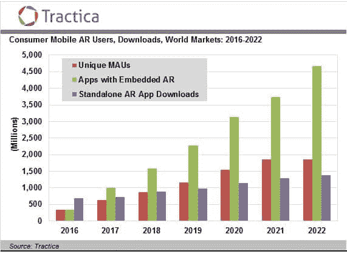

# 增强现实开发者消亡的传言被大大夸大了

> 原文：<https://web.archive.org/web/https://techcrunch.com/2017/06/27/rumors-of-the-demise-of-augmented-reality-developers-have-been-greatly-exaggerated/>

安德鲁·凯门多撰稿人

安德鲁·凯门多是

[Pair](https://web.archive.org/web/20230320184700/http://www.pair3d.com/)

.

随着苹果 ARKit 的宣布，我被 ARKit 对增强现实(AR)开发者意味着什么的问题轰炸，特别是那些构建硬移动 AR 技术的开发者。

我们，连同我们在 Modsy，[的朋友，甚至在最近的一篇 TechCrunch 文章](https://web.archive.org/web/20230320184700/https://techcrunch.com/2017/06/19/apple-just-created-and-killed-a-generation-of-ar-businesses/)中被称为被苹果“锁定”。所以让我先说清楚 arKit 对 AR 开发者市场的影响:它发展了这个市场。

**来自外界的 ARKit 历史**

ARKit 的推出是一个漫长的过程。苹果在 2015 年收购 Metaio 向 AR 社区的每个人发出了一个信号，即苹果正式向增强现实进军。Metaio SDK 虽然很好，但并不完全符合苹果的标准，所以我们认为还需要几年时间才能发布原生 AR 支持。在此期间，每个人都知道增强现实应用的市场会越来越大，SDK 也是如此，这是事实。

当 iPhone 7 发布时，我们预计苹果会发布一个 AR 框架，所以我们立即停止了 iOS 版 SDK 的进一步开发。然而，在后来与苹果团队的交谈中，他们希望在 AR 框架发布之前，更好地了解双摄像头如何用于更长的范围深度。

7 上相机之间的轴间距离实际上只能提供大约 18”的高质量深度回报，对于人像深度来说是好的，但对于更远距离的立体深度来说不是很好。

我们预计苹果会在双摄像头深度设置上加倍努力，我们认为苹果要么会修改 iPhone 8 的摄像头位置，要么会采用单目解决方案。

[基于 ARKit 支持](https://web.archive.org/web/20230320184700/http://www.iphonehacks.com/2017/06/list-iphone-ipad-compatible-arkit-ios-11.html)现在很明显，单摄像头(单目)SLAM 是他们正在实施的核心技术，尽管 ARKit 可能会在 7 上使用双摄像头做一些棘手的事情。随着传言 iPhone 8 将推出更好的深度硬件，他们仍然可以通过更强大的深度支持让每个人感到惊讶。

那么这对第三方 AR 开发者意味着什么呢？

已经为 iOS 开发了单目 SLAM SDK 的公司将需要淘汰该产品。差不多就是这样。考虑到全球有十几家公司在从事这项工作，这对 AR 市场的影响微乎其微。

事实上，ARKit 减少了他们投资组合中最大的成本之一，使他们能够专注于为 AR 中的一些更深层次的问题(即映射)构建工具和产品。

我们与 Wikitude、Kudan 和其他人一起填补了 Metaio 为 AR 开发者留下的漏洞。不过最终，AR 开发者社区中的每个人都知道硬件公司最终会将这些技术集成到他们的框架中，只是我们不知道什么时候。

**苹果不是唯一的增强现实玩家**

苹果正在扼杀第三方 AR 公司的推理忽略了一个事实，即苹果只是移动 AR 市场的一小部分。Android 缺乏强大的 SLAM 解决方案仍然是一个开放的问题，也是硬 AR 开发者的机会。

Android 生态系统如此多样化，以至于制作一个标准的单目 SLAM 框架比苹果必须处理的一小组摄像头要困难几个数量级。然而，我们预计谷歌将很快接受 AR 框架的挑战，所以从长远来看，Android SLAM 开发者不应该指望在这个市场上获胜。

[正如我之前所写的](https://web.archive.org/web/20230320184700/https://venturebeat.com/2017/04/29/facebooks-ar-studio-blows-the-market-wide-open/)，脸书引入 AR Studio 对 AR 开发者市场的影响至少和 ARKit 一样大，如果不是更大的话。

AR Studio 在所有脸书应用上的跨平台性质(安装量接近 20 亿)意味着用户的准入门槛大大降低——这是开发者经常忽视的一点。Snapchat 当然希望成为 AR 竞赛中的赢家之一，他们有一个良好的开端。如果 Snap 想要跟上，对 AR 开发者的支持和为独立开发者建立发布平台是至关重要的。

[人们认为苹果将尽力阻止在 iOS](https://web.archive.org/web/20230320184700/https://techcrunch.com/2017/06/13/augmented-reality-platform-wars/) 上的其他应用程序中使用 AR。苹果是否决定阻止脸书、Snap 或其他公司在其平台应用程序中构建 AR 体验，这是一个悬而未决的问题。这将是反竞争的，如果苹果采取这种方式，他们将面临来自用户和开发者的巨大阻力。

**增强现实不仅仅是深度追踪**

[正如我在](https://web.archive.org/web/20230320184700/https://virtualrealitypop.com/heres-what-it-s-going-to-take-for-augmented-reality-to-take-over-the-world-275db4aabe7)之前详细描述的那样，对于增强现实开发者来说，还有大量未解决的问题和机会。在向消费者提供 AR 体验的整个过程中，来之不易的经验非常有价值，市场仍然对大多数问题敞开大门。AR 领域 95%的成功来自于在 3D 建模和优化、内容基础设施、内容交付、渲染优化、用户界面、用户工作流和合作伙伴关系方面帮助用户和客户。最大的机会仍然在于将生态系统捆绑在一起，作为具有大规模地图、内容和硬件集成的基础设施。

预计随着新的 AR 硬件的出现，同样的争论将会出现，公司将需要快速预测和调整。AR 是一个如此巨大的机会和如此快速增长的市场，以至于理解用户以及他们如何与 AR 交互是获胜的关键。