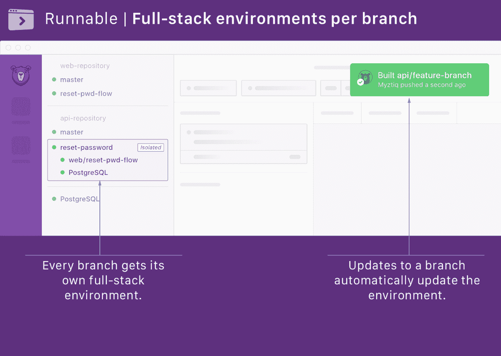

# Runnable 希望提高开发人员的工作效率 

> 原文：<https://web.archive.org/web/https://techcrunch.com/2016/09/20/runnable-general-availability/>

早在 2013 年， [Runnable](https://web.archive.org/web/20221206230937/https://runnable.com/) 成立时的使命是成为代码的“[YouTube](https://web.archive.org/web/20221206230937/https://beta.techcrunch.com/2013/10/02/runnable-wants-to-become-the-youtube-of-code/)，允许用户在其网站上查找和运行代码片段。然而，时过境迁，这家资金雄厚的公司如今正朝着一个略有不同的方向发展。Runnable today 是一个面向企业的工具，这些企业希望让他们的开发人员能够为每个代码分支快速构建全栈环境——从今天开始，这项服务将停止测试并正式推出。

Runnable 首席执行官兼创始人 Yash Kumar 在今天的公告中表示:“我们从代码片段社区获得的巨大反响是，他们的专业开发工作流需要按需环境。“我们很高兴今天所有开发团队都可以使用它。”

该服务仍然由库马尔领导，但随着新总裁首席运营官·肯·奥洛夫森和董事会成员埃里克·惠特曼的上任，该公司现在还引进了两名具有多年直接向开发商销售经验的前 Atlassian 员工。奥洛夫森在 Atlassian 的大部分时间都在从事开发工具和 JIRA 营销方面的工作，而惠特曼则是那里的开发工具总经理。

“如今，应用程序被构建成许多小部件，许多组件和微服务，开发人员现在在小团队中处理应用程序的小部件，但实际上，他们直到将组件运送到登台环境时，才看到组件在整个应用程序中的工作，”Olofsen 上周在一次采访中向我解释道。“转移服务器成为了这个瓶颈，每个人都在准备测试他们的变化。Runnable 真正让您做的是为每个代码更改或分支创建这些按需环境。”

为了绕过这个瓶颈，Runnable 为 GitHub 上的每个代码更改或分支创建了一个按需环境，该环境的特点是具有完整应用程序的全堆栈环境。可运行性使这些环境在 AWS 上运行，整个过程通常只需要半分钟左右。

对于一些团队来说，这可能意味着要运行数百个这样的环境，但是 Runnable 的卖点之一是，它只根据您需要多少应用程序模板而不是根据您运行的环境收取固定的费用(从每月 9 美元开始)。

“随着行业的发展和环境变得更容易获得，对开发者来说，管道的概念将会消失，”威特曼指出。

从某种意义上说，Runnable 的到来正是时候。容器现在可以很容易、快速、相对实惠地加速这些短暂的环境，让开发人员可以测试他们的代码。与此同时，即使是企业现在也知道他们必须走得更快(甚至他们也开始接受微服务的想法)。

Runnable 目前的客户群包括像 Cratejoy、DoorDash、Hitch 和 Udemy 这样的公司。这家总部位于旧金山的公司目前有 1000 万美元的资金。

https://www.youtube.com/watch?v = BX5iPEWSrnY