# 我们能从 3500 个意在煽动美国政治的俄罗斯脸书广告中学到什么

> 原文：<https://web.archive.org/web/https://techcrunch.com/2018/05/10/russian-facebook-ads-house-intelligence-full-list/>

周四，众议院情报委员会的民主党人发布了一批由俄罗斯政府资助的针对美国选民的脸书政治广告。虽然我们之前已经通过委员会的[先前发布的](https://web.archive.org/web/20230315095314/https://democrats-intelligence.house.gov/hpsci-11-1/hpsci-minority-open-hearing-exhibits.htm)看到了广告的横截面，但意识形态操纵的广度在超过 3500 个新发布的广告中得到了充分展示——这还不包括仍未发布的、分享相同分裂目标的免费内容。

在观看了从 2015 年到 2017 年底的广告后，一些明显的趋势出现了。

### 俄罗斯关注美国黑人

这些广告中有许多是针对美国黑人的。从我们审查的相当大的广告样本来看，美国黑人显然是特别感兴趣的，可能是为了升级潜在的种族紧张关系。

这些广告中有许多是为了纪念被警察杀害的美国黑人。其他人只是想激起黑人的自豪感，比如其中一个引用了安吉拉·戴维斯的话。“黑人事务”在 2015 年 6 月发布的一则广告针对的是密苏里州弗格森的居民，并且只展示了图帕克的“加州之恋”的歌词。大约在这个时候，许多广告瞄准了巴尔的摩和圣路易斯地区的脸书黑人用户。

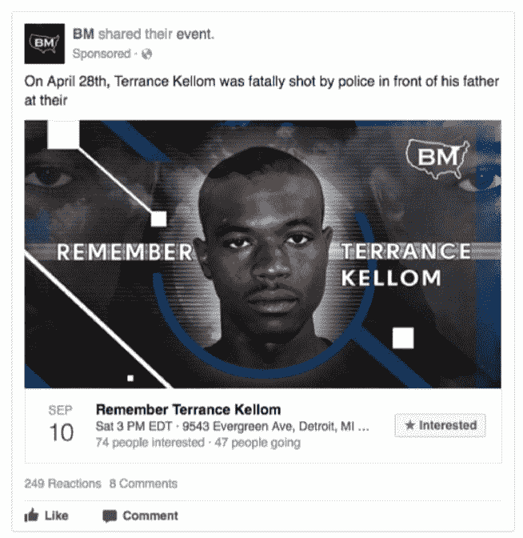

一些 Instagram 广告使用脸书的个人资料信息，针对对黑人权力、马尔科姆·Ⅹ和新黑豹党感兴趣的黑人选民。在 2016 年 11 月 8 日之前的日子里，其他广告专门针对美国黑人，传达反克林顿的信息。

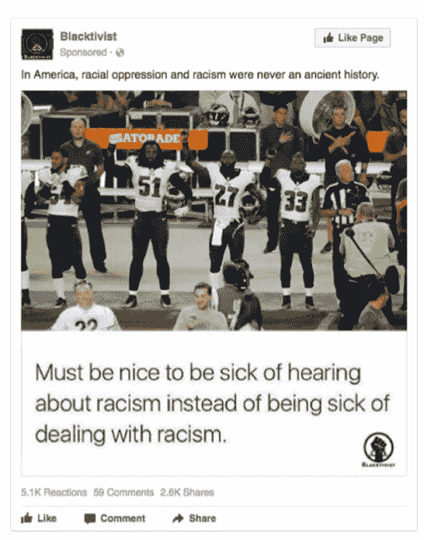

### 并不是所有的帖子都有分歧(尽管大多数是这样)

虽然大多数广告都迎合了明显的意识形态议程，但这些帖子偶尔会被更中性的内容打断。争议较少或呼吁行动风格的帖子可能旨在缓冲政治分歧的内容，有助于随着时间的推移建立和发展账户。

对于经过多年增长的账户，一些“中立”的帖子可能有助于使它们看起来合法，并在追随者中建立信任。一些针对 LGBT 用户和其他基于身份的群体的帖子只是分享了针对这些群体的积极信息。

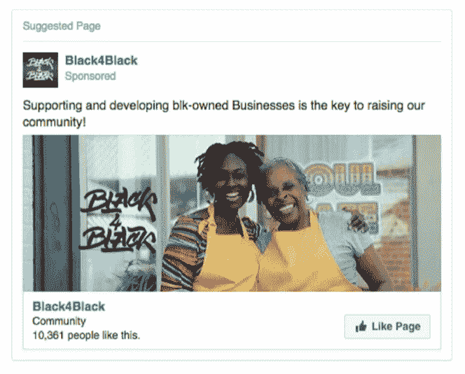

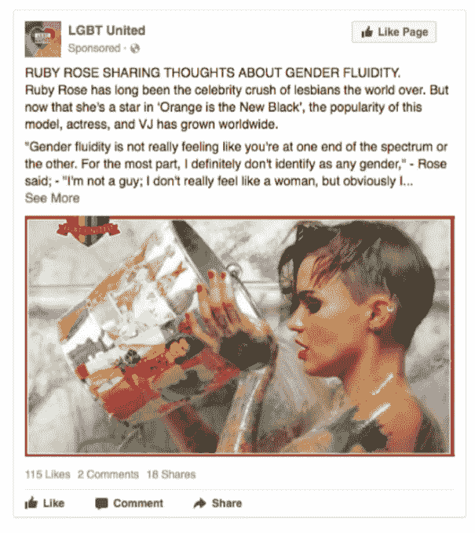

### 广告针对媒体消费者和地理区域

我们遇到的一些广告以 Buzzfeed 读者为目标，尽管它们莫名其妙地更加以迷因为导向，而不是政治性质的。其他人则关注喜欢《赫芬顿邮报》黑人之声栏目或肖恩·哈尼蒂的脸书用户。

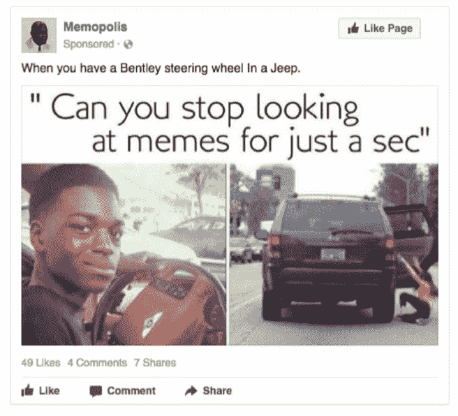

许多针对黑人选民的广告瞄准了黑人人口众多的美国主要城市(例如巴尔的摩和新奥尔良)。其他以地理为中心的广告利用了德州的自豪感，呼吁德州人脱离联邦。

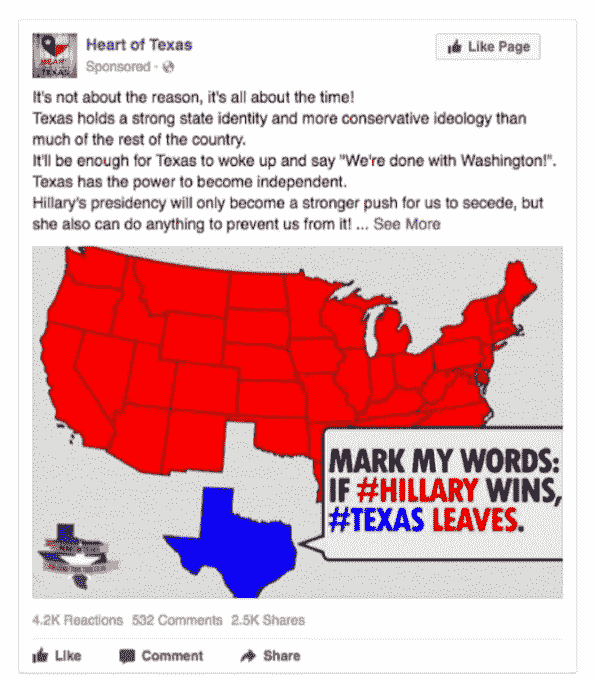

### 保守派在许多问题上成为众矢之的

我们已经从广告预览中知道了这一点，但新的广告集清楚地表明，许多利益集团的保守的美国人经常成为目标。这一目标集中于煽动爱国情绪，有时是反克林顿、持枪权、反移民和宗教立场的民族主义情绪。一些定制的账户直接与退伍军人和保守的基督徒对话。自由主义者也是单独的目标。

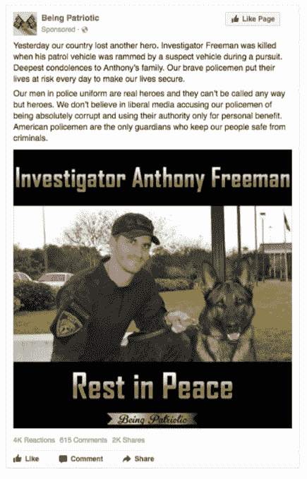

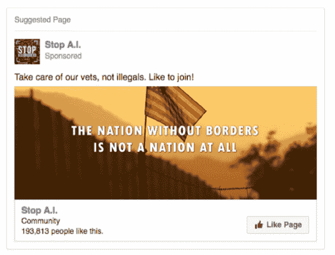

### 事件集合了竞争原因

在俄罗斯购买的广告中，基于事件的帖子在 2016 年变得相当频繁。选举后的第二天，一场活动呼吁在联合广场举行反特朗普集会，尽管另一则广告呼吁特朗普的支持者在特朗普大厦外集会。在另一个例子中，广告宣传了纽约市支持碧昂斯和反对碧昂斯的活动。

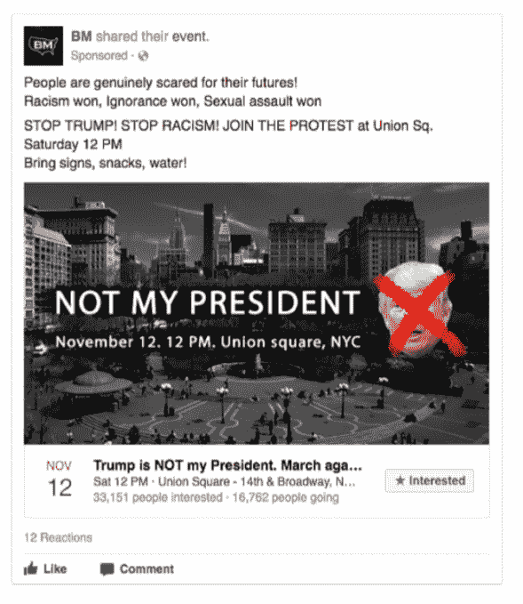

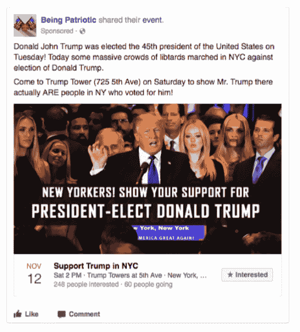

### 候选人广告大多支持特朗普，反对克林顿

与[情报机构对](https://web.archive.org/web/20230315095314/https://www.dni.gov/files/documents/ICA_2017_01.pdf)2016 年美国大选期间俄国意图的评估一致，在候选人中，抨击希拉里的帖子似乎占了上风。支持特朗普的广告相当常见，尽管其他广告也激起了反特朗普的情绪。几乎没有反对伯尼·桑德斯的广告，甚至在希拉里赢得提名后，一些广告仍转而支持桑德斯。2016 年 8 月，来自账户 Williams & Kalvin 的一则广告谴责了两位总统候选人，可能是为了阻止黑人选民的投票。在这种情况和其他情况下，帖子呼吁选民完全忽略选举。

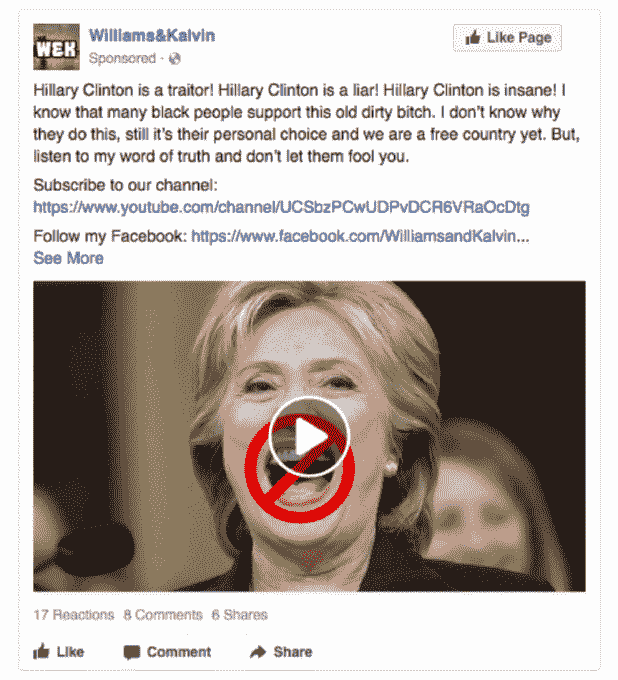

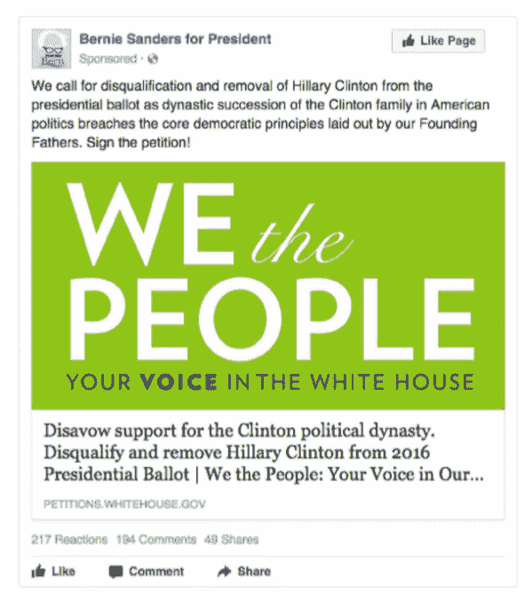

虽然像[诚实广告法案](https://web.archive.org/web/20230315095314/https://techcrunch.com/2018/04/10/twitter-honest-ads-act/)这样的努力正在不断增加，以打击外国支付的社交媒体对美国政治的影响，但今天众议院英特尔发布的范围和多样性表明，美国人在社交平台上接触挑衅性的、党派意识形态内容之前最好暂停一下——至少当它来自未知来源时。