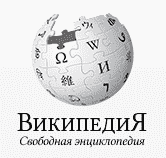

# 俄罗斯维基百科编辑在网站被列入俄罗斯黑名单后权衡选择 

> 原文：<https://web.archive.org/web/https://techcrunch.com/2015/08/24/russian-wikipedia-editors-weighing-options-after-site-is-blacklisted-in-russia/>

**更新 8/25:** 截至周二上午，俄罗斯维基百科已被俄罗斯政府从互联网黑名单中移除。

在国务院发布的[公告中，Roskomnadzor 表示，经过某些编辑后，该网站不再违反俄罗斯法律:](https://web.archive.org/web/20230217185339/https://translate.google.com/translate?hl=en&sl=ru&u=http://rkn.gov.ru/news/rsoc/news34302.htm&prev=search)

> 法院认定的信息禁止编辑。 关于麻醉药品“charas”的文章目前载于“维基百科”，根据俄罗斯联邦药物管制署的专家意见，并不违反法律。
> 
> 本参考文献中的这一法院判决被排除在禁止信息统一登记册之外。

维基媒体基金会发表了一份声明回应网站的解封，其中部分内容如下:

> 8 月 24 日，我们听说 Roskomnadzor 指示互联网服务提供商从 午夜 开始屏蔽俄语维基百科。我们在 Twitter 上看到一些报道，称俄罗斯某些地区的用户访问维基百科有困难。我们的工程团队也看到了俄罗斯部分地区断电的迹象。
> 
> 第二天早上在俄罗斯，Roskomnadzor 发布了一份公开声明，称该文章不再违反俄罗斯法律。该机构将维基百科从黑名单中移除。
> 
> 维基百科是世界上最大的免费知识资源。它由世界各地的志愿者编辑组成的专门社区编写和维护。维基媒体社区确保文章符合准确性、可验证性和中立性的原则。如果一篇文章不符合维基百科的政策和准则，任何社区都可以选择对其进行审查、修改或完全删除。
> 
> 当政府试图审查维基百科时，当地的读者和编辑群体通常会强烈反对这些行动。确保维基百科上的内容符合准确性、可验证性和中立性的原则一直是维基媒体编辑社区的目标。我们支持俄罗斯维基百科社区和所有维基媒体社区努力向全世界免费提供准确、中立和可靠的信息。

* * *

俄罗斯政府已指示该国所有互联网服务提供商屏蔽俄罗斯维基百科，此前他们要求删除一篇关于准备毒品的帖子的请求遭到拒绝。

“今天，我们听说负责监督俄罗斯通信的俄罗斯机构 Roskomnadzor 指示互联网服务提供商屏蔽俄罗斯维基百科。支持维基百科和其他项目的非营利组织维基媒体基金会在一份声明中说，对维基百科内容的审查与维基媒体的愿景背道而驰:在这个世界里，每个人都可以自由地获取所有知识的总和。

俄罗斯维基百科目前拥有超过 100 万篇文章，每月浏览量超过 10 亿次。

维基媒体在发给 TechCrunch 的一份声明中详细描述了这篇违规文章的主题:

> 上周，当 Roskomnadzor 就俄罗斯维基百科上一篇关于一种大麻的文章发布通知时，我们第一次了解到了一个可能的封锁。通知称，该文章包含如何制备该物质的信息。通知要求维基百科删除这篇文章。

Roskomnadzor，本质上是俄罗斯的联邦通信委员会，最近一直在打击有关药物使用的帖子。本月早些时候，在发布了一篇详细介绍如何种植迷幻蘑菇的帖子后，该部门短暂禁止该国许多用户使用 Reddit。在这种情况下，Reddit 立即遵守俄罗斯政府的规定，阻止俄罗斯人访问该网站，随后被解禁。

这里的情况有很大不同。首先，维基媒体基金会是一个非营利组织，允许他们在面对政府入侵时在言论自由问题上更加直言不讳。接下来，如何进行的决定不在维基媒体董事会成员手中，而是由俄罗斯维基百科的实际编辑来决定。

据维基媒体报道，俄罗斯维基百科的编辑们目前正在讨论如何在这种情况下更好地前进，他们已经在寻求以保持自己标准的方式来收紧有问题的文章。

“俄罗斯维基百科社区就该通知和文章展开了积极的讨论。编辑对文章做了重大修改，增加了更多信息和可靠来源的引用，使其符合维基百科的中立和可靠标准。该社区还在俄语维基百科上添加了通知横幅，向用户指出该网站可能被屏蔽。”