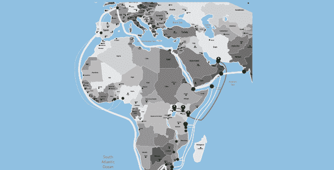

# 卢旺达的科技创新证明非洲政府能够催化创新

> 原文：<https://web.archive.org/web/https://techcrunch.com/2016/10/31/rwandas-tech-initiatives-prove-african-governments-can-catalyze-innovation/>

卢旺达政府与总部位于加州的初创公司 [Zipline](https://web.archive.org/web/20230321042810/http://flyzipline.com/product/) 合作，最近启动了世界上首个国家无人机送货计划。

在当地技术人员和国际媒体观众的注视下，保罗·卡加梅总统在卢旺达穆汉加区的一个无人驾驶机场，通过平板电脑控制的发射器进行了首次飞行。这一场景与 22 年前的媒体形象形成鲜明对比，当时卡加梅身穿军装，正领导这个国家走出内战。

自 20 世纪 90 年代以来，卢旺达取得了长足的进步。成为一个技术中心是该国的国家优先事项的核心。卢旺达与硅谷一家无人机初创公司的合作显示了非洲国家塑造 [ICT](https://web.archive.org/web/20230321042810/http://techterms.com/definition/ict) 政策的潜力，这些政策通过全球应用催化创新。

自 10 月 13 日^日上线以来，Zipline 的无人驾驶飞行器每天向卢旺达 21 个地方运送 50-150 次关键医疗物资(主要是血液和疫苗)。小型飞行器从定制的“无人机巢穴”起飞，通过降落伞空投货物，然后返回基地——由连接到卢旺达 3G 网络的 Zipline 加州导航系统进行数字导航。

“这是第一个此类项目，”Zipline 的联合创始人凯勒·里瑙多说。他指出，世界各地已经有一些无人机送货演示，但没有一个像卢旺达的操作一样。“我们在全国范围内运营商业服务，得到了国家监管机构的批准，客户每天都在付钱给我们。”

尽管 Zipline 的简介听起来像是一家社会企业，但它是一家盈利实体。Rinaudo 和他以前的哈佛同学 Will Hetzler 在发现了一个以更低的价格和更快的速度提供基本医疗产品的市场后，成立了这家公司，特别是在偏远地区和基础设施落后的地区。

Rinaudo 估计，非洲紧急卫生物流的价值超过 10 亿美元。在卢旺达，政府按每次递送向滑索支付费用。该公司的愿景是扩大其在卢旺达的业务，然后扩展到整个非洲大陆，全部盈利。

Zipline 已经从投资者那里筹集了 1900 万美元的风险投资，投资者包括红杉资本、谷歌风投、微软联合创始人保罗艾伦、雅虎联合创始人杨致远和 T2 减法资本。该公司在旧金山郊外的一个私人设施测试其由机器人工程师定制设计的无人机。

当 Zipline 的 eureka moment 在一次坦桑尼亚之旅中来到 Rinaudo 时，前*经济学家*非洲记者和 Red Line 无人机创始人 [Jonathan Ledgard](https://web.archive.org/web/20230321042810/https://www.weforum.org/agenda/authors/jonathan-m-ledgard) 的介绍将他带到了卢旺达。

“他非常了解卡加梅，并转达了卢旺达对这项技术如何在该国产生影响的愿景，”里瑙多说。Rinaudo 说，通过研究和会议，“我们发现卢旺达确实具有前瞻性和创新性，政府已经在技术和医疗保健方面进行了大量投资”。

因为这个原因，“它看起来像是一个自然的地方…来推出一些新的东西，”里瑙多说。卢旺达政府支持该国开发无人驾驶飞机操作系统。在 Zipline 的案例中，它给予了土地，并提供了与卫生部、国防部和民航局的合作。这符合该国促进信通技术模式以提高人民生活水平的承诺。

在非洲从经济脱节转向融入全球经济和技术进步的过程中，卢旺达一直是一个突出的例子。该国采取了电子政务服务举措，积极寻求与国际投资者的合作，并对其私营部门进行了重大改革。

卢旺达现在是世界银行经商便利度排行榜上排名最高的非洲国家——第 54 位，T4 第 5 位，领先于智利、卢森堡和希腊。政府仍然在民主和人权问题上受到指责(见其[镇压政治异议](https://web.archive.org/web/20230321042810/https://www.hrw.org/world-report/2016/country-chapters/rwanda)和卡加梅可能的第三个任期)，但它在塑造技术驱动的商业环境方面取得了不可否认的进展。

一张拍摄于 2014 年 7 月 24 日的照片显示了在基加利国际贸易博览会期间，手机上显示的与遥控无人机相机同步的鸟瞰图。
(摄影:CYRIL NDEGEYA/AFP/Getty Images)

“卢旺达是一个新兴国家，”青年与信息通信部长 Jean Philbert Nsengimana 告诉 TechCrunch。“我们的发展战略从一开始就很明确，信息和通信技术将是我们转型的基础之一，”他说，指的是卡加梅总统在 2000 年启动的该国 2020 年愿景计划。该计划提出了将卢旺达转变为“以知识为基础的……中等收入国家”的目标，将“科学和技术”作为对企业和政府的“交叉影响”。

也许实现这一目标的最基本步骤是建立一个专门负责这一问题的部。除了南非和博茨瓦纳之外，政府对信息和通信技术投入大量资源是撒哈拉以南非洲相对较新的趋势。肯尼亚在 2010 年率先完成了东非海洋系统海底光缆项目。

这些团队增加了东非的宽带，并促成了肯尼亚[信息与通信技术管理局](https://web.archive.org/web/20230321042810/http://www.icta.go.ke/)的成立。两者都为信息技术的成功(即移动货币)奠定了基础，这也为肯尼亚赢得了“硅草原”的绰号。

肯尼亚和卢旺达 ICT 管理机构的成立和[非洲新兴技术运动](https://web.archive.org/web/20230321042810/https://techcrunch.com/2015/07/23/the-rise-of-silicon-savannah-and-africas-tech-movement/)促使其他政府，如尼日利亚、加纳和坦桑尼亚，充实更加明确的国家技术战略。

恩森吉亚马纳部长欢迎非洲大陆增加国家竞争以促进创新。他认为这是“所有非洲国家应该做的正确的事情”，并指出卢旺达希望成为领导者。

“我们最终应该形成一个星座，在那里，整个地区有许多科技中心，”他说。“但是在任何星座中，并不是所有的星星都有同样的光辉。我的工作是确保基加利和卢旺达成为最辉煌的，但绝不是唯一的明星。”

卢旺达正在公布一些辉煌的信息和通信技术成就。根据政府统计数据，中国的互联网普及率将很快达到 40%，而三年前还不到 10%。

这一改善主要得益于国家对 4500 公里长的光纤网络投资超过 1 亿美元。卢旺达正在全国范围内推广其 4G LTE 计划，并且是经济实惠的互联网价格指数联盟排名最高的非洲国家。

在教育方面，卢旺达通过其[每个孩子一台笔记本电脑](https://web.archive.org/web/20230321042810/http://wiki.laptop.org/go/OLPC_Rwanda)计划以及与卡耐基梅隆大学的合作，在小学和大学阶段采用了技术，卡耐基梅隆大学创建了一个基加利校区，提供计算机科学和 IT 方面的高级学位课程。

卢旺达的信息和通信技术倡议不胜枚举。该国通过其基加利经济特区为阿根廷硬件制造商 Positivo BGH 生产笔记本电脑。它正与合作伙伴爱立信一起主办一个由技术驱动的非洲智能城市项目。

明年，它将启动 1 亿美元的卢旺达创新基金，投资于早期科技创业公司。“引领无人机只是一个例子。我们也希望在其他尖端技术方面处于领先地位，如区块链等，”部长恩森吉亚马纳说。

在无人机送货方面，卢旺达进步的信通技术立场可能已经产生了一种具有先进经济影响的创新模式。

正如 TechCrunch 8 月份报道的那样，Zipline 的卢旺达项目引起了白宫无人机项目的关注，该项目已经开始测试无人机向美国偏远社区运送医疗用品。Zipline 首席执行官 Rinaudo 表示:“下个月，美国交通部长将参观我们的测试设施。“就上个月我们在卢旺达所做的事情而言，可能性发生了巨大的转变，尤其是在发达国家。”