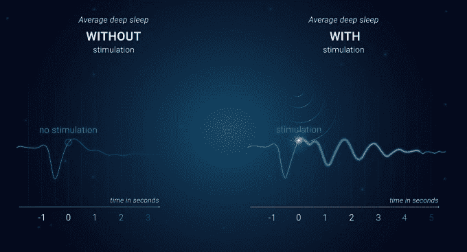

# Rythm 募集 1100 万美元用于改善睡眠的神经技术

> 原文：<https://web.archive.org/web/https://techcrunch.com/2016/03/29/rythm-raises-11m-to-pursue-sleep-improving-neurotechnology/>

法国初创公司 ry thm T1 周二宣布，该公司从私人投资者和公共拨款中筹集了超过 1100 万美元的资金。ry thm T1 生产一款据称可以改善睡眠质量的科技耳机。“Dreem”耳机于上个月发布，但只是原型形式——这笔资金应该有助于它在 2017 年初向消费者发布。

想法是这样的:许多恢复功能发生在你睡眠周期的最深阶段，对吗？但是这些周期很短，随着夜晚的到来会越来越短。Dreem 耳机使用音频来刺激大脑，延长深度睡眠周期，这可能会提高你的休息质量，也可能提高记忆力和其他认知功能。

在阅读了 Rythm 的白皮书后，我与该公司的联合创始人雨果·梅塞尔进行了交谈，这让我对该技术的科学基础有点怀疑。与严肃的实验室设备相比，小型化、可佩戴的脑电图仪就像玩具一样，用骨导音频影响大脑深层状态的想法在我看来是异想天开，直到我读到几项研究证实了这一点。大脑是一个非常神秘的器官。

【T2

目前，好处和方法都有点过时了，但是梅塞尔向我保证，白皮书已经过时了，而且自发表以来，已经做了大量的研究——还会有更多的研究。

“我们现在不发表是因为我们在申请专利，”他说。“我们希望有一个大的出版物，而不是一个小的，”和他们的科学家正在热追求更多更好的数据，其中如下。他还提到，不管怎样，他和我一样厌恶伪科学。

这笔资金是里坦姆的第一轮股权融资，形式是私人投资者投资 700 万€，公共投资者投资 300 万€。€获得 220 万英镑的后者来自于在法国世界创新大会上赢得个性化药物类别的两个阶段。Rythm 拒绝进一步细分投资数字或披露条件和其他细节。以美元计算，总额略高于 1100 万美元。

该公司首先与生物技术投资者洛朗·亚历山大(Laurent Alexandre)进行了交谈，梅塞尔将他比作法国人雷·库兹韦尔(Ray Kurzweil)——他是这些不可抑制的“超人类主义者”之一，仍然悲伤地停留在身体上，但谢天谢地，他已经准备好投资于优雅的方式来摆脱它。

一段时间以来，Alexandre 一直致力于神经科学与技术的接口研究，并对 Dreem 等非侵入式双向脑接口的长期前景感兴趣。他很早就给公司带来了€750，000 英镑，帮助这个概念起步。

另一个大投资者是泽维尔·尼尔，他是基马风险投资和 T2 1000 家初创公司 T3 的创始人。他更感兴趣的是产品本身——一种高科技的睡眠辅助工具，也可能发展到其他应用领域。

当然，这款设备还有很长的路要走，盈利能力也是如此——这两件事梅塞尔说他已经和他的投资者谈过了。

“我们知道，该产品是充分发挥作用，但它还不够成熟，不足以全面向消费者推出，”梅塞尔说。概念验证已经完成，下一步是大规模测试，该公司正在通过早期接入计划和与法国军方一起进行的临床试验来进行这一测试。这 1100 万美元将主要用于工程和研究，而未来的资金将支持营销和制造。

2017 年初是带有修正硬件的消费者版本的目标，到那时还会有更多的实验数据和科学报道——或者至少这是计划。

梅塞尔预计，随着公司的发展和试图打入健康和保健市场，还会有更多的投资。Rythm 目前正在避免与 Dreem 的严重医学索赔，官方表示它只是从总体上改善了睡眠质量(尽管它随后可以声称改善睡眠的好处)。但 Dreem 收集的数据足以检测睡眠呼吸暂停等疾病，因此未来寻求美国食品和药物管理局(FDA)和欧洲药品管理局(European Medicines Agency)的批准是一种明显的可能性。

我们的目标不仅仅是制造一个很酷的改善睡眠的设备，而是要建立，正如梅塞尔在公司的新闻稿中所说的，“世界上最大的神经技术公司”然而，要做到这一点，需要相当多的坚实的基础科学，这需要时间和金钱。期待在 2017 年产品发布会之前听到更多来自该公司的消息。