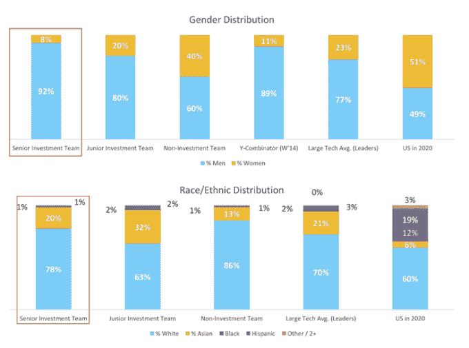
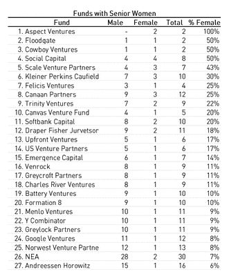
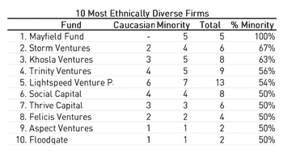
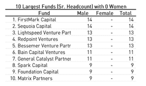
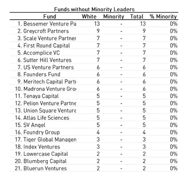

# 以下是美国风险投资公司的种族和性别多样性数据的详细分类

> 原文：<https://web.archive.org/web/https://techcrunch.com/2015/10/06/s23p-racial-gender-diversity-venture/>

 [查马斯·帕里哈皮提亚](https://web.archive.org/web/20230326193740/https://twitter.com/chamath)，这位固执己见的风险投资家[曾因收入不平等问题与罗恩·康韦](https://web.archive.org/web/20230326193740/https://techcrunch.com/2014/06/09/eruption-over-sf-housing-and-google-breaks-out-at-next-big-thing-conference/)发生公开口角[挑战创始人要有“搬到奥克兰的勇气”](https://web.archive.org/web/20230326193740/https://techcrunch.com/2015/09/17/chamath-palihapitaya-on-insane-burn-rates-ipos-and-raising-a-new-real-estate-fund/)[几周前，](https://web.archive.org/web/20230326193740/http://www.vcdiversity.org/)[在一份与订阅科技新闻网站](https://web.archive.org/web/20230326193740/http://www.vcdiversity.org/)[《信息](https://web.archive.org/web/20230326193740/https://www.theinformation.com/)合作的报告中，列出了整个硅谷风险企业的详细种族和性别多样性数据。

[Palihapitiya](https://web.archive.org/web/20230326193740/https://twitter.com/chamath) 的公司[社会+资本](https://web.archive.org/web/20230326193740/http://s23p.com/)和信息提取了代表超过 1600 亿美元管理资产的 71 家公司的数据，并揭示了*投资*领导层的种族和性别组合。这种区别很关键，因为许多公司都有女性或少数族裔，但她们可能担任营销或人力资源等非投资职位。例如，在调查中，女性在风险投资公司的非投资职位中占 60%，但在高级投资团队中仅占 8%。[(你可以在这里浏览整个数据集。)](https://web.archive.org/web/20230326193740/https://docs.google.com/spreadsheets/d/1GT5nUwbW7oPy0-dSAPCtmTF_rg5ug3CJRGpYFsGa-DQ/edit)

Palihapitiya 说，他这样做的动机是因为如果 Slack 这样的大型科技公司和初创公司开始更认真地对待多样性，那么资助它们的公司和投资者也应该如此。

在一篇名为[“Bros funding Bros:How Not Change the World One Delivery Service At A Time”的专栏文章中，他写道:](https://web.archive.org/web/20230326193740/https://www.theinformation.com/articles/bros-funding-bros-whats-wrong-with-venture-capital)

> “我们需要一个叫醒电话。我们需要重新发掘我们的潜力，打开大门。邀请更多的人参与决策:年轻人、黑人、拉丁美洲人、女性、同性恋者、双性恋者和其他不一定属于明显多数的人。让我们周围有更多不同的经历，也许我们会优先考虑更多不同的事情。也许我们会找到更多的勇气去做困难的事情。”

事实上，2014 年 5 月[谷歌终于披露了自己的数据](https://web.archive.org/web/20230326193740/https://googleblog.blogspot.com/2014/05/getting-to-work-on-diversity-at-google.html)之后，包括[苹果、甲骨文和雅虎在内的其他几家主要技术公司多年来一直拒绝根据联邦法律公开报告数据](https://web.archive.org/web/20230326193740/http://www.siliconvalley.com/news/%20ci_14382477)，由此开始的多样性对话不一定与数字有关。

关于美国社会的未来应该是什么样子，以及谁应该塑造这个未来，这是一个更基本的话题。如果少数以白人为主的男性正在建立或精心挑选接触全球数亿或数十亿客户的科技公司，这些产品和商业模式中存在哪些进一步加深不平等的缺陷？

随着科技行业从纯粹基于软件的公司转向接触和分配现实世界中有限资源的企业，如劳动力、交通、土地使用、房地产、医疗保健和教育，公平是公共政策制定者的主要关注点，这成为一个更加紧迫的问题。

以下是风险投资公司的性别和种族多样性的总体分类:

以下是基于投资领导层种族和性别构成的最多样化的公司:

以下是投资领导岗位上没有女性或少数族裔的公司:

 

然后，Social + Capital 计算出所有风险企业的量化排名，基于它们的性别和种族多样性，并按照管理的资产总额进行划分。

对于管理资产超过 10 亿美元的公司，Palihapitiya 名列榜首。对于中型企业，Y Combinator 名列前茅，其次是 Formation 8。对于管理资金少于 2.5 亿美元的公司，排名最高的是 Floodgate，然后是 Cowboy Ventures。

Social + Capital 的数学公式在白人、黑人、拉丁美洲人和亚洲人之间平均分配了种族多样性，并没有特别强调代表性不足的少数族裔。

总的来说，相对于美国人口的比例，白人和亚裔美国人在大型科技公司和风险投资界的比例都过高。无论如何，社会+资本模式的选择都将是一个复杂的选择，因为“模范少数族裔”的叙事遮蔽了亚裔美国移民的故事。

Palihapitiya 希望公司和公众如何处理这些数据？

他说，这在很大程度上取决于他们。

VC 多元化最终展品作者金麦卡特勒

由 Kim-Mai Cutler 撰写的 VC 多样性方法记 VFinal