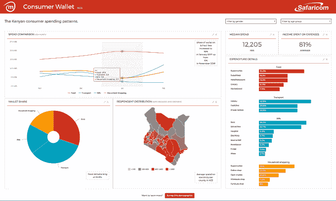

# Safaricom 和 mSurvey 推出消费者钱包，描绘非洲的现金经济

> 原文：<https://web.archive.org/web/https://techcrunch.com/2017/03/06/safaricom-and-msurvey-launch-consumer-wallet-to-map-africas-cash-economy/>

肯尼亚领先的移动提供商 Safaricom 与数据收集初创公司 T2 mSurvey 合作推出消费者钱包，这是一个利用手机和短信来描绘非洲现金经济的在线平台。

该产品的测试版将于本月在肯尼亚上线。Safaricom 和 mSurvey 正在与包括麦肯锡咨询公司在内的潜在客户和企业合作伙伴一起测试这款应用程序，mSurvey 首席执行官肯菲尔德·格里菲斯告诉 TechCrunch。

消费者钱包最早将于 2017 年 8 月在订阅和许可的基础上推出。“我们正在与一群潜在客户一起完善产品，以设计定价模型，”格里菲斯说。“我们沿着肯尼亚的道路前进，但也放眼更远的地方，因为我们不仅仅是在解决肯尼亚的问题，我们也在解决非洲的问题。”

格里菲斯指的是许多企业在量化非洲大陆消费者支出习惯和趋势方面面临的挑战，根据非洲开发银行的数据，非洲大陆超过 50%的经济活动和就业发生在非正规部门。

mSurvey 总部位于肯尼亚，自 2012 年开始运营，利用非洲向数字化的转变来更好地跟踪消费者的偏好。这家初创公司采用基于手机的调查来收集各种主题和细分市场的数据。mSurvey 已经从包括跨文化投资公司和阿尔法天使投资公司在内的支持者那里获得了种子和风险投资基金。Safaricom 的 Spark 风险基金也是投资者之一。

消费者钱包合作伙伴关系将 mSurvey 的数据研究功能与 Safaricom 的内部资源和分销网络相结合。Safaricom 是肯尼亚最大的电信公司，拥有 2500 万(65%)的移动用户。

除了其 M-Pesa 移动货币产品(通过 100，744 个代理网络被 1，660 万肯尼亚人使用)之外，该公司一直在向其移动网络添加基于消费者和小企业的产品。其中包括[数字电视](https://web.archive.org/web/20230313220412/https://www.safaricom.co.ke/TheBigBox/)、 [M-Kopa](https://web.archive.org/web/20230313220412/https://techcrunch.com/2016/04/28/solar-startup-m-kopa-leapfrogs-africas-electricity-grid/) 太阳能照明套件、Lipa-Na 账单支付服务和[小拼车应用](https://web.archive.org/web/20230313220412/https://techcrunch.com/2016/08/07/africa-roundup-kenyas-safaricom-takes-on-uber-orange-expands-pan-african-profile/)，后者现在正与优步展开正面交锋。

对于消费者钱包测试版测试，mSurvey 将使用日常短信和文本消息来跟踪从 Safaricom 移动用户中抽取的 1，000 人样本的现金支出。这将输入消费者钱包数据库，跟踪食品、交通、教育和住房等项目的偏好和支出。

消费者钱包的推出顺应了非洲消费者研究成为正式部门的趋势。欧洲许多核心经济体十年的增长和改革，以及零售业的扩张，推动了对更详细客户数据的需求。

过去十年，几家以消费者为中心的全球公司在非洲扩张，从 2011 年的沃尔玛到 2016 年的网飞和 T2 易趣。

大型全球性研究公司如[尼尔森](https://web.archive.org/web/20230313220412/http://www.nielsen.com/ssa/en.html)和欧睿信息咨询公司已经增加了他们的非洲消费者研究项目。一家美国公司 GeoPoll 也在 20 个非洲国家建立了数字调查服务和数据库。

格里菲斯表示，mSurvey 在 2016 年将其核心消费者研究平台扩展到了南非，并正在考虑进入赞比亚、加纳和尼日利亚等国家。虽然都没有指明国家，但 mSurvey 和 Safaricom 都计划将这种新的消费者钱包从肯尼亚市场推广到非洲大陆的其他国家。

Safaricom 首席执行官鲍勃·科利莫尔(Bob Collymore)在谈到新平台对寻求利用非洲大陆现金经济的企业的价值时表示:“要在非洲投资，你必须了解它的消费者。”