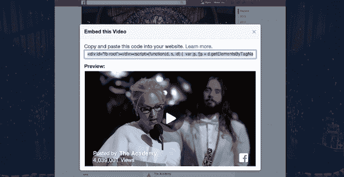
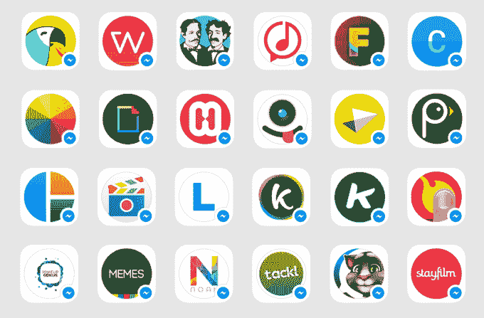

# 脸书发现作为一个家庭的力量，而不是一个应用程序

> 原文：<https://web.archive.org/web/https://techcrunch.com/2015/03/25/safety-in-numbers/>

F8 从一张全家福开始。但不是扎克伯格一家。脸书的产品。“脸书曾经是你手机上的一个蓝色应用程序，现在脸书是一个应用程序家族，”其首席执行官在展示不同家族成员的用户数量时说道。拥有 7 亿人口的脸书集团。有 7 亿的 WhatsApp。有 6 亿的信使。有 3 亿的 Instagram。族长脸书拥有 14 亿人口。

脸书认为力量不仅仅是一个社交网络，而是一个相互联系的经验家族——内部开发的、获得的和从外部挖掘的。

扎克的“家庭”引用的潜台词是，一个应用程序不能做所有的事情。在移动设备上，人们想要精益的、目的驱动的体验。把所有东西都塞进一个尺寸，会使它变得缓慢和臃肿。

但是，当你谈论试图连接地球上的每一个人时，一个单独专注的应用程序不可能满足多样化人口的多样化需求。扎克伯格解释说:“我们正在建立这个家庭，所以我们可以为人们想要分享的每一种方式提供独特的、世界级的体验。”

人多力量大。

## 后脸书时代

iOS 应用的早期脸书

脸书是一个网站，而不是一个应用程序。在 11 岁的时候，按照社会标准，它已经是彻头彻尾的老古董了，而且它的年龄已经开始显现了。普遍的看法是，青少年已经超过了脸书，或者至少是过去的样子。幸运的是，脸书预见到了这一点。

脸书家族是从收购 Instagram 开始的，insta gram 是与 Snapchat 并列的年轻人的新宠。它没有将 Instagram 推向脸书，也没有将其更名为脸书相机，而是让 Instagram 成为了 insta gram。如果人们不想阅读链接或处理脸书上个人状态更新的戏剧性事件，他们可以让漂亮的图片流过他们的眼睛。

随着手机成为人们联系的主要方式，脸书发现其消息系统的发展受到了阻碍，因为它被隐藏在主应用程序中。

当人们忙碌时，他们通常需要交流。在桌面上，消息是一个功能。在手机上，脸书意识到这是一个完整的应用程序——一个人可能会比新闻订阅使用得更多。因此它衍生出了信使号并取得了巨大成功。它以看似疯狂的 190 亿美元收购了 WhatsApp 直到消息传递成为智能手机的中心这一点变得显而易见。

扎克伯格今天早上说，五年前，脸书上的大多数内容都是文本。现在是照片，很快会是视频，最终会是虚拟现实和增强现实这样的沉浸式内容。如果未来的内容分享需要一个耳机，脸书需要一个，所以它收购了 Oculus。

通过组建家庭，脸书现在和将来都不会受到破坏。如果竞争对手控制了最大的照片分享或消息应用，他们可以利用这些作为楔子，撬动自己进入脸书的核心社交网络广告业务。但在家人的包围下，脸书基本上成功击退了这些威胁。

马克·扎克伯格宣称“人们想要分享的方式如此之多，这个家庭将会不断壮大。”

## 大家庭

尽管如此，脸书不能购买或建造一切。例如，Snapchat 拒绝了据报道至少 30 亿美元的收购要约。当脸书试图用 Poke 和 Slingshot 克隆 Snapchat 时，两次都以惨败告终。

但除了购买或建造，还有第三种选择:合作伙伴。这是脸书今天透露的策略。

信使报负责人大卫·马库斯在 F8 舞台上

几年前，它在网络上得出了同样的结论。它知道人们想在脸书做更广泛的事情，从使用公用设施到玩游戏，但它没有时间、资源，也不知道如何在内部创造这些东西。这导致了脸书的第一个平台。开发者获得了内置的用户群、病毒式传播和赚钱方式，脸书吸收了平台应用驱动的所有参与。

现在，脸书在移动通讯平台上做着同样的事情。它邀请了 40 多名开发人员开发配套应用程序，用于创建和发现通过 Messenger 共享的内容，从而扩大了家庭的范围。这一次，开发者在发现和病毒传播方面得到了帮助，脸书再次得到了他们吸引的所有参与。Messenger 的使用转化为平台锁定，推动显示广告的脸书新闻源的浏览量。

使用 Facebook Messenger 平台内容应用程序

玩过几个 Messenger 内容应用后，它们肯定不是脸书会开发的东西。有傻乎乎的 GIF 制作者的花招，在你的照片上叠加卡通动画或特殊效果的方法，或者录制假唱视频。

这就是全部的想法。到他们各自的 Messenger 应用程序。

更严肃的成年人可能喜欢分享 ESPN 的片段，而孩子们更喜欢创建自定义的表情符号。正如扎克伯格指出的那样，“人们需要能够与他们关心的所有不同群体分享对他们来说重要的东西，这就是我们如何给予人们权力，让世界变得更加开放和互联。”

这种方式类似于亚洲的单一聊天应用，如微信和 Line。通过让其他应用程序构建配套体验，他们加强了围绕其核心应用程序的社区。

F8 还公布了更多加入家庭的方式。网站现在可以整合一个改进后的实时脸书评论小工具，巩固公司的身份系统。他们可以将脸书的视频与 T2 的新嵌入式视频播放器 T3 联合起来，利用额外的浏览量吸引出版商将他们的内容发布到脸书上。并且[商家可以开始通过 Messenger 与顾客沟通](https://web.archive.org/web/20230404162627/https://techcrunch.com/2015/03/25/facebook-launches-messenger-platform-with-content-tools-and-chat-with-businesses/#fTw4kd:vII0)。

## 保持家庭团结

虽然 Messenger 平台今天掀起了巨大的波澜，但它并没有最负盛名的发布合作伙伴。只有少数开发 Messenger 应用程序的开发者，如 Giphy、Imgur 和 JibJab，已经拥有了一批健康的追随者。问题在于，知名公司是否愿意开发一款专用的信使伴侣应用程序，供脸书使用。

正如 Andreessen Horowitz 合伙人兼移动专家 Benedict Evans 明智地指出的那样:

当为 Messenger 开发更多应用时，管理平台的发现优势将会减少。如果这些应用看不到成为 Messenger 伴侣的商业优势，比如获得其主要应用的下载，他们可能不会费心去构建或维护另一套代码。

过去，保持合作伙伴的忠诚和被重视一直是脸书的痛处。

当 Zynga 降低其网络平台上的病毒传播时，它让 Zynga 这样的游戏公司陷入困境。《卫报》和《华尔街日报》的新闻阅读器应用程序在新闻订阅停止推广后被烧毁。脸书复制了基于它的应用程序的功能。随着脸书在 2009 年左右迅速改变其 API，平台的动荡震惊了开发者。脸书鲜为人知的 HTML5 应用平台在诞生后不久就被抛弃了。现在，页面管理员正在竭力反对，因为他们的新闻供稿范围在缩小。

为了悔过，开始了“开发者之爱行动”。去年 F8 的口号是“在稳定的基础上快速行动”，这是对其不太成熟的口号“快速行动，打破常规”的更新。它制定了为期一年的 API 稳定性保证，并强调新闻提要变化的透明度。

当我在 Messenger 负责人 David Marcus 的 F8 小组问答中问及 Messenger 将如何让开发者感受到价值时，他坚持认为“这个平台的美妙之处在于开发者得到了归属。如果你的朋友正在使用应用程序并与你共享内容，你可以下载该应用程序并与更多朋友共享。”

但是不可靠性的酸味很难从开发者的嘴里洗掉，现在一些病毒式传播可能还不够。扎克伯格总结道，“从单一服务转向一系列世界级应用是我们多年来做出的最大改变。”

如果脸书想要保持家庭完整，它必须证明自己对合作伙伴的承诺。该公司一直反驳开发商和营销人员的抱怨，称其优先考虑对最终用户最好的东西。如果受众被垃圾邮件、过时的功能或恼人的营销帖子所困扰，未来就不会有人使用脸书的合作伙伴应用了。

但就像一个真正的家庭一样，即使你有最爱，你也不能大声说出来。

当脸书还是个年轻的单身汉，在大学里蹦蹦跳跳的时候，除了自己，它不用担心任何人。但它正进入一个新的生活阶段，肩负着新的责任，它将不得不平衡对用户、广告商、开发者的感情，以及自己的底线。家庭并不总是容易的，但这是脸书的遗产得以延续的唯一方式。