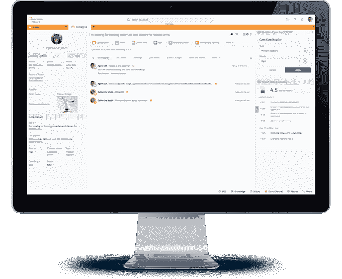

# Salesforce 为客户服务产品添加了一些人工智能

> 原文：<https://web.archive.org/web/https://techcrunch.com/2017/02/13/salesforce-brings-ai-to-service-cloud/>

# Salesforce 在客服产品中加入了一些人工智能

去年秋天，当 Salesforce 推出其人工智能计划 Einstein T1 时，它首次亮相时将一些智能内置于核心 CRM 工具中，但承诺随着时间的推移，它将扩展到其他产品中。今天，它宣布将爱因斯坦人工智能添加到其服务云客户服务平台。

目标是让客户服务代表和他们的经理的生活更轻松。对于销售代表来说，它提供的信息应该有助于他们更好地了解他们正在处理的客户的需求。对于经理来说，它旨在帮助他们更深入地了解客户服务中心的运营。最终目标是提高被称为 CSAT 的关键客户满意度指标。

对于客户服务代表来说，首先是如何将电话转接给他们。它使用底层智能根据已知信息将电话转接给最佳销售代表，并在销售代表与客户互动之前为他们提供一些背景信息。

所有这些都应该有助于 CSR 更好地完成他们的工作，更有效地服务于客户。他们还会在客户服务窗口的右侧获得一些数据，系统认为这些数据将有助于提高 CSAT 得分。

爱因斯坦案例管理窗口。照片:Salesforce

当你与客户打交道时，这可能是一个信息过多的情况，因为它迫使你查看爱因斯坦认为适合这种互动的分类。你还必须吸收几个数据点，爱因斯坦已经确定这些数据点可能会对预测得分产生影响。这很好，但是查看这些数据需要将您的注意力从客户身上移开。

无论如何，单个 CSAT 数据将被编译到客户服务经理的视图中，客户服务经理可以看到客户服务团队在任何给定时刻的代理可用性、队列大小和等待时间方面的表现。所有这些都有助于汇编和改进《非常重要的 CSAT 乐谱》。

一段时间以来，Salesforce 一直在开发其人工智能技术。正如[在九月](https://web.archive.org/web/20230321122905/https://techcrunch.com/2016/09/18/salesforce-turns-its-attention-to-artificial-intelligence-with-salesforce-einstein/)发布时我写的:

> 该公司召集了 175 名数据科学家来帮助创建 Salesforce Einstein，同时利用收购的 MetaMind、PredictionIO 和 RelateIQ 等公司。事实上，MetaMind 的创始人 Richard Socher 现在是 Salesforce 的首席数据科学家。Salesforce Einstein 最终会以某种方式接触到它的每一件产品。

事实上，今天的发布是最初愿景的延续，我们可以预计在未来的几个月和几年中，更多的 Salesforce 产品将获得爱因斯坦待遇。