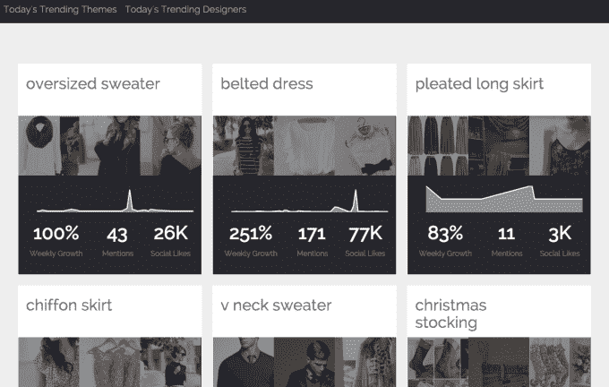

# Salesforce 已经收购了 AILA 虚拟营销助手 的创造者 MinHash

> 原文：<https://web.archive.org/web/https://techcrunch.com/2015/12/14/salesforce-has-acquired-an-ai-startup-called-minhash-to-build-out-its-marketing-analytics/>

# Salesforce 已经收购了 AILA 虚拟营销助理的创造者 MinHash

TechCrunch 获悉，Salesforce 已经收购了 [MinHash](https://web.archive.org/web/20230326023722/http://www.minhash.com/) 。Salesforce 向我们证实，它已经收购了这家位于帕洛阿尔托的年轻初创公司，该公司由两位数据科学工程师共同创立，他们以前在易贝和 Avaya 工作。

米纳什开发了一个人工智能平台和一个名为 AILA 的“个人助理”，可以在互联网的许多角落来回爬行，为营销人员找出相关趋势，并帮助他们围绕这些趋势构建活动。Salesforce 进行此次收购可能是为了为营销人员建立大数据分析，但它没有透露 MinHash 团队将致力于什么的细节。

该交易的财务条款尚未披露。

MinHash 是一家年轻的公司，没有筹集到超过一轮种子资金——其投资者包括雅虎前首席技术官[雷米·斯塔塔](https://web.archive.org/web/20230326023722/https://www.linkedin.com/profile/view?id=AAkAAAAA3bgBCqWDmLi7Q95L0tginlB2nhxq6I4&authType=NAME_SEARCH&authToken=LqBn&locale=en_US&trk=tyah&trkInfo=clickedVertical%3Amynetwork%2CclickedEntityId%3A56760%2CauthType%3ANAME_SEARCH%2Cidx%3A1-1-1%2CtarId%3A1450111106504%2Ctas%3Araymie%20stata)，通过他共同创立的 [Start Smart Labs](https://web.archive.org/web/20230326023722/http://www.startsmartlabs.com/) 孵化器，以及 [Amit](https://web.archive.org/web/20230326023722/https://www.linkedin.com/in/patniamit) 和 [Arihant Patni](https://web.archive.org/web/20230326023722/https://www.linkedin.com/profile/view?id=AAkAAAFjLBsBmYRA8uFrfZ9Rfrbb4i3l-KbWrL0&authType=NAME_SEARCH&authToken=7gHI&locale=en_US&trk=tyah&trkInfo=clickedVertical%3Amynetwork%2CclickedEntityId%3A23276571%2CauthType%3ANAME_SEARCH%2Cidx%3A1-1-1%2CtarId%3A1450111221458%2Ctas%3Aarihant) 。

尽管如此，随着许多营销人员寻求利用大数据分析和机器学习的进步来改善他们的工作，MinHash 已经与世界上最大的五家在线零售商合作，帮助他们开展营销项目。MinHash 主页上的一份确认出售的说明指出，客户将无法在 2016 年 1 月 21 日之后使用该平台。

虽然在那之后，MinHash 产品可能不再工作，但该公司的技术和四名工程师员工团队——联合创始人贾耶什·戈文达拉扬和那仁·奇塔尔，以及阿努普里特·卡莱和埃德加·维拉斯科——都将来到 Salesforce，在那里他们可能会重建一个版本的产品，作为该公司搜索和数据科学团队的一部分。

这可能包括跟踪用户行为和为特定受众创建兴趣图等功能；针对“长相相似”观众的聚类算法；扫描来源，自动呈现关键词和其他信号的趋势，并与一家公司现有的(和其他公司现有的)活动以及您提供给它的任何其他信息保持连续性。

也许最引人注目的是，米纳什的团队围绕 AILA 设计了整个产品，这个基于人工智能的角色根据使用者定制了一切。

“我们很高兴分享这个消息，MinHash 团队将加入 Salesforce，”MinHash 网站上的说明说。“在 Salesforce，我们将继续在更广泛的范围内追求我们对搜索、数据科学和机器学习的热情。”

除了一位发言人简单地说:“我们可以确认 MinHash 团队将加入 Salesforce”之外，我们已经联系了 Salesforce，以了解更多关于购买的细节

这是 Salesforce 的第 34 次收购，之前还有更广泛的大数据分析领域的其他几起收购，包括 2014 年以 3.9 亿美元收购的客户关系平台[RelateIQ](https://web.archive.org/web/20230326023722/https://techcrunch.com/2014/07/11/salesforce-buys-big-data-startup-relateiq-for-up-to-390m/)和今年早些时候的智能日历初创公司 [Tempo AI](https://web.archive.org/web/20230326023722/https://techcrunch.com/2015/05/29/salesforce-acquires-tempo/) 。

*文章更新，澄清 Salesforce 尚未确认 MinHash 团队将从事的工作。*