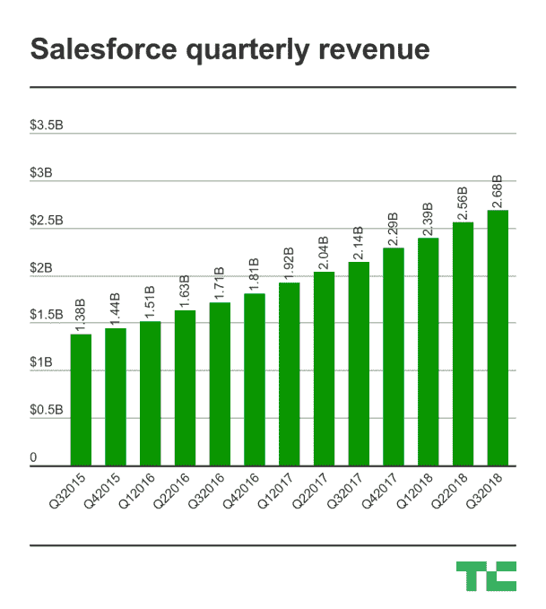
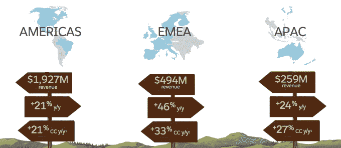
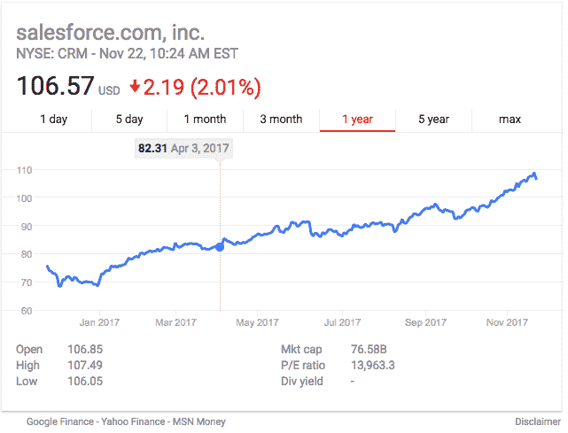

# Salesforce 又迎来了一个巨大的季度，它设定了 200 亿美元的收入目标 

> 原文：<https://web.archive.org/web/https://techcrunch.com/2017/11/22/salesforce-keeps-rolling-with-another-monster-quarter-as-it-sets-20-billion-revenue-goal/>

# 随着 Salesforce 设定了 200 亿美元的收入目标，它又迎来了一个巨大的季度

昨天， [Salesforce](https://web.archive.org/web/20221007230326/http://salesforce.com/) 宣布了[的季度收益](https://web.archive.org/web/20221007230326/http://investor.salesforce.com/about-us/investor/investor-news/investor-news-details/2017/Salesforce-Announces-Fiscal-2018-First-Quarter-Results/default.aspx)，消息再次传来，收入增长了 25 %,达到 26.8 亿美元。该公司[已经突破了 100 亿美元的年收入目标](https://web.archive.org/web/20221007230326/https://beta.techcrunch.com/2017/05/19/salesforce-marches-steadily-toward-10b-run-rate-goal/)，并大胆设定了到 2022 财年达到 200 亿美元的目标。我不会放过他们的。

该公司还宣布了一些重大的管理举措。稍后会详细介绍

Salesforce 是反 IBM 的。虽然蓝色巨人已经连续 22 个季度收入下降，但 Salesforce 在过去几年中一直稳步增长。从三年前到 2015 年第三季度，该公司的季度收入几乎翻了一番，从 13.8 亿美元增加到本季度的 26.8 亿美元

这是一个稳步上升的过程，比任何软件公司都更快地攀升到 100 亿美元，首席执行官兼董事长马克·贝尼奥夫完全有权利在财报电话会议上夸耀这一点。

“事实上，作为有史以来增长最快的企业软件公司，达到 100 亿美元，我们现在的目标是到 2022 财年将公司有机增长到 200 亿美元以上，我们计划成为有史以来增长最快的企业软件公司，达到 200 亿美元，”贝尼奥夫说。

该公司能够实现这种增长的一种方式是通过国际扩张。根据美国消费者新闻与商业频道的一篇文章，至少有一位分析师，Strategic Wealth Partners 的马克·泰珀(Mark Tepper)说，他会密切关注这个领域的进展。

泰珀一定对他所看到的很满意。Salesforce 的总裁、副董事长兼首席运营官基思·布洛克(Keith Block)表示，今年 40%的新员工来自美国以外的地区，这种投资似乎正在取得回报，海外的增长数字高于美洲。

照片:Salesforce

贝尼奥夫还宣布，去年以 7 . 5 亿美元收购 Quip 的[布雷特·泰勒在](https://web.archive.org/web/20221007230326/https://beta.techcrunch.com/2016/08/01/salesforce-buys-word-processing-app-quip-for-750m/)[成为总裁兼首席产品官](https://web.archive.org/web/20221007230326/https://beta.techcrunch.com/2017/11/21/salesforce-appoints-bret-taylor-as-chief-product-officer/)时获得了的晋升。“Bret 将推动我们的产品愿景、设计、开发和上市战略，”贝尼奥夫解释道。与此同时，曾经担任首席采购官的亚历克斯·戴恩被提升为总裁兼首席战略官。“亚历克斯将领导战略举措，在产品方向和转型方面与我们的客户更密切地合作，”他说。

这两项举措都旨在为公司带来新一代的领导层，这应该有助于 Salesforce 避免停滞不前或过于满足于其成功，但该公司确实有很多总裁，泰勒和戴恩加入了布洛克，首席财务官马克·霍金斯和首席人事官辛迪·罗宾斯都拥有这个头衔。总裁可能成为 Salesforce 的新副总裁。

Constellation Research 的创始人兼首席分析师王(Ray Wang)表示，这与其说是头重脚轻，不如说是公司选择区分某些高管角色的方式。“我认为看待这个问题的方式是他们有很多 CXO 症，”他说。他解释道:“区分高管和 CXO 的方式是总裁头衔，但晋升是理所应当的，这个头衔让他们与高管团队的其他人处于平等地位。”。

王还认为，泰勒在收购后证明了自己的勇气，赢得了冠军，大勇准备尝试不同的角色。“经过多年在产品和服务方面的磨练，亚历克斯现在可以专注于战略，”王说。

这种方法似乎奏效了。虽然该股今天上午略有下跌，但仅低于一年来的高点 107.49。目前还不清楚华尔街为什么没有对昨天的报告做出更积极的反应(至少暂时如此)，但该公司继续其增长轨迹，未来看起来很光明。

