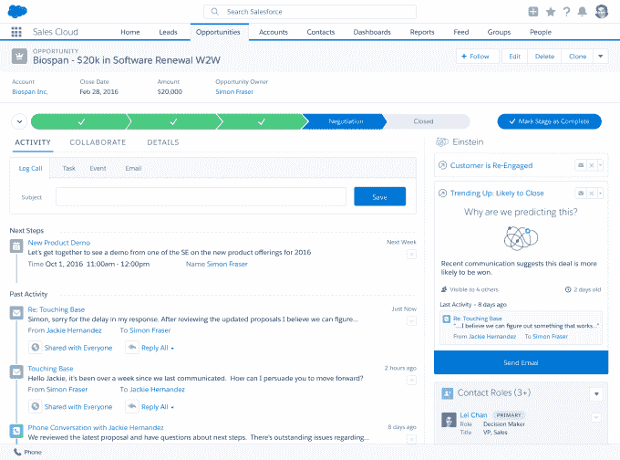

# Salesforce 用爱因斯坦人工智能展望未来 

> 原文：<https://web.archive.org/web/https://techcrunch.com/2016/10/20/salesforce-looks-to-the-future-with-einstein-artificial-intelligence/>

Salesforce 有着紧跟技术前沿的历史，所以它最近宣布了一项人工智能计划也就不足为奇了，它被称为爱因斯坦。

本月早些时候，我们在 Dreamforce 采访了爱因斯坦团队的一些关键成员，请他们为我们解释这项新技术。

Einstein 与其说是一个产品，不如说是支撑整个 Salesforce 平台的一套智能功能，虽然它现在支持的功能类型有些有限，但其想法是提供一个基础，公司可以在此基础上继续向未来添加新功能。

如今，Einstein 可以提供预测性线索评分和机会洞察等信息，这些信息可以提醒销售代表交易的趋势，许多 CRM 应用程序已经提供了一段时间的这种信息，但随着技术的发展，该公司认为 it 将发挥更大的作用。

正如 Salesforce 的 Einstein 总经理约翰·鲍尔解释的那样，它的真正目的是让用户的生活更轻松。“我们真正想做的是，通过关注重要的事情并给他们时间来改变人们的工作方式。”

传统上，销售代表被期望将关于他们的客户和他们的交易状态的数据输入到系统中，这是它被打破的地方。最终，输入这些信息会让销售人员脱离他们的生活，他们这样做没有什么好处。

爱因斯坦的目标是翻转这个模型，所以系统会为他们做很多工作，而不是花很多时间输入信息，因为它是智能的，它会提供关于下一步做什么的有意义的建议。

Salesforce 数据科学总监 Shubha Nabar 解释说:“人工智能可以将最重要的信息提交给高层，并说，‘嘿，这是你接下来需要做的事情’，这样销售人员就可以做他们最擅长的事情，即与客户联系，而不是花太多时间输入数据。”

销售云机会洞察。你可以在右边看到给销售代表的建议。图片: [Salesforce](https://web.archive.org/web/20221206153446/http:/www.salesforce.com)

问题变成了为什么人工智能现在占据了 Salesforce 和大部分软件行业的中心舞台。Salesforce 的首席科学家 Richard Socher(去年春天该公司收购 meta mind 时他来到了 T4)说，这是技术和计算能力在正确的时间完美融合。

“由于算法方面的一些小改进，人工智能变得非常有用，有了数据，有了基础设施和计算来真正做到这一点，”Socher 说。

很容易认为人工智能取代了人类，但销售人员是计算机和软件如何增强人类优势的完美例子——在这种情况下，与其他人互动，向他们出售东西。

虽然我们可能处于人工智能的早期，但我们应该开始看到该技术在未来 5 年或 10 年内成熟，对于 Salesforce 用户来说，这可能意味着更智能、更快速地工作，并知道下一步的最佳举措。