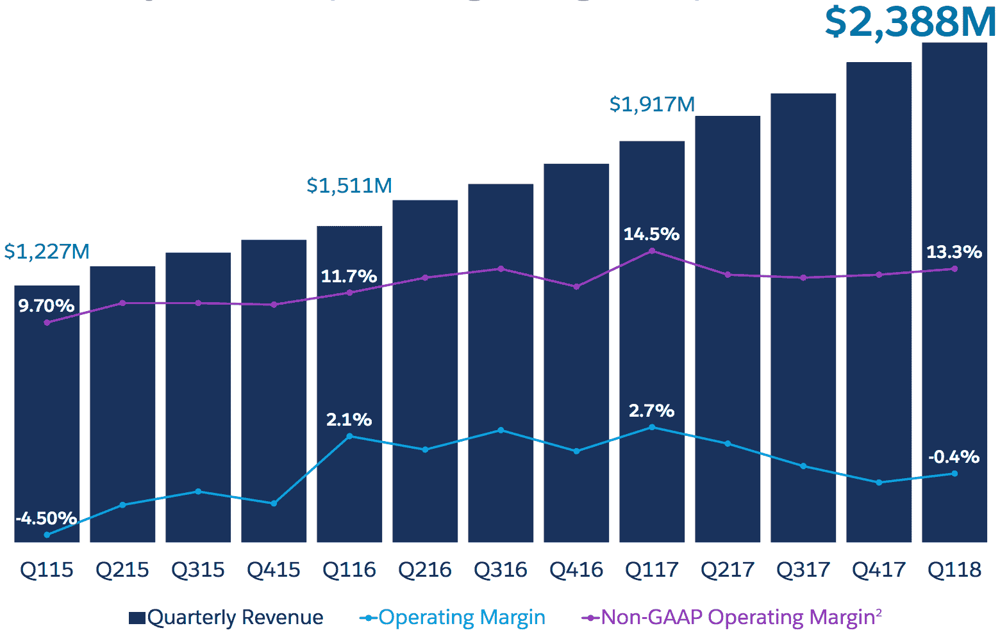
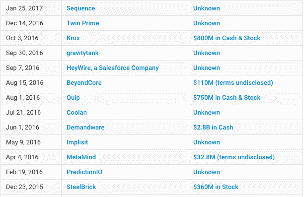

# Salesforce 稳步迈向 100 亿美元的运行率目标 

> 原文：<https://web.archive.org/web/https://techcrunch.com/2017/05/19/salesforce-marches-steadily-toward-10b-run-rate-goal/>

Salesforce 正朝着 100 亿美元的营收率稳步攀升。虽然还没到那一步，[最近一个季度近 24 亿美元的收入](https://web.archive.org/web/20221207205906/http://www.businessinsider.com/salesforce-crushes-earnings-raises-revenue-and-profit-outlook-2017-5)让它完全在附近。

据[公司首席执行官](https://web.archive.org/web/20221207205906/http://www.nasdaq.com/aspx/call-transcript.aspx?StoryId=4074580&Title=salesforce-com-s-crm-ceo-marc-benioff-on-q1-2017-results-earnings-call-transcript)马克·贝尼奥夫称，Salesforce 的收入增长结果使其成为“前五大企业软件公司中增长最快的”

很明显，Salesforce 在过去五年中收入增长惊人。投资者似乎对结果很满意，奖励公司本月新的股价记录。

所有这一切都回避了一系列简单的问题:是什么在推动 Salesforce 的增长，该公司可能会保持这种势头吗？

## 看着这些数字

该公司的第三季度表现出色，Salesforce 的收入、利润和未来增长都超出了投资者的预期。

关于顶线，Salesforce [收入](https://web.archive.org/web/20221207205906/http://www.businessinsider.com/salesforce-crushes-earnings-raises-revenue-and-profit-outlook-2017-5)23.9 亿美元，高于 23.5 亿美元的预期。在调整后的底线上，Salesforce 赚了 0.28 美元，高于 0.26 美元的预期。并且，该公司现在预计其当前 2018 财年的收入将在 102.5 亿美元至 103.0 亿美元之间，调整后每股利润在 1.28 美元至 1.30 美元之间，包括所有成本(GAAP)在内的每股利润在 0.06 美元至 0.08 美元之间。

重要的是，Salesforce 将在下一季度跨越收入里程碑。以下是该公司[详述其 2018 财年第二季度预期](https://web.archive.org/web/20221207205906/http://s1.q4cdn.com/454432842/files/doc_financials/2018/Q1/CRM-Q118-Earnings-Press-Release-w-financials.pdf):

> Q2 2018 财年指南:收入预计约为 25.1 亿至 25.2 亿美元，同比增长 23%至 24%。

在 25.1 亿美元或 25.2 亿美元的关口，Salesforce 将*跨越*100 亿美元的收入运行率关口。现在，并非所有的 Salesforce 收入都是纯订阅(SaaS)，因此我们不应将其全部收入称为经常性收入。因此，现在说该公司本季度的纯年度经常性收入(ARR)将突破 100 亿美元大关还为时过早，但该公司已经开始向之前宣布的目标迈进。

不管怎样，一张图片讲述了一个清晰的故事。从其最近的收益数据中，查看 Salesforce 收入图表。

同时，观察这条蓝色的小线离零有多近，我们可以把它看作是“盈亏平衡点”。通过保持接近于零，蓝线表明考虑到所有成本(GAAP)，Salesforce 在历史上从未从其运营活动中亏损或赚钱。这意味着它的日常业绩让它几乎没有钱。相反，随着 Salesforce 的成熟，它不断地对增长进行再投资。

图表:销售队伍

(作为对比，尽管有这样的运营利润率，该公司在过去几个财年的运营现金流增长一直令人印象深刻。)

除了公司的指导，它将在当前财年保持 GAAP 利润。因此，该公司将设法保持其持续增长，包括其最近的顶线击败，同时保持真正的盈利能力。

综上所述，不难理解为什么投资者对该公司最近的表现持积极态度。

## 吞没和吞食

当然，促成增长的一个因素是 Salesforce 的收购策略。根据 Crunchbase 的数据，去年，该公司继续大举收购，收购了令人震惊的 11 家公司，同时花费了至少 50 亿美元。今年，它在收购方面要安静得多，迄今只收购了一家公司。

图表:Crunchbase

这些收购不仅带来了技术和人才，还有助于扩大市场和增加收入(至少当他们做出明智的选择时)。这一战略似乎对 CRM 巨头奏效，因为收入继续稳步增长，从 2013 年的约 30 亿美元增长到本财年的近 100 亿美元。去年的收购包括大型交易，如 28 亿美元的[Demandware](https://web.archive.org/web/20221207205906/https://beta.techcrunch.com/2016/06/01/salesforce-buys-demandware-for-2-8b-taking-a-big-step-into-e-commerce/)、8 亿美元的[Krux](https://web.archive.org/web/20221207205906/https://beta.techcrunch.com/2016/10/03/to-beef-up-in-marketing-tech-salesforce-is-buying-krux-for-340m-in-cash-and-stock-potentially-750m-overall/)和 7.5 亿美元的 Quip，这些收购降低了他们的现金头寸，但有助于充实产品组合，带来新客户和额外收入。

下图显示了公司的总现金头寸(包括有价证券，这是富裕公司作为现金等价物使用的一种正常工具)随时间的变化:

图表:销售队伍

该公司在财报电话会议上讨论了这些收购的影响:“随着我们继续对我们的业务进行战略投资，我们的投资组合不仅变得更加强大，而且正如你所知，去年我们还收购了许多令人惊叹的公司，这些收购的整合非常成功，”贝尼奥夫在本周早些时候与分析师和记者举行的财报电话会议上表示。

## 生活在边缘

CRM Essentials 的合伙人 [Brent Leary 密切关注 CRM 行业，他告诉 TechCrunch，增长引擎的另一大贡献者是投资物联网和人工智能等新技术的意愿。](https://web.archive.org/web/20221207205906/http://www.crm-essentials.com/index_aboutus.html)

Leary 说，该公司正在全力以赴，部分原因是他们非常擅长宣传 CRM/客户参与的发展方向。“他们在传播人工智能方面领先于竞争对手，他们似乎总能引导行业内的对话，”Leary 说。

虽然 Leary 目睹了整个行业向人工智能的转变，但他说，去年在旧金山举行的大规模 Dreamforce 客户会议之前， [Salesforce 宣布了 Einstein](https://web.archive.org/web/20221207205906/https://beta.techcrunch.com/2016/10/20/salesforce-looks-to-the-future-with-einstein-artificial-intelligence/) 人工智能平台，之后对话才真正开始。Salesforce 经常利用这次会议作为跳板，向普通企业用户提供新技术，这些用户可能不知道新技术如何应用于他们。

Leary 预测，他们将基于去年的人工智能公告，推出更多的对话界面，如亚马逊的 Alexa。他认为这是去年对人工智能最初投入的逻辑延伸，符合贝尼奥夫对亚马逊所有事物的新发现的热爱。

“总体来看，CRM 似乎是企业空间中增长最快的类别。我认为人工智能和对话界面将在未来几年推动客户参与的加速和多产的变化。Salesforce 将自己定位在所有这些的最前沿，”Leary 解释道。

如果这是正确的，那么这种增长轨迹可能会继续。

## 孤岛式增长

该公司的收入分成四类。在查看公司的综合增长结果时，他们的结果有一个值得注意的对称性。

如您所料，趋势显示 Salesforce 的最小收入类别增长最快。事实上，收入类别的规模与增长速度之间存在反向关联。

你可以从该公司投资者网站的下图中看到这一点:

图表:销售队伍

这意味着，尽管 CRM 利基市场的增长速度和 Leary 预期的一样快，但该公司有其他收入可以支撑自身的增长。简而言之，该公司比乍看上去更加多元化。

然而，Salesforce 的成功表明其市场地位是有价值的。这一事实吸引了不少竞争对手，从初创公司一直到 Adobe 和微软，都是他们亲密的友敌。

当然，没有一家公司希望看到 Salesforce 再增加一美元。他们可能会失望地听到贝尼奥夫感觉 100 亿美元的运营成本触手可及，已经将[的下一个里程碑定在 200 亿美元](https://web.archive.org/web/20221207205906/http://fortune.com/2016/12/08/salesforce-ignite-cloud-strategy/)。