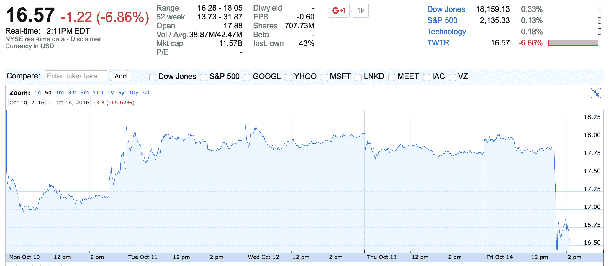

# Salesforce 这次正式放弃收购 Twitter 

> 原文：<https://web.archive.org/web/https://techcrunch.com/2016/10/14/salesforce-officially-walks-away-from-twitter-acquisition-for-real-this-time/>

# Salesforce 这次正式放弃收购 Twitter

Salesforce 希望让所有人都超级清楚——不，该公司不会收购 Twitter。Salesforce 首席执行官马克·贝尼奥夫(Marc Benioff)接受英国《金融时报》采访时表示，该公司[排除了收购](https://web.archive.org/web/20221029065225/https://www.ft.com/content/2c8cdd72-922c-11e6-a72e-b428cb934b78)。

“既然这样，我们就走开。贝尼奥夫对英国《金融时报》表示:“它不适合我们。如果你在寻找一个官方的确认，没有比这更官方的了。

两周前，[几乎所有的追求者](https://web.archive.org/web/20221029065225/https://beta.techcrunch.com/2016/10/06/twitter-shares-drop-20-as-takeover-rumors-fade-away/)同时宣布他们对 Twitter 根本不感兴趣。谷歌、苹果、迪士尼都不想再买 Twitter 了。Salesforce 是最后剩下的追求者。

虽然该公司本可以利用这个机会降低收购价格，但事实并非如此。在[投资者会议](https://web.archive.org/web/20221029065225/http://uk.businessinsider.com/salesforce-ceo-marc-benioff-not-buying-twitter-2016-10)期间，贝尼奥夫已经说过 Twitter 不适合 Salesforce。他最后甚至说“我祝杰克一切顺利。”

但许多人认为贝尼奥夫对收购 Twitter 的想法非常兴奋。到底发生了什么？Salesforce 的最大股东 Fidelity Investments 反对这笔交易。鉴于富达持有 sales force 14%的股份，在董事会同意的情况下收购 Twitter 将会很困难。这可能是贝尼奥夫最明智的决定。

在接受英国《金融时报》采访后，Twitter 的股价再次暴跌。股价下跌 6.86%，至 16.57 美元。Twitter 的市值现在是 116 亿美元。

