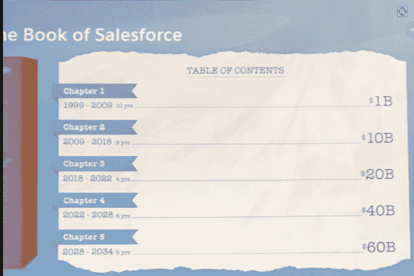

# Salesforce 希望到 2034 年实现 600 亿美元的收入目标 

> 原文：<https://web.archive.org/web/https://techcrunch.com/2018/01/04/salesforce-wants-to-be-a-60-billion-company-by-2034/>

# Salesforce 希望到 2034 年实现 600 亿美元的收入目标

我们都知道 Salesforce 设定了很大的目标。就在首席执行官兼联合创始人马克·贝尼奥夫(Marc Benioff)设定 100 亿美元目标的几年后，该公司最近刚刚实现了这一目标，但该公司无意就此止步，绝不可能。

在[今天发布在 Twitter 上的一张幻灯片](https://web.archive.org/web/20230122195954/https://twitter.com/BrentLeary/status/948950294205026304)中，首席技术官兼联合创始人 Parker Harris 向一群分析师做了演示，该公司透露，它还有更大的目标，要大得多。[我们都听说过到 2022 年达到 200 亿美元的目标](https://web.archive.org/web/20230122195954/https://techcrunch.com/2017/11/22/salesforce-keeps-rolling-with-another-monster-quarter-as-it-sets-20-billion-revenue-goal/?ncid=mobilerecirc_recent)，但是到 2028 年达到 400 亿美元，到 2034 年达到 600 亿美元怎么样？

https://twitter.com/BrentLeary/status/948950294205026304

在 Salesforce 看来，他们的收入目标就像一本书的章节。随着我们进入 2018 年，该公司刚刚开始第三章，即 200 亿美元的目标。除此之外，第四章和第五章提出了每六年增加 200 亿美元的目标。

图:CRM Essentials 的 Brent Leary

对任何公司来说，这都是一个相当大胆的目标。让我们面对现实吧，对于一家公司来说，收入达到 10 亿美元是一个巨大的成功，但设定 600 亿美元的目标是完全不同的事情。客观地看，甲骨文在 2017 年是一家价值 370 亿美元的公司(根据 Statista 的[)微软](https://web.archive.org/web/20230122195954/https://www.statista.com/statistics/269722/oracle-revenue-since-2005/)[去年是一家价值 900 亿美元的巨大公司](https://web.archive.org/web/20230122195954/https://www.microsoft.com/investor/reports/ar17/index.html)，所以这并不完全令人愤慨，但这可能需要该公司继续像 2016 年一样积极收购[，并在未来 17 年保持稳定的增长记录。](https://web.archive.org/web/20230122195954/https://techcrunch.com/2016/12/23/salesforce-asserted-itself-in-2016/)

该公司需要保持其市场领导地位，任何成功的公司都会告诉你，这并不容易做到，尤其是在一个聪明的新贵可以在你知道发生了什么之前削弱你的市场的时代。

但在这一点上，Salesforce 已经不是一家普通的公司了。它不仅仅是袖手旁观，保护自己的地盘。它继续创新并进行战略性收购，以保持自己处于技术变革的前沿，无论是人工智能还是物联网。

当公司保护自己的市场而未能创新时，它们往往会陷入困境。虽然 Salesforce 可能正在努力巩固其在客户体验所有领域的市场主导地位，但至少到目前为止，它还没有表现出停滞不前或未能创新的迹象。

没有一家公司会因为实现了一个目标就停下来，Salesforce 也不例外，但它不仅仅是为未来设定目标，它还设定了极其艰难的目标。没有人知道未来会发生什么，或者积极或消极的经济力量会对 Salesforce 乃至所有大型科技公司产生什么影响，但数字现在就在那里，要靠他们来执行。