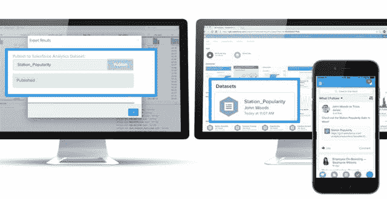

# Salesforce 帮助客户驾驭大数据平台浪潮 

> 原文：<https://web.archive.org/web/https://techcrunch.com/2015/05/28/salesforce-wants-to-ride-wave-to-big-data-platforms/>

[Salesforce Wave](https://web.archive.org/web/20230131003559/http://www.salesforce.com/analytics-cloud/overview/) ，[Salesforce.com 去年秋天发布的数据分析平台](https://web.archive.org/web/20230131003559/https://techcrunch.com/2014/10/12/salesforce-hopes-to-ride-the-analytics-wave-with-new-business-intelligence-service/)最初的构想是可视化 Salesforce 数据，但该公司总是对其产品进行修补。今天，它宣布了一系列连接器，将 Wave 与流行的大数据工具连接起来，其想法是将外部数据源引入平台。

合作伙伴包括 Cloudera、Google、New Relic、Hortonworks、Trifacta 和 Informatica。

Salesforce 正在提供这些平台的连接器，Salesforce Wave 管理员可以使用它将所需的数据放入 Wave，业务用户可以访问这些数据。

在拥有这些连接器之前，可以将这种类型的数据放入 Wave，但这需要大量的工作。连接器提供了一种更简单的方法，并在使用 Salesforce 工具的业务线和使用这些不同大数据平台的 IT 之间建立了一座桥梁。

Salesforce 从客户那里了解到，除了 Salesforce 平台上提供的数据之外，他们还希望将其他类型的数据引入 Wave。

“首先，我们正在为企业用户解决[一个问题]，”Salesforce Analytics Cloud 产品营销高级总监 Anna Rosenman 解释道。

来自营销、销售和服务的用户不会开始在这些其他平台上混日子，这些平台往往是数据科学家和开发人员的领域。最终用户能做的是问正确的问题。*如果我们能接触到 x 的信息不是很好吗？*

然后，Wave 管理员可以使用它，看看是否有可能回答这个问题，并让这些业务用户访问他们想要的数据。如果可以，连接器会让它们更快到达目的地。

问题是最终用户需要有必要的资源来问正确的问题，这可能是一个问题。他们可能不知道大公司内部存在什么类型的信息，甚至不知道它在使用什么工具。如果 Salesforce 的目标是弥合这一差距，那么这种沟通正在进行，或者销售、营销和服务人员会意外地提出正确的问题，这是一个巨大的信念飞跃

Rosenman 提供了一个来自 RFID 标签的数据作为例子。假设销售团队想要查看这些数据，并将其与 Salesforce CRM 数据库中的数据相结合。在这些连接器出现之前，它应该是一个项目。一旦他们将这些数据输入 Wave，销售人员就可以使用 Wave 平台查询这些数据，以获得新的见解——或者至少理论上是这样。

合作伙伴当然很乐意与 Salesforce 的客户群建立联系，这使这些供应商能够接触到一组全新的潜在客户(或者至少是一种让他们的平台对业务更有用的方式)。

很明显，IT 不能与数据科学家和数据开发人员生活在一个孤岛中。数据只有在被处理并交付给组织的其他部分时才有价值。这些连接器和伙伴关系提供了利用这些数据的可能途径。

但是，It 和业务线是否会相互交流并开始利用这些数据，还有待观察。让数据科学家提供有意义的数据是一回事。对他们来说，向公司其他人传达这一点是另一回事。我怀疑这将是棘手的部分。

但 Salesforce 无疑走在了正确的道路上，它提供了一种连接到这些平台的方法，并帮助其客户从各种数据源中做出更多数据驱动的决策。剩下的就要靠客户来做了。

*产品图片由 Salesforce.com 提供。*