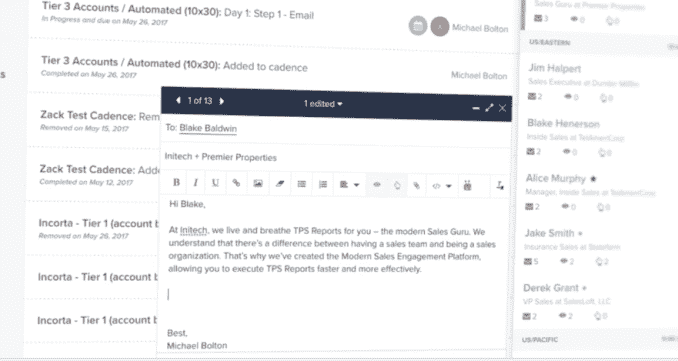

# SalesLoft 凭借 5000 万美元的 C 系列 TechCrunch 实现腾飞

> 原文：<https://web.archive.org/web/https://techcrunch.com/2018/04/03/salesloft-soars-with-50-m-series-c/>

总部位于亚特兰大的初创公司 saleloft，帮助公司管理销售过程中的接触阶段，今天宣布了 5000 万美元的 C 轮投资。

Insight Venture Partners 是领投人，LinkedIn 和 Emergence Capital 也参与了该公司的 A 轮和 B 轮投资。今天的投资使融资总额达到 7500 万美元，因此这是一次重大的资本注入。

吸引投资者的是，SalesLoft 专注于销售渠道中的一个领域，即“销售参与”。它为销售人员提供了一个关于如何联系潜在客户、联系频率以及使用何种语言的框架。它意义重大，引起了 Insight Venture Partners 联合创始人兼董事总经理杰夫·霍林(Jeff Horing)的注意，他愿意开出一张大额支票。

他认为销售参与是销售堆栈中一个新兴且快速增长的领域。Horing 在一份声明中说:“SalesLoft 一贯帮助客户增加他们的渠道，同时也加强了他们与买家的关系——这是一个巨大的差异。”

SalesLoft 的联合创始人兼首席执行官凯尔·波特(Kyle Porter)表示，他的公司所做的基本上是为销售团队创建一个联系工作流。它提供了一个框架或蓝图，同时将一个可测量的结构应用到管理过程中。无论销售成功与否，都有一个对所有互动的审计跟踪，以及软件建议采取的行动和销售人员采取的行动。

这包括为销售团队提供下一个最佳行动，可以是一封电子邮件、一个电话，甚至是一张手写的便条。“建议的电子邮件内容和电话脚本来自与买家打交道的经验。这是正确的沟通方式，”波特说。“最终，我们将帮助客户提供更好的销售体验，”他补充道。

该软件可以推荐最佳人选，然后用建议文本发送电子邮件。照片:销售店

机器学习将在构建该工作流程中发挥越来越大的作用，因为系统会了解什么类型的交互最适合某些类型的客户，它会从中学习，系统的建议应该会随着时间的推移而改进。

它似乎在起作用。该公司于 2011 年成立，目前有 230 名员工和 2000 多名客户，包括 Square、思科、Alteryx、戴尔和 MuleSoft(上个月 [Salesforce 以 65 亿美元](https://web.archive.org/web/20221206002135/https://techcrunch.com/2018/03/20/salesforce-is-buying-mulesoft-at-enterprise-value-of-6-5-billion/)收购了 MuleSoft)。)该公司报告称，他们在过去两年的收入增长了 800%(是的，800%)。

波特说，这笔钱让他们真正扩大了公司规模，计划到今年年底达到 350 名员工。事实上，他们目前有 40 多个职位空缺。