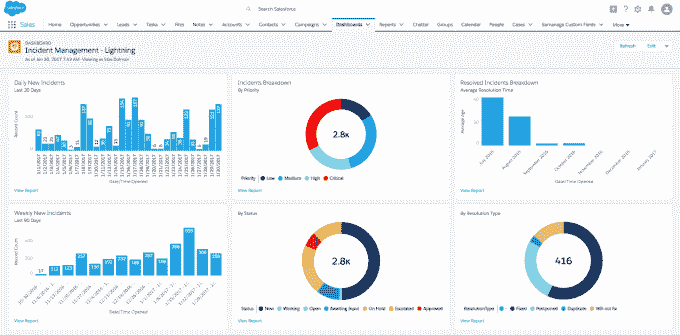

# Samanage 筹集了 2000 万美元，并利用新的 Salesforce 集成 打造企业游戏

> 原文：<https://web.archive.org/web/https://techcrunch.com/2017/02/14/samanage-raises-20m-and-makes-play-for-enterprise-with-new-salesforce-integration/>

# Samanage 筹集了 2000 万美元，并通过新的 Salesforce 集成使企业发挥作用

[Samanage](https://web.archive.org/web/20230330224411/http://www.samanage.com/) ，云中客户服务软件的制造商，今天发布了几个重要公告。首先，他们获得了 2000 万美元的投资，他们还宣布了一个重大步骤:在 Salesforce 平台上发布他们的企业产品。

让我们从资金开始。这一轮包括来自卡梅尔风险投资公司、双子座以色列风险投资公司、Marker LLC、Salesforce Ventures 和 Vintage Investment Partners 的资金。鉴于该公司本周将在 Salesforce AppExchange 发布一款应用程序，Salesforce Ventures 的投资并非巧合。事实上，Samanage 的首席执行官兼创始人多伦·戈登表示，目前一半的投资来自 Salesforce。

该产品使用户能够在 Salesforce 的服务云中管理与员工、客户和现场服务代理的服务交互。与 Salesforce 的新合作伙伴关系是 Samanage 有意超越其中小企业根基进入企业的举措。

戈登认为，将自己的车与 Salesforce 挂钩将有助于他的公司加快向企业客户的转变。“我们相信，与 Salesforce 的合作将使我们能够加快为企业客户提供服务的时间，并成功地与 ServiceNow 这样的供应商竞争。我们想追求更大的客户，”他解释道。

Salesforce 的 Samanage。图像:Samanage

该公司从 2015 年底开始与 Salesforce 展开讨论。2016 年初，戈登指派了一个开发团队来熟悉 Salesforce 闪电平台。他们花了大约 11 个月的时间来交付新版本，戈登说这非常快。“这证明了平台能够如此快速地进入 GA，”他说。

到目前为止，Samanage 的目标主要是中小型企业(SMB)市场。该产品将一如既往地继续在美国和欧洲的 AWS 上运行，该公司计划并行开发这两个平台。戈登说，他不认为这是一个大问题，因为两种产品都运行相同的界面，虽然后端明显不同，但他们已经建立了一个系统来适应这种情况。

Salesforce 早在 2007 年就推出了 Force.com，允许企业在自己的平台上构建自己的应用程序。如今有了现代 Salesforce 照明工具集[，像 Samanage 这样的公司可以使用 Salesforce 已经构建的开发工具来构建应用程序。Samanage 将在 Salesforce AppExchange 中提供，并将在 Salesforce 服务云(该公司的客户服务平台)中运行。](https://web.archive.org/web/20230330224411/https://developer.salesforce.com/lightning)

Samanage 成立于 2007 年，拥有 1400 名客户。