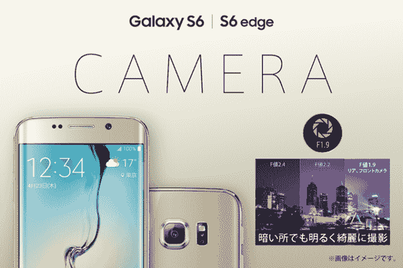

# 三星将在日本销售不带其标志的 Galaxy S6 和 S6 Edge 

> 原文：<https://web.archive.org/web/https://techcrunch.com/2015/04/19/samsung-ditches-logos-in-japan/>

# 三星将在日本销售不带其标志的 Galaxy S6 和 S6 Edge

据《韩国先驱报》报道，三星公司在其最新的智能手机上去掉了自己的名字后，正在降低其企业品牌在日本的知名度。

Galaxy S6 和 Galaxy S6 Edge 将于 4 月 23 日在日本上市，但消费者不会像往常一样在手机上看到三星的标志，相反，它们将与运营商合作伙伴以“Docomo Galaxy”和“au Galaxy”的名称共同营销。

这一品牌重塑超越了公司的产品。三星还将[在日本的脸书页面](https://web.archive.org/web/20221128090933/https://www.facebook.com/galaxymobilejapan)更名为“银河移动日本”——反对删除对“三星”的引用——同时其新手机的营销视觉效果也去掉了它的名字。

TechCrunch 联系了三星就这一变化发表评论，但我们尚未收到回复。一位公司发言人告诉《先驱报》:“我们认为 Galaxy 品牌在日本已经很好地建立起来了。”

这不是一个明确的答案。从外部来看，三星的举动似乎有些奇怪，但这是对其在日本建立品牌的持续努力的回应——在日本，三星的手机销量低于富士通和夏普等公司——以及日本与本土韩国之间的紧张局势。

根据 Counterpoint Research 的数据，2014 年 11 月，三星在日本排名第五，市场份额不到 5%。这与主要竞争对手苹果形成了鲜明对比，苹果在 2014 年 10 月和 11 月占据了中国智能手机销售的一半。

今年早些时候流传的谣言表明，由于未能在日本产生有意义的影响，该公司将退出日本。相反，它正在尝试让自己的手机与母公司没有任何直接联系——尽管考虑到日本本土对日本品牌和苹果 iPhones 的偏好，这种尝试会有多成功还有待观察。