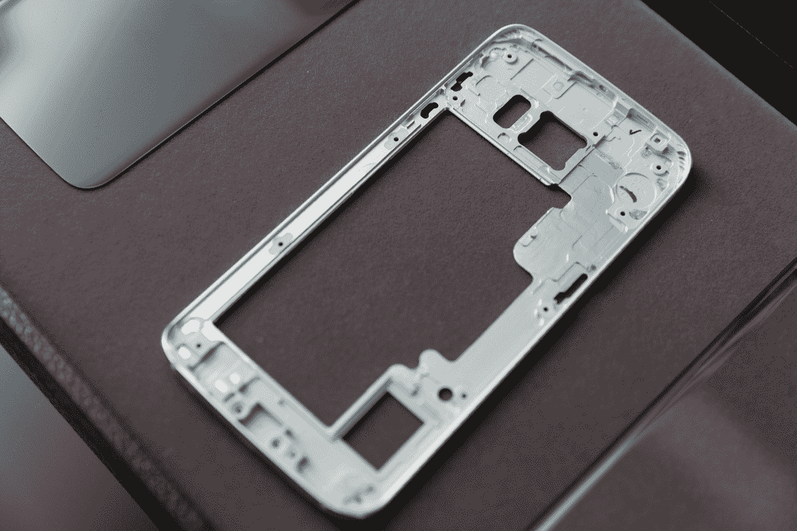
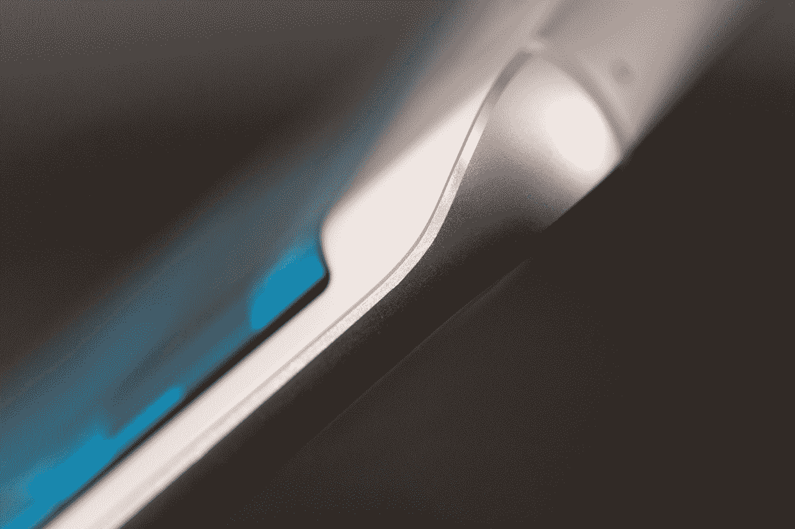
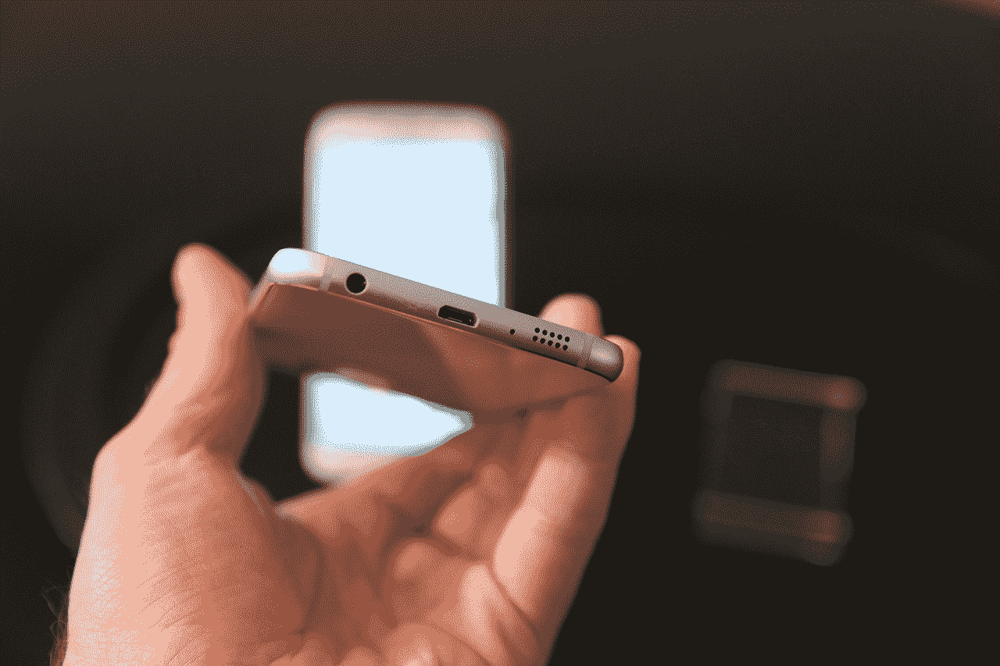

# 三星 Galaxy S6 和 S6 Edge 设计背后的故事 

> 原文：<https://web.archive.org/web/https://techcrunch.com/2015/03/01/samsung-galaxy-s6-design-story/>

三星在今年的旗舰上做了一些非常不同的事情，或者至少对三星来说是不同的。这家公司长期以来一直坚信，它可以使用塑料作为设备工业设计的核心组件来生产顶级硬件，现在它已经转向全金属和玻璃外壳。

对于那些想知道使用优质材料的三星智能手机会是什么感觉的人来说，Galaxy S6 edge 尤其是一个非常有希望的结果。但是，在所有公司中，三星是如何推出以设计为主要特色的设备的呢？

## 零

为了开发 Galaxy S6 和 S6 edge，三星表示必须从零开始——这意味着抛弃导致塑料仿皮背和闪亮的塑料汉堡外脊的设计书。这意味着后退一步，开放设计流程以听取反馈，听取专业人士和消费者对三星之前设计选择的抱怨，然后从那里重新构建。

> 三星表示，为了开发 Galaxy S6 和 S6 edge，它必须从零开始。

有些人可能会说，三星决定放弃其塑料设计遗产时，并不是从零开始的。毕竟，苹果已经创造了看起来与 Galaxy S6 非常相似的设备，硬件底部边缘的端口和孔的排列等细节看起来也与 iPhone 6 底部的当前设置非常相似。但是，尽管有熟悉的端口布局、天线位置和材料选择，新的 Galaxy 手机仍然给人明显的三星感觉，可能部分是因为它们保留了熟悉的功能，如圆角矩形 home 键和中央设置的相机镜头。

曲面显示器而非 S6 edge 的独特品质也是三星的一贯风格，融入了该公司去年推出的一项深远功能，在某种程度上有助于说明他们的整个产品开发过程。笔记边缘有一个带有专用显示的弯曲边缘，它与其余部分连续出现。然而，评论者大多认为这很可爱，但最终是无关紧要的，S6 edge 是基于这种反应的行动迭代:它主要是审美的，而不是功能性的，它有助于它需要的东西，而不会最终感觉轻率。

## 与过去格格不入，并行不悖

三星表示，这些设备的设计在过去几年中一直在进行中，而不是在几个月的时间里或自 Galaxy S5 推出以来。它的设计与 S5、Note 和 Note Edge 系列的选择是并行的，尽管你也可以从该公司获得这样的感觉，即有明显的阵营倾向于一种轨道而不是另一种轨道，S6 上使用的金属和玻璃方法没有经过斗争就获得了优势。

三星最近在全球智能手机市场主导地位上的挣扎可能有助于相信该公司内部的一些声音，这些声音试图改变他们制造功能性大于时尚性的手机的声誉。这也可能是由于三星业务性质的变化:该公司被挤下了在关键的大中华区智能手机市场的崇高地位，首先是小米在价格上削弱了其广泛的产品系列，然后是苹果凭借 iPhone 6 和 6 Plus 在高端领域超越了它。

不管是什么原因，三星已经决定打破传统，冒险尝试一种更符合高端客户期望的设计。这并不能保证他们能够在这一领域夺回失地，但很明显，从长期增长的角度来看，相反的策略并不奏效。

## 实用性和个性

尽管他们改变了材料策略，在继续提供更薄更时尚设备的压力下，三星也不想让他们的设备变得更冷更不容易接近。这就是为什么他们在内部开发了次表面反射涂层，使 GS6 和 S6 edge 具有金属或宝石般的表面，由于位于 Gorilla Glass 4 外表面之下，它还具有保护自己免受刮擦或损坏的额外好处。

颜色选项，包括每个型号的大胆和明亮的专属选项，是三星试图承认消费者对反映自己个性的设备越来越多的渴望。在智能手表中，更大程度的定制化趋势是显而易见的，但三星的设计选择旨在吸引同样的本能，在某种程度上仍然保持相同的总体设备感觉和手持用户体验。

在实用方面，三星的设计师做出了一些改变，反映了以前设计的可用性挑战。后置扬声器被一个朝下的扬声器取代，三星表示，这使得声音更大 1.5 倍。还有一个可定制的 LED，根据与您联系的人提供颜色选项，以及快速回复设置，您可以将这些设置分配给相机旁边的后置红外传感器，这样您只需用手指按压就可以自动回复，而不必将手机从桌子上拿起来。

设计师还确保将玻璃表面上方的金属框架延伸到边缘周围，努力使其在跌落时不太可能破碎。这是一个充满激情的项目，强调用户体验的细节。

## 设计能拯救吗？

让设计成为 Galaxy S6 的核心卖点的一个大问题是，它能否扭转三星智能手机部门的局面，并帮助它恢复增长，夺回其在全球设备领域的绝对主导地位。在我看来，毫无疑问，三星所做的大大改善了其现有的硬件外观和感觉，但最终市场将拥有最终发言权。

> 这是一个充满激情的项目，强调用户体验的细节。

这可能会决定三星未来是否会承担更多此类设计风险，而不是过去几年三星 Galaxy 旗舰产品的保守做法。