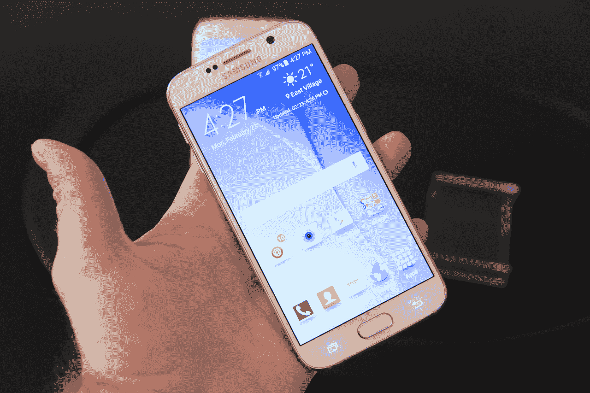
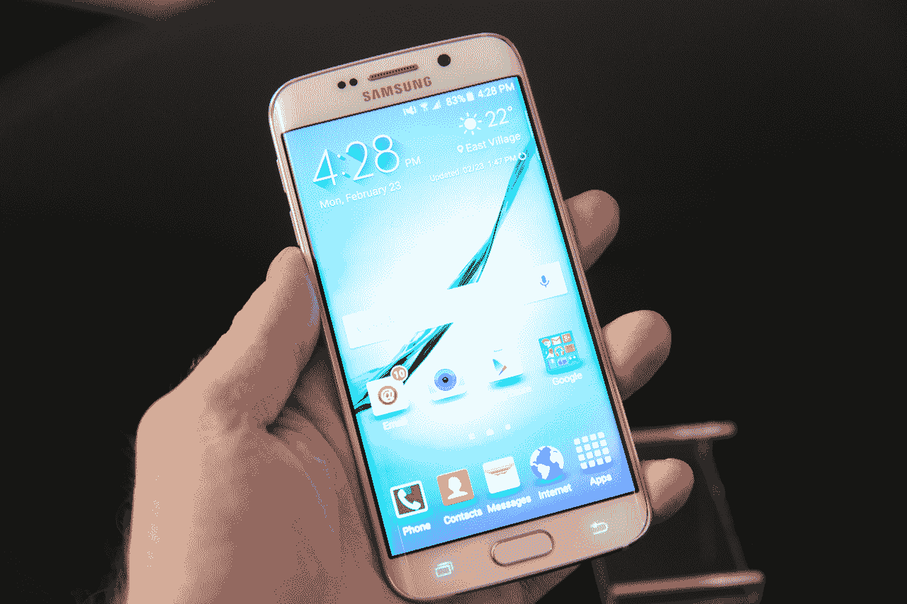
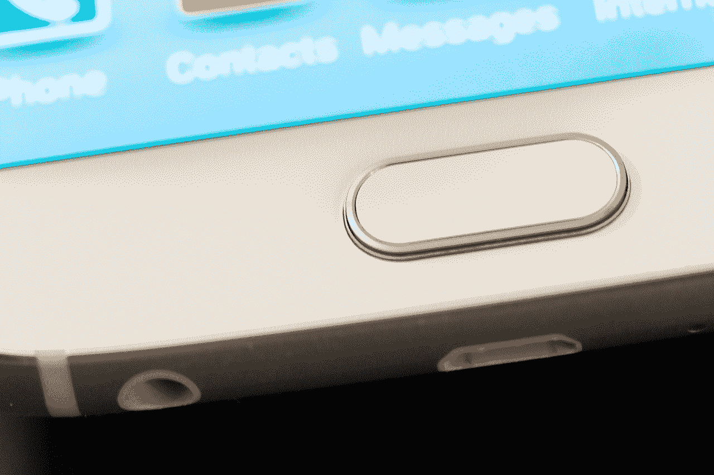

# 手握三星 Galaxy S6 和 S6 Edge 

> 原文：<https://web.archive.org/web/http://techcrunch.com/2015/03/01/samsung-galaxy-s6-s6-edge-hands-on/>

三星有两款全新智能手机， [Galaxy S6 和 Galaxy S6 edge](https://web.archive.org/web/20230320012908/https://techcrunch.com/2015/03/01/samsung-galaxy-s6-s6-edge/) 。这是该公司第一次在舞台上同时展示其主要旗舰产品的两个不同版本，我们有机会尝试这两个版本，看看它们的表现如何。

在这两种情况下，最终的体验都令人印象深刻，虽然最大的变化是在设计方面，但三星的软件转变总体上也非常有前途。

## 手握视频

## 设计

**银河 S6**

Galaxy S6 和 S6 edge 都避免了三星过去喜欢用于旗舰产品的常见塑料玻璃和金属，但 S6 的正面更传统，其设计不禁让人与 iPhone 设备相提并论，类似于 iPhone 5/5S 和 iPhone 6 或 6 Plus 的混合体。它有一个 5.1 英寸的显示屏，前后都是玻璃，金属边缘沿着手机的外边缘延伸。

虽然 Galaxy S6 肯定有 iPhone 风格的线索，但如果说它完全是克隆或复制，那就过于简单化了。S6 和 S6 edge 都采用了新的特殊处理，在保护玻璃表面的下侧涂上一层超薄的金属漆反射涂层。机械加工的金属边缘是贯穿 S6 机身的固体框架的一部分，实际上在玻璃上方的每一点都有延伸，三星表示，这是为了确保跌落的任何冲击都被手机的防摔部分吸收，而不是玻璃表面。

[gallery ids="1125570，1125568，1125564，1125561，1125560，1125559，1125558，1125550，1125543，1125542，1125540，1125539，1125532，11255536，1125537，12537

S6 的设计已经与三星过去坦率乏味的工业设计大相径庭，为这个肯定需要激发新激情的品牌注入了一些新鲜的生命。拿在手里，它感觉比 Galaxy S5 更高端，尽管一些可拆卸电池的铁杆粉丝可能会对 S6 被锁起来(SD 卡插槽也不见了)感到难过，但三星终于做出了一款感觉有点不像儿童玩具的旗舰产品，这种权衡是值得的。

**银河 S6 边缘**

如果说 Galaxy S6 标志着三星在智能手机工业设计方面的毕业，那么 S6 edge 就是一个博士后。虽然 Note Edge 看起来更像是一个实验，为那些可能寻求特别未经测试和新奇的东西的用户保留，但 S6 edge 的倾斜侧面反而感觉像是一个基本上美学的设计决定。两个弯曲的边缘仍然容纳着几乎占据整个 S6 edge 正面的同一个显示器，而不是像 Note Edge 那样覆盖一个离散的屏幕，最终导致用户在软件端添加不需要的无关功能的技巧减少。

[gallery ids="1125556，1125575，1125574，1125573，1125565，1125557，1125555，1125554，1125552，1125551，1125549，1125548，1125547，11255546，112546

S6 edge 在 S6 的高级感上加倍，以某种方式说服大脑，它是一台比更传统的三星旗舰机更轻薄的机器，尽管它在这方面实际上没有什么不同。结合新的颜色效果，以及金属框架与曲面玻璃接触处的锥度，这是一款看起来非常好、握起来感觉很好的设备。

## 硬件和软件功能

与过去的设备相比，新的 Galaxy S6 提供了许多改善整体体验的功能，但最实用的两个功能可能是在 home 键上使用单点触摸指纹读取器，它的工作方式类似于苹果的触控 ID，而不是像 GS5 那样基于滑动的读取，以及双击 home 键快捷方式，以便在你碰巧处于手机操作系统中的任何位置时立即触发相机。

基于我们使用该设备的时间，重新设计的、更轻便的用户界面与传统的 Android 5.0 Lollipop 有很多共同之处，加上新的相机快捷方式和实际有用的指纹传感器(之前的那个可以用，但操作起来很痛苦，尤其是单手操作)，所有这些结合起来，使这成为三星有史以来最好的开箱即用产品之一。

在非常有限的测试中，新的前置和后置摄像头都证明能够在混合亮度和怪异的色彩平衡方面相当具有挑战性的光线下拍摄良好的照片。我确实设法拍了一些模糊的照片，基本上是尽我最大的努力来衬托它，但根据非常早期的经验，它似乎可以成为 Android 智能手机相机卓越性能的有力竞争者。

## 结果

三星的 Galaxy S6 在某些方面不如其他产品那样令人惊叹，至少在华而不实的软件功能和可疑的硬件添加方面是如此，这些硬件添加似乎只是为了突破极限。相反，他们展示的是一款几乎在各方面都比他们以前发布的任何产品都更成熟的设备，具有一些智能的新功能，要么 100%改善了前代产品的不足，要么真正增加了人们实际使用的便利功能。

> 三星有史以来最出色的开箱即用产品之一。

尽管三星在设备销售和市场份额方面取得了巨大的全球成功，但它从未提供我个人最喜欢的 Android 硬件。S6 和 S6 edge 这次很有可能获得这一殊荣，这在很大程度上要归功于一种在触摸或握持时最终会发出“溢价”的设计。