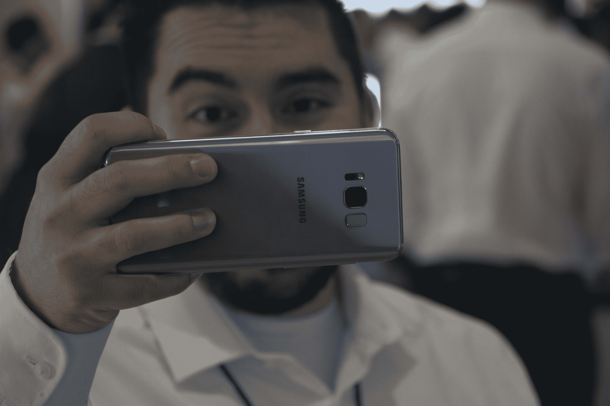
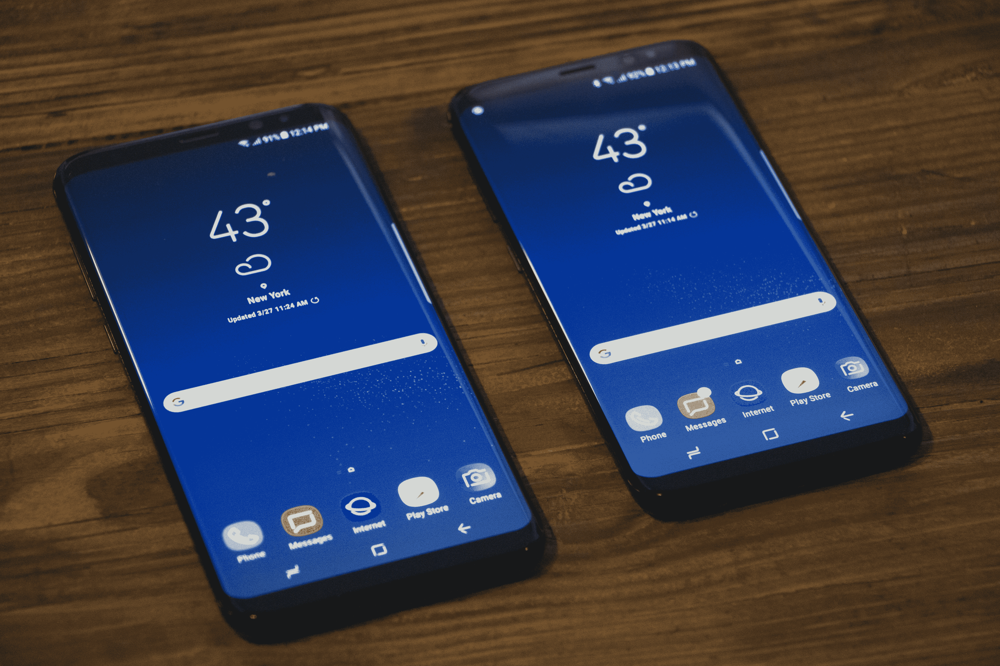
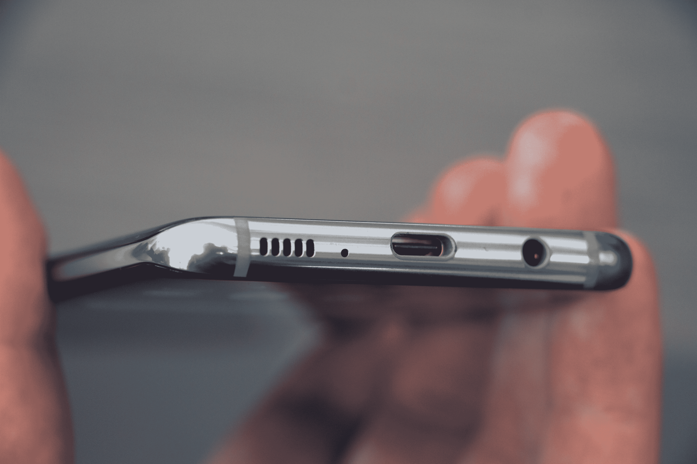
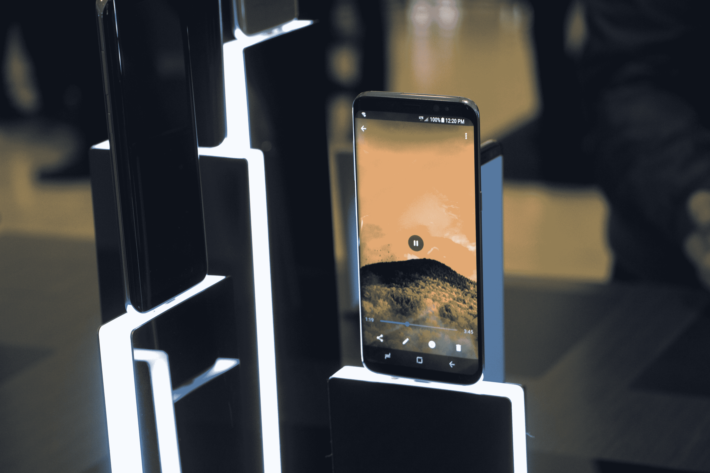
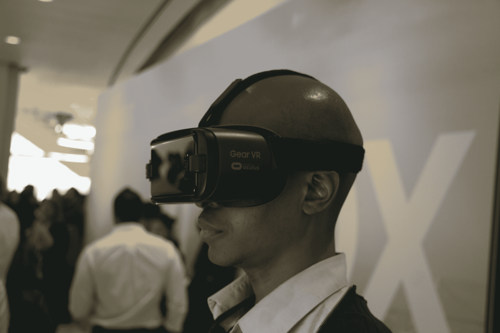

# 三星的 Galaxy S8 和 S8+正是泄密所暗示的，这是一件好事 

> 原文：<https://web.archive.org/web/https://techcrunch.com/2017/03/29/samsung-galaxy-s8-reveal/>

几乎所有你已经读到的关于三星 Galaxy S8 的事情都是真的。这是件好事。无论是意外还是有意，该公司在上个月的世界移动通信大会(Mobile World Congress)上发布新旗舰后的一个月左右时间里，在保密方面做了一件真正糟糕的工作。两款机型(S8 和 S8+)，边对边的显示屏，物理 home 键的抛弃——这些都是大量泄露的预兆。

见鬼，那些狡猾的泄密者甚至设法锁定了 4 月 21 日的发布日期，并在旁边的按钮上专门写了[公司的新专有助理 Bixby](https://web.archive.org/web/20230128070839/https://techcrunch.com/2017/03/20/bixby-is-samsungs-new-intelligent-interface-for-smartphones-and-beyond/) 。综合起来看，亲自看，这是一个非常好的硬件。虽然每次在随意的谈话中提到三星的名字，都需要不止一款旗舰产品来结束 Twitter 上所有令人捧腹的爆炸笑话，但 S8 表明这家公司肯定跌了一跤，但没有失去步伐。

与三星的产品一样，其决定性的特征是显示屏。该公司仍在通过 S8 和 S8+上的 5.8 英寸和 6.2 英寸屏幕推动尺寸的界限。分辨率为 2,960 x 1,440(据泄露的消息称)——比 S7 的 2,560 x 1,440 有所提高，这是由于该公司在纵横比上的改变。三星跟随 LG 的脚步，转向了一款更高的手机，这款手机与内置的 HDR 支持一起，是该公司试图让内容提供商提供更真实的视频的一部分。

更高的手机还允许用户一次打开更多的内容，不过与 LG 不同，三星并没有在手机的这一方面做太多的改进。这在很大程度上是由于该公司在这里的手机中塞进了大量的数据。

根据三星的统计，屏幕占据了手机正面大约 80%的面积。这意味着，除其他外，它成功地制造了一款真正的大屏幕手机，感觉不到大或笨重。就像之前的那张便条一样，令人印象深刻的是，该公司成功地将多少部手机塞进了一块相对较薄的地方，比其前身薄 1.5 毫米。事实上，三星取消了设备正面标志性的椭圆形 home 键。

[https://web.archive.org/web/20230128070839if_/https://www.youtube.com/embed/9_Dl6gz9U3k?feature=oembed](https://web.archive.org/web/20230128070839if_/https://www.youtube.com/embed/9_Dl6gz9U3k?feature=oembed)

视频

S8 底部有一个虚拟触摸感应按钮。在生物指纹识别器的地方，你可以用你的视网膜(在昂贵的 Note 7 上提供的功能)或通过扫描你的整个面部来解锁手机。有趣的是，虽然该公司在前面取消了大的物理 home 按钮，但它在左侧增加了一个全新的按钮，就在音量摇杆下方，这表明它认为其新的智能助手 Bixby 对于 S8 和三星整个联网设备生态系统的发展有多么重要。

三星非常明确地表示，Bixby 不仅仅是家庭辅助服务。像之前的亚马逊一样，该公司希望其新的专有家庭助手将是更大的事情的开始。因此，用户可以在手机上访问正式名称为 Viv 的助手的方式没有限制，包括前面提到的按钮和从手机屏幕上右击。

Bixby 在我们玩的模型上没有完全成型，这可能有助于解释手机发布延迟的原因。请记住，该公司只是在 10 月份完成了对 Viv 的收购。我个人无法评价该产品的完整性，但它确实看起来雄心勃勃，而且很清楚为什么该公司避开谷歌的助手(就此而言，还有 Alexa)而青睐自己的自制解决方案。

除其他原因外，它显然投资于建立自己的联网家庭解决方案，而且与大多数竞争对手不同，三星有大量自己的品牌电器来帮助建立智能家庭自动化流程。与使用 Home Kit 创建的场景类似，用户可以将多个自动化的时刻与他们的来来往往或一天中的时间联系在一起——所以，比方说，当你离开房子时，三星机器人吸尘器会启动，三星智能电视会关闭。

有很多承诺使 Bixby 成为一个令人信服的提议，即使在一个充斥着专有个人助理的世界里。该公司添加了一些有趣的上下文信息，例如，助手可以根据你在应用程序中做的其他事情，更好地了解你想要什么。三星称之为“认知宽容”。该公司还承诺开放各种第三方兼容性，目标是让用户通过语音做他们可以通过触摸在应用程序中做的一切事情。

该应用还拥有一些引人注目的图像和文本识别功能。通过与亚马逊等零售商的合作，当你把相机举到书的封面或酒标上时，它就能够拉起商业链接。它还具有文本识别功能，支持 52 种语言的翻译。现在还为时尚早，感觉该公司更多的是在为助手打基础，但 Bixby 已经为银河生态系统增添了一个极其雄心勃勃的元素。

此外，作为一个不错的奖励，如果你把它举到耳边，像一个真正的人一样对它说话，助手就会工作。这可能是一个愚蠢的小功能，但它可能会减少学习与手机内置人工智能交谈的尴尬。

三星一直在努力将去年的 Note 7 混乱推向幕后，在随后的每次新闻发布会上都提到这一事件，同时慢慢将话题从道歉转移到讨论该公司新发现的额外安全预防措施。它甚至提供了一个华丽的放克配乐广告，详细介绍了其性感的电池安全设施。然而，这一事件显然更多的是背景，而不是新旗舰的定义特征。

正如该公司在活动前的演示中所说，“一些关键的学习要点是，尽管我们在产品和服务方面进行了创新，但我们也需要在安全方面进行创新。”然而，除了早期的幕后窥视，该公司满足于将所有的安全检查藏在幕后。这种担忧显然不是设计过程中的驱动因素。从表面上看，这是该公司一直计划发布的 S8——尽管可能有点早。

[gallery ids="1470479，1470357，1470485，1470487，1469453，1469451，1469456，1469448"]

该公司少数几个没有推进的领域之一是电池容量。3000 毫安时(8+为 3500 毫安时)，与 S7 相同。也许该公司不想飞得离太阳太近，尽管它在 CES 上试驾时打出了“到达更高”的口号。不过，说实话，这次没人会强迫三星测试电池容量的极限。嘿，它还有一个额外的好处，那就是保持手机的轻薄。

有趣的是，三星这次似乎已经放弃了后置摄像头大战的幽灵。在过去几年中，这一功能一直是大多数手机制造商的主要战场。这一次，该公司主要只是调整了软件，允许更智能的自动对焦和减少模糊。另一方面，前置摄像头有点小问题。因此，我们参与的 Bixby 演示之一涉及到用智能助手自拍。

三星在 Note 7 灾难后的首次大型新闻发布会上明确表示，尽管它致力于未来的安全，但该公司不会让过去的错误阻碍前进。诚然，该公司的早期声明感觉有点自大，而该公司本应弥补其错误。但现在，自灾难发生以来，它的第一款主要手机已经到来，感觉该公司没有错过任何一个节拍。

S8 雄心勃勃，但也不过分。它的设计是对前几代产品的合乎逻辑的演变，而它最引人注目的功能 Bixby 给人的感觉更像是一个闪亮的新功能，就像是一家公司在为未来奠定基础。此外，为了确保每个人都支持这款自 Note 7 以来的第一款大型智能手机，该公司将为预购手机的人提供[新款 Gear VR 耳机/控制器套装](https://web.archive.org/web/20230128070839/https://techcrunch.com/2017/03/29/samsung-gear-vr-3/)。

哦，该公司还赠送了一副 AKG 品牌的耳塞，这是该公司最近收购哈曼(Harman)的结果，并承诺保持耳机插孔，至少目前如此。这是该公司在上一次大型手机发布会上毫不隐晦地提到的一点。毕竟，如果说三星这次需要什么的话，那就是取悦大众。