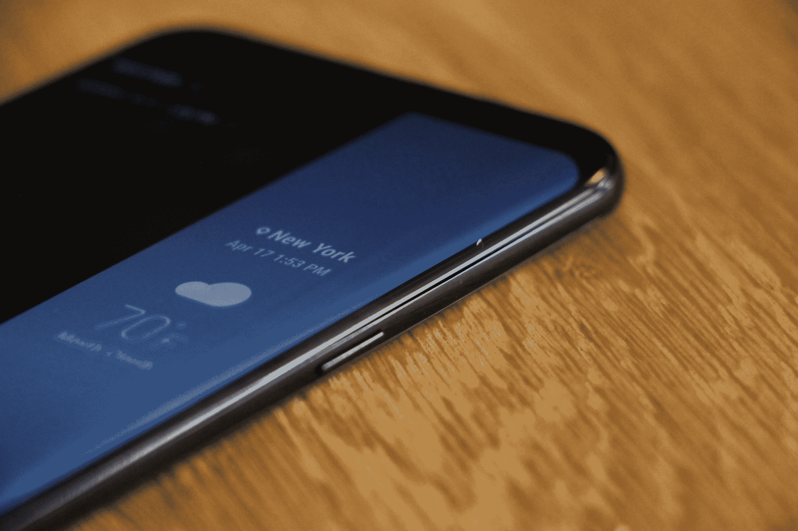
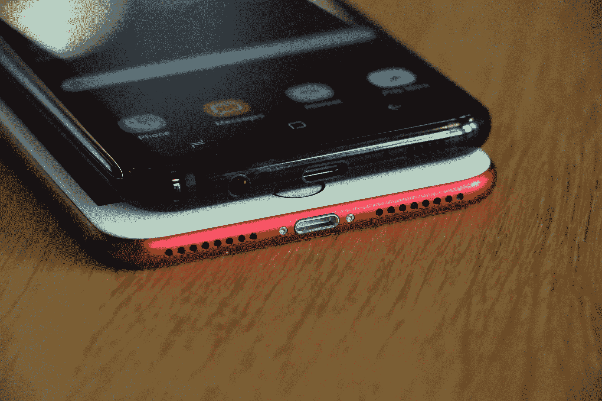
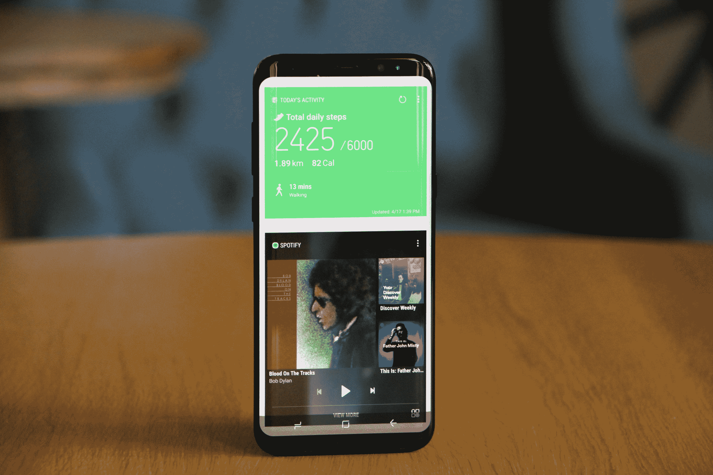
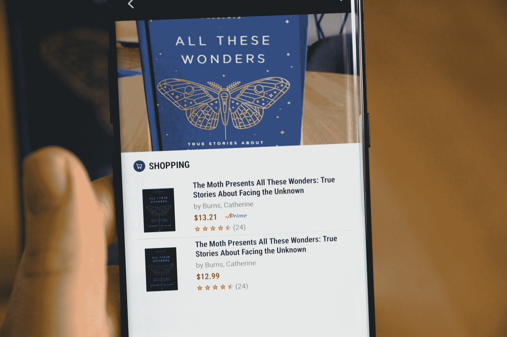
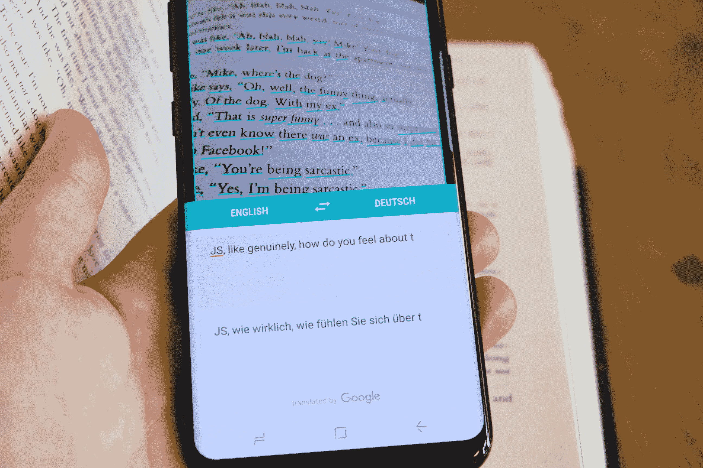
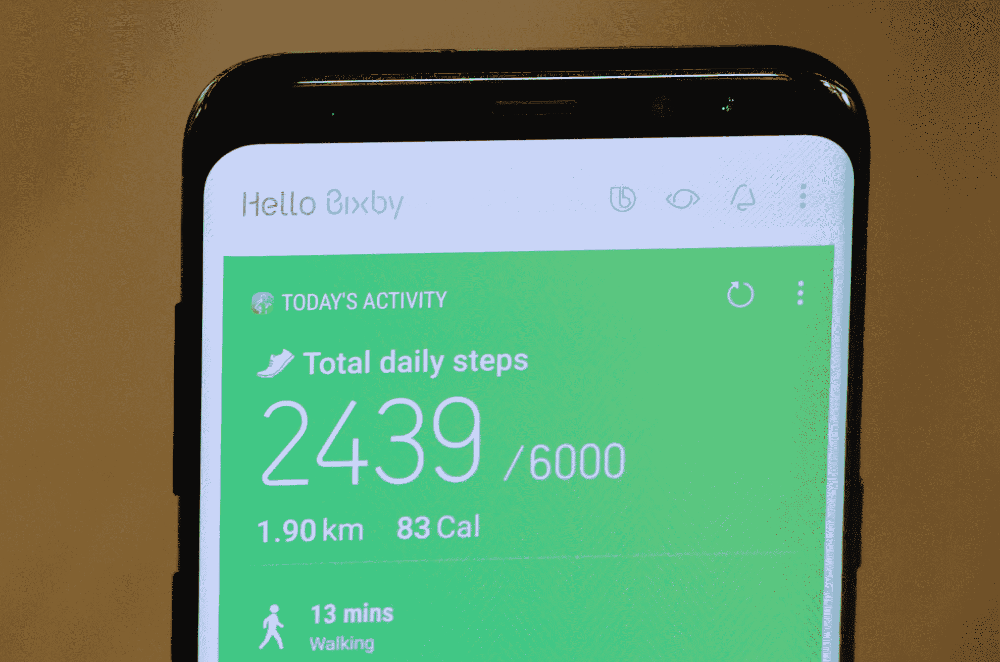
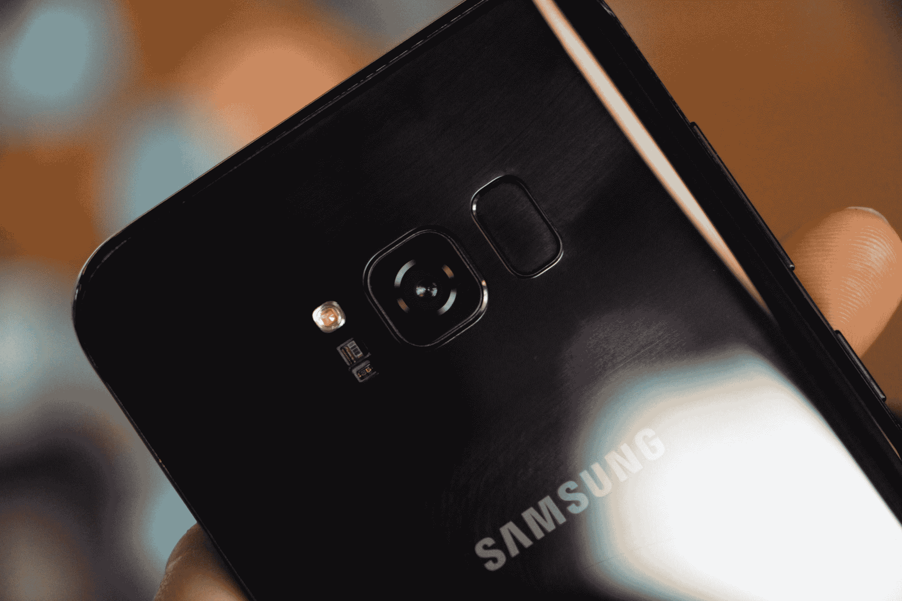
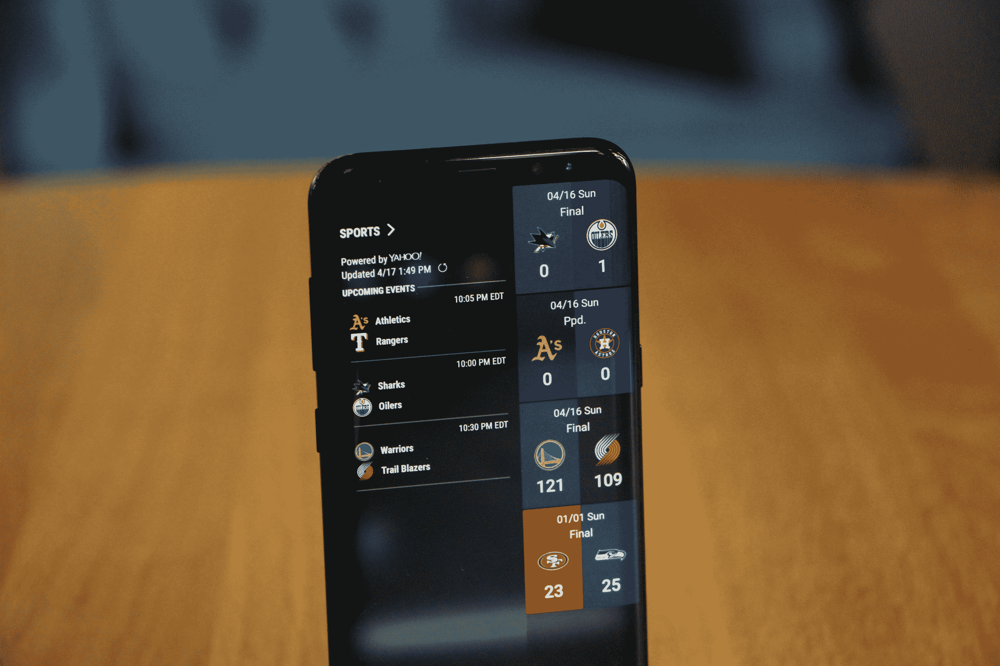
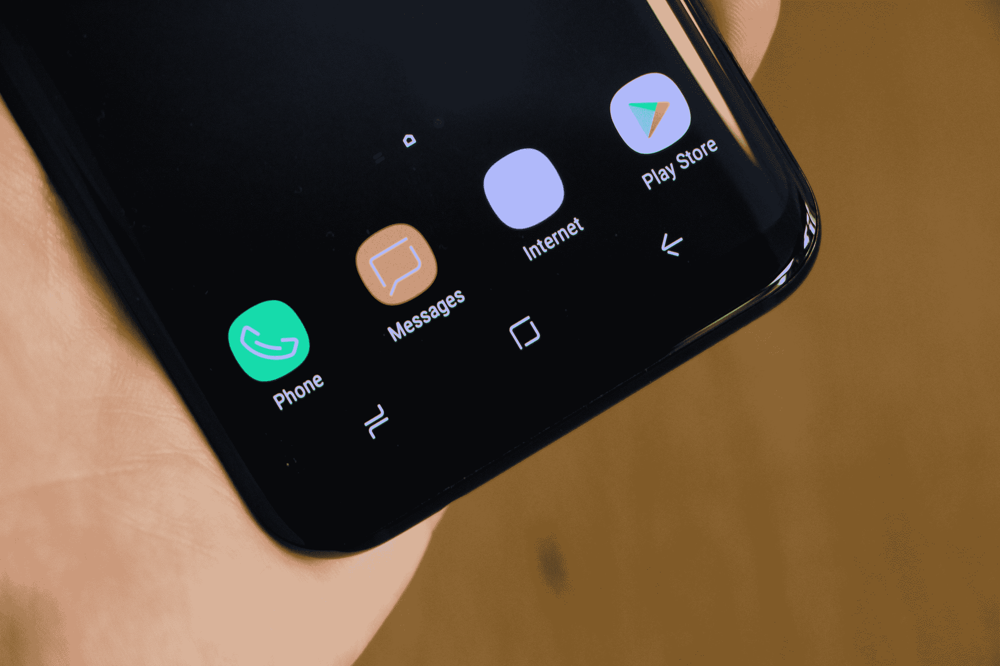

# 三星 Galaxy S8 漂亮的硬件值得拥有更统一的软件体验 

> 原文：<https://web.archive.org/web/https://techcrunch.com/2017/04/18/samsung-galaxy-s8-review/>

三星 Galaxy S8 是个怪兽。突然间，这似乎既是几代智能手机发展的巅峰之作，又让人感觉是对该公司未来宏伟计划的一次不完整的窥视。这是一款制作精美的硬件，带有一些很酷的软件技巧，与其说是三星承诺的革命，不如说是对统一星系理论的洞察，这种理论可能会定义该公司未来几代设备。

当三星[上个月](https://web.archive.org/web/20230128070817/https://techcrunch.com/2017/03/29/samsung-galaxy-s8-liveblog/)登上舞台时，它提出，“不仅仅是一个伟大设备的发布，而是体验世界的新方式的开始。”在经历了公众形象极度低迷的一年后，长达数月的道歉之旅让位于移动通信史上下一个关键时刻的承诺。

S8 的现实是一个坚固的设备，进一步推动了该公司征服边框的勇敢追求。三星在几代优秀手机的基础上，进行了大部分迭代，但值得跟进。与此同时，该公司全新的[智能助手 Bixby](https://web.archive.org/web/20230128070817/https://techcrunch.com/2017/03/29/samsung-bixby-smart-home/) 的问世，为三星即将推出的生态系统指明了前进的道路。

但是公司仍然需要在这方面穿针引线。这种体验并不充分，给该公司新推出的大型回归设备增添了失望的气氛。

## 无限和超越

[https://web.archive.org/web/20230128070817if_/https://www.youtube.com/embed/OiK9THLq8Cg?feature=oembed](https://web.archive.org/web/20230128070817if_/https://www.youtube.com/embed/OiK9THLq8Cg?feature=oembed)

视频

毫无疑问，三星已经完善了一件事:让大手机看起来很小。这是该公司在 Note 7 上取得的非凡成就之一，在 S8 和 S8+上得到了充分展示。事实上，我第一次在新闻发布会上接触 S8+时，我可以发誓我拿的是较小的版本。

我已经随身携带这款手机几天了，它可以像 5.5 英寸的 iPhone 7+一样舒适地放在我的口袋里。而且你可以单手操作电话，所以这个设备不会有问题。

更大的手机感觉不到它的 6.2 英寸，因为它的外形更高，而且该公司诱人地将其视为“无限显示屏”。曲面屏延续了该公司在边框上的多代战争，去年的 S7 Edge 和 Note 7 就是例证。它们并没有完全消失，但它们隐藏得足够远，相比之下，前几代看起来很笨重。

全屏手机的承诺可能还需要几代人的时间(部分原因是自拍相机的持续流行)，但三星已经做了约曼的工作，试图从地球上消除边缘。这在很大程度上得益于取消了前置 home 键——这是手机上最引人注目的设计变化，否则会保留其前代产品的大部分设计语言。

熟悉的椭圆形按钮已经被一个虚拟的对应物取代，它位于屏幕下方大致相同的位置。它与触觉引擎相结合，提供了与最新 iPhone 相同的物理点击的粗略近似。为了解锁，指纹读取器被移到了后面，就在相机的右边。这是一个奇怪的设计选择。

它很难用一只手接近——即使与 Pixel 上的手机中部位置相比也是如此，而且它基本上是要求你在摸索着找到它时在相机上到处跑你油腻的指纹(黑色版本的整个背面是一个巨大的指纹磁铁)。值得庆幸的是，不需要用不同的身体部位来解锁手机，尽管面部解锁很酷，但在光线较暗的情况下很容易出错。

## 比克斯比的诞生

是时候简化 Galaxy 软件体验了。Bixby 很可能是做这件事的聪明助手。然而，就目前而言，人工智能有点混乱。到处都有精彩的闪光，但三星的半自制助手感觉更像是对未来的承诺，而不是真正有用的软件功能。这在很大程度上是因为并非所有承诺的 Bixby 功能都将在发布时向 Galaxy S8 买家提供。

三星通过电子邮件向我们证实，这款手机将不带 Bixby Voice。这将在今年春天晚些时候出现。目前来看，该公司正面挑战 Siri、Alexa 和谷歌助手的计划似乎出现了一个缺口。没有它，体验感觉欠火候，我无法避免偷偷怀疑该公司在购买 Viv 后仅仅五个月左右就匆忙推出它，以试图为其首款后 Note 7 旗舰产品增加一个关键功能。

该公司甚至在手机侧面给 ol' Bixby 提供了自己专用的按钮，尽管它取消了设备正面唯一的物理按钮。让我们在六个月或一年后再聚一次，看看该公司是否兑现了一些宏伟的承诺，比如联合其智能家庭游戏。同时，有一些有用的功能，最明显的是 Bixby 视觉。

## 展望 Bixby 愿景

三星总是推出一些有趣的软件功能，旨在将自己与一群安卓失败者区分开来。毫无疑问，Bixby Vision 是近年来最引人注目的产品之一，它利用车载摄像头进行许多不同的活动，如购物和文本翻译。

看过或使用过亚马逊 Flow 的人应该对前者很熟悉，这款于 2014 年推出的迷人应用无疑让数百万实体店老板轻微心脏病发作。它使用图像识别来扫描条形码和图像的正面。一旦识别出它们，两个应用程序都会弹出一个亚马逊购物结果列表。

不可否认，这并不比下载亚马逊的应用程序有用多少，但可能会有助于推动三星汇编的大规模上下文信息门户，以帮助建立更有用的 Bixby 体验。视觉识别产品上的文字也做得很好。通过突出显示，你可以将它们翻译成多种不同的语言。毫无疑问，这是一个潜在的有用功能。

## 心脏在哪里

Home 是 Bixby 最具有前瞻性的功能。它是当你短按专用按钮时弹出的东西(接下来长按一次会弹出声音)。乍一看，它看起来像是 Android 硬件制造商在操作系统上安装的任何数量的内容中心。在使用手机一周后，我的显示屏上显示了最近播放的 Spotify 歌曲、我的每日步数、提醒和天气等。

与 Bixby 的底层技术一样，Home 的设计会随着时间的推移引入越来越多的上下文信息，可能会越来越有帮助。然而，就目前而言，除了一个标准的内容中心之外，还很难看到其他的东西。这不是一件坏事，头脑，但不是革命性的。

加上语音、承诺的第三方支持和清晰的互联家庭战略，Bixby 开始看起来像一个真正令人信服的智能助手。它很可能最终成为最终将 Android 顶部的几代功能联合起来的结缔组织——也是帮助其软件产品真正区别于竞争对手的东西。然而现在，为了赶上 S8 的最后期限，它感觉有些仓促。

## 摄像机动作

就规格而言，三星没有对后置摄像头进行太多更新。这完全没问题。这是过去几代人的主要关注点，结果是金钱可以买到的最好的智能手机相机体验之一。有一些软件调整，如增强图像处理，使相机已经坚实的弱光图像捕捉更好。

有趣的是，大多数大型摄像头更新的目的是让 S8 更像一台社交机器，跟随华为等中国制造商的升级脚步。

前置摄像头已经提升到 800 万像素，现在拥有更快的自动对焦和更好的面部识别功能。所以，你知道，更多更好的自拍。三星还在相机应用程序中加载了几十个滤镜和动画贴纸，为设备本身带来了 Snapchat 的味道。该软件还被调整为更容易单手拍照。

事实上，这里的升级很少集中在“严肃”的拍照上。三星的软件产品通常以生产力和安全性为目标。鉴于该公司如何在早期向 YouTube 评论者提供 S8 的评论单元，很明显三星正在寻求扩大其对年轻人群的吸引力。

[gallery ids="1477877，1477880，1477879，1477878，1477881，1477876"]

## 坚实的基础

单独来看，没有一款新品像三星希望你想象的那样具有突破性。但是 S8 和 S8+确实有几代的进步，综合起来，它是功能最全的 Android 手机之一。像他们的前辈一样，这些手机的等级为 IP68，所以你可以在倾盆大雨中淋雨，甚至可以将它们浸泡在一桶水中，没有任何问题。

它们再次支持可扩展内存和无线快速充电。

S8 上的电池大小与其前代产品相同(当然，Plus 上的电池要大一点)。我可以正常使用一天半。可以理解的是，三星并不想挑战极限

处理器有了很大的提升，这是为了让设备适应未来。你可能不会在日常使用中看到很大的差异，但随着该公司越来越多地推进虚拟现实等更复杂的任务，它将开始产生更大的差异。

## 伸得更高

S8 注定是三星的一次走钢丝。在最近的活动中，该公司测试了“达到更高”等口号，同时对过去的问题表达了歉意。S8 感觉有点像这种精神棋的现实世界表现，坚固的硬件和软件体验为更好的东西指明了方向——该公司一直在努力实现的统一生态系统，但从未完全实现。

S8 的售价为 725 美元，S8+的售价为 825 美元，这款设备一如既往地是一款价格不菲的高端产品。事实上，凭借 Infinity 显示屏、下一代处理器和已经稳固的相机体验，有很多东西值得喜欢，让三星在 Android 手机竞赛中保持领先。

像 Bixby 这样的产品很可能是将手机带到下一个水平的关键，最终将三星的各种软件产品捆绑到一个统一的体验中。种子都在那里。现在三星要做的就是让他们成长。