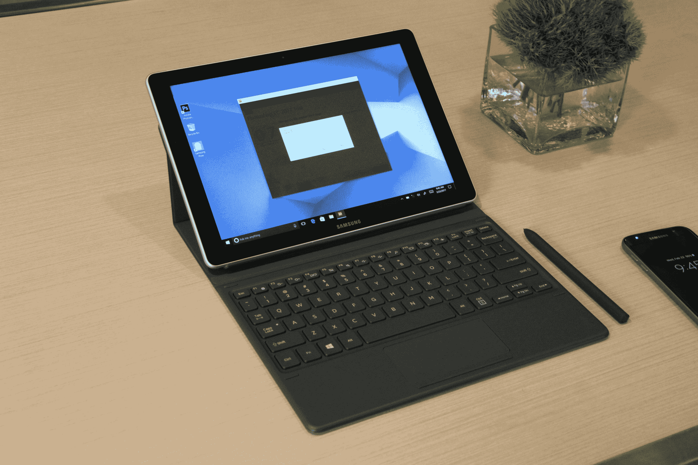

# 三星在平板电脑上押了双倍赌注，推出了 Galaxy Tab S3 和 Galaxy Book 

> 原文：<https://web.archive.org/web/https://techcrunch.com/2017/02/26/samsung-galaxy-tablets/>

世界移动通信大会可能是三星凭借全新的旗舰手机将 2016 年一劳永逸地抛在脑后的重要时刻。相反，该公司正在利用世界上最大的智能手机展推出两款截然不同的——但肯定是三星的——平板电脑领域。

该公司肯定预先知道这样一个事实，即 [Galaxy S8 将不得不等待](https://web.archive.org/web/20221206180319/https://beta.techcrunch.com/2017/01/22/samsung-galaxy-s8-mwc/)在下个月的一次活动中发布自己的独立公告，而不是发出一份邀请函，暗示将发布一款新的平板电脑，早期的传言表明，这将作为人们期待已久的 2015 年 Galaxy Tab S2 的后续产品。

事实上，Galaxy Tab S3 已经按计划在巴塞罗纳登台，带来了熟悉的 Android 界面，并进行一些硬件调整和外围设备更新，与该公司的其他 Galaxy 产品保持一致。然而，稍微令人惊讶的是，不断增长的 Galaxy 产品宇宙中又增加了一款设备，Galaxy Book，这是一款基于 Windows 的可转换产品，旨在与微软的 Surface 系列等产品进行更直接的竞争。

Galaxy Tab S3 和 Galaxy Book 面向截然不同的受众——前者是一种更传统的方法，旨在内容消费，具有 2048 x 1536 的显示屏，能够播放 HDR——这是显示技术领域的当前流行语，曾经被 4K 的言论所主导。该系统还具有自动校准扬声器，旨在根据系统的握持方式重新定位。

与此同时，Galaxy Books(有 10 英寸和 12 英寸两种型号)在英特尔处理器上运行 Windows 10，其火力足以毫无延迟地运行 PhotoShop 等应用程序。与此同时，与 Adobe 的合作为 S-Pen 增加了新的功能，如倾斜，让抽屉可以通过调整手写笔的角度来做出不同的设计。

[https://web.archive.org/web/20221206180319if_/https://www.youtube.com/embed/hTspwR97nLI?feature=oembed](https://web.archive.org/web/20221206180319if_/https://www.youtube.com/embed/hTspwR97nLI?feature=oembed)

视频

当然，系统之间还是有重叠的。Tab S3 还使用 S3 进行内容创作(尽管它更类似于你将在笔记上看到的东西，而不是一种近乎严肃的艺术工具)，该公司正在提供 Pogo，这是我使用过的最好的平板电脑键盘保护套之一，取代了毛毡保护套和具有诚实触感的响应键。

这些产品加入了三星上个月在 CES 上发布的类似公告，当时该公司展示了与谷歌合作开发的一对新 chrome book,该产品将类似 S-Pen 的技术和 Google Play 接入带到了生产线上。很难不看到该公司在这一领域的做法有相当多的重叠，但在三星阵营中，这从来不是一个问题，在那里，这种模式一直是砍刀而不是手术刀。

当被问及裁员时，高级产品营销经理 Hassan Anjum 告诉 TechCrunch，“做更多的主题在所有操作系统中都是一致的”。“在三星，我们非常自豪能够给消费者提供选择。”在这种情况下，这意味着 Chrome OS、Android 和 Windows 10 之间的类似功能，一直到 S-Pen(或者，在 Chromebook 的情况下，触控笔肯定不是 S-Pen)。

随着三星在经历了困难重重的 2016 年后重组，在平板电脑上加倍下注似乎是一个奇怪的时间——从 Strategy Analytics point 等公司的数据到由苹果主导的收缩市场，以及亚马逊 fire line 等廉价设备的罕见增长迹象。定价尚未公布，但这两款新平板电脑的价格肯定不会便宜。

该公司长期以来一直将其平板电脑称为高端设备，旨在与 iPad(现在是 Surface/iPad)直接竞争，而不是与充斥市场的无数安卓平板电脑竞争。新的硬件肯定会保持这种模式，与它的前辈相比，Tab S3 提供了更优质的构建。

与 CES 一样，这一宣布感觉有点像权宜之计，因为该公司准备好了下一款大型智能手机。