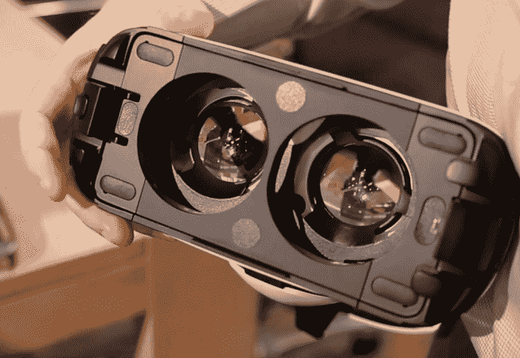

# 与首席执行官 Brendan Iribe TechCrunch 一起深入了解三星 Gear VR 在 Oculus 的发展

> 原文：<https://web.archive.org/web/https://techcrunch.com/2014/09/03/samsung-gear-vr-oculus-ceo-brendan-iribe/>

Oculus VR 是[三星新 Gear VR](https://web.archive.org/web/20221015130757/https://beta.techcrunch.com/2014/09/03/samsung-gear-vr-galaxy-note-4/) 背后的关键平台合作伙伴，共同开发了硬件，并完全在内部构建了 [Oculus 移动软件开发套件](https://web.archive.org/web/20221015130757/http://www.oculusvr.com/blog/introducing-the-samsung-gear-vr-innovator-edition/)和第一方演示应用。该公司进军移动领域可能是最近才透露的，但它是在 2013 年 CES 上向世界推出最初的 Oculus Rift 硬件后不久开始的。

Oculus Rift 首席执行官布伦丹·伊里贝(Brendan Iribe)在接受 TechCrunch 采访时解释说:“我们制造了所有这些令人兴奋的事情，人们真的变得非常热情。“我们当时展示的只是一个原型，获得了许多奖项，之后不久就与三星见面了。”

Oculus 一直在寻求与三星会面，因为它正确地认为该公司的 AMOLED 屏幕技术将是 Oculus Rift 耳机技术的关键部分。事实证明，三星虽然对这种供应关系感兴趣，但也对移动虚拟现实及其未来有所设计。

“当我们与(三星)会面时，他们说‘实际上，我们很高兴在你的产品中支持屏幕技术的虚拟现实，但我们也认为移动设备也有机会’，他们带来了第一个(Gear VR)原型，”Iribe 回忆道。“他们说他们已经研究了一段时间，我们问他们需要多长时间，他们说‘哦，几个月’，所以当我们在 CES 上引起全世界的关注时，他们决定参与进来。”

起初，Iribe 和 Oculus 对虚拟现实在移动领域的成就持怀疑态度——毕竟，该团队一直在研究由令人印象深刻的桌面硬件驱动的设备。但他们仍然对这种可能性持开放态度，并决定首先采用三星的产品，看看他们能在此基础上开发出什么。

“我们把它带回实验室，他们的原型，玩了一会儿，我们有了一个想法，”他说。“手机内部的传感器不足以提供出色的虚拟现实；不够快，不够准等等。但是如果我们把 DK1[Oculus Rift 最初的开发者原型]的传感器粘在这个东西的侧面，并将其插入 USB 端口，会怎么样呢？你瞧，我们开始看到真正有希望的结果。”

移动的可能性是帮助说服 ID 创始人[约翰·卡马克加入公司](https://web.archive.org/web/20221015130757/https://beta.techcrunch.com/2013/11/22/dooms-john-carmack-leaves-id-software-to-focus-on-the-oculus-virtual-reality-headset/)的原因，虽然 Iribe 说这不是他加入的唯一原因，但智能手机驱动的虚拟现实原型确实在很大程度上激起了他的兴趣。

“我们把它展示给约翰·卡马克，他变得超级兴奋，基本上说‘我认为这里有真正的潜力，我希望在未来几年里把它变成现实，因为我真的相信整个移动虚拟现实无束缚世界，’”Iribe 补充道。

一旦这种热情建立起来，Oculus 就请来了该公司的移动副总裁 Max Cohen。卡马克在最初几个月负责移动工作，通过他的标志性做法，即 Iribe 所说的“把自己锁在房间里”，一心一意地解决问题。虽然卡马克提供了最初的热情，但他并不是 Oculus 唯一一个专注于移动平台开发工作的人。

科恩向 TechCrunch 解释说:“约翰在这个项目上的伟大之处在于，他有令人惊叹的想法，其中许多想法他会一直坚持到完成，因为他非常有效率。”。“但其他时候，团队中会有其他非常有能力的开发人员，他们可以利用这一点，自己创造奇迹，让约翰有时间提出下一个疯狂的想法。”

根据 Iribe 的说法，卡马克和移动团队在硬件和软件体验上的迭代已经产生了一个最终产品，尽管仍不像 Oculus Rift 原型那样“身临其境”，但 Oculus 自己也承认，仍远远超出了竞争对手。

“当我们看到第一个三星演示时，它看起来就像大多数其他移动 VR 演示一样，无论是谷歌 Cardboard 还是 FOV2GO，”他说。“有很多这种蹩脚的移动虚拟现实耳机，它们无法提供出色的体验。你肯定不会想把它们中的任何一个绑在头上超过几秒钟。”

【YouTube https://www.youtube.com/watch?v=5n5ov-DKBMA&w=640&h=480】
南加州大学创意技术研究所混合现实实验室的 FOV2GO 研究项目

Oculus 在自己的传感器方面的努力，以及对三星设计其他方面的补充，以及在软件开发工具和第三方应用程序方面的努力，是它与谷歌 Cardboard 等实验的区别。然而，这仍然是一个实验项目本身，旨在为早期采用者和开发者，甚至 Iribe 也承认，广泛的消费者可用性可能仍有一段路要走。

“这是一种尚未为大众市场消费者准备好的东西，但很快就会到来，随着它的推出，你将在未来几年内开始看到更多由 Oculus 驱动的设备，”他说。“十年后，甚至不到十年——五年、七年或八年后，我认为你会看到许多由 Oculus 驱动的设备在移动和 PC 上都能使用。”

Iribe 和 Cohen 都不愿评论与三星以外的智能手机原始设备制造商的任何讨论，称他们目前“专注于三星”，但 Iribe 确实承认，他认为与韩国公司竞争的移动制造商一旦看到 Gear VR 的表现，至少会想要它提供的东西。

Iribe 和 Cohen 表示，三星的合作伙伴关系和 Gear VR 项目早在脸书出现之前就已经存在，社交网络公司收购 Oculus VR 实际上对他们与移动制造商的项目路线图没有任何影响。据两人说，Oculus 的母公司只是提供支持，并在每一步都提供资源，但 Iribe 说这最终仍然完全是 Oculus 的项目，由 Oculus 团队管理和运营，并牢记自己的目标。尽管如此，脸书显然对移动的未来感兴趣，因此在这种情况下合作伙伴的利益显然是一致的。

最终，移动性可能有助于推广 Oculus，其程度超过了护目镜背后的任何技术魔法——Iribe 表示，鉴于 Gear VR 的相对便携性和设置的简单性，他已经能够在更短的时间内更容易地向更多人演示 Gear VR。虚拟现实是那些没有亲身经历过的人很难理解的技术成就之一，Gear VR 可以在短时间内为 Oculus 做更多的事情，而不是 Rift 开发人员数量稀少的产品。

无论其最终命运如何，Gear VR 都是沉浸式计算的移动化身的概念证明，Iribe，Carmack，Cohen 和他们的团队已经用它证明了谷歌可能会拿纸板云雀开玩笑，但 Oculus 在智能手机和虚拟现实方面不是在开玩笑。