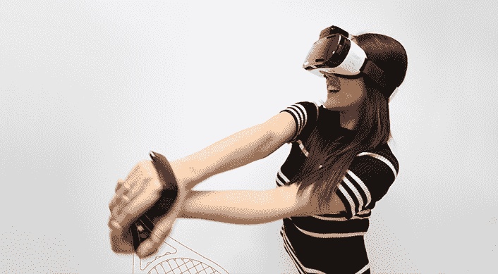

# 三星因一条名为 WELT 和其他古怪的皮带而变得古怪

> 原文：<https://web.archive.org/web/https://techcrunch.com/2015/12/30/samsung-gets-wacky-with-a-belt-called-welt-and-other-oddities/>

# 三星变得古怪，带所谓的贴边和其他古怪

CES 有点像去年的车展，那时汽车制造商只是来展示他们的肌肉和能力，而不是推出预定给经销商停车场的产品。本着同样的精神，三星[发布了](https://web.archive.org/web/20221025223100/http://news.samsung.com/global/samsung-to-showcase-three-creative-lab-projects-for-the-first-time-at-ces-2016)三款产品，它们将在下周的 CES 2016 展会上亮相。

首先，也是最奇怪的，是一种叫做 WELT 的“智能可穿戴保健带”。

叫做世界报。

(长时间停顿)

这款智能健康腰带看起来非常正常，但能够测量用户的腰围(我希望如此)、饮食习惯、一天的步数以及坐着的时间。从那里，信息通过一个应用程序进行消化，为更好的健康提供建议。

第二个产品是一个用于 VR 头戴设备的手部运动控制器，名为 rink。这提供了与虚拟现实游戏的 Wii 类型的交互。例如，一个用户可以打网球，感觉就像在体育场里，手里拿着球拍。

最终产品是一个奇怪的表带，可以连接到你的智能手机或智能手表上，用户可以通过将手指放在耳朵上来听设备发出的噪音，就像特工一样。

鉴于对所有这些产品的好奇，我们期待着在下周的 CES 上亲自讨论这些小工具。

