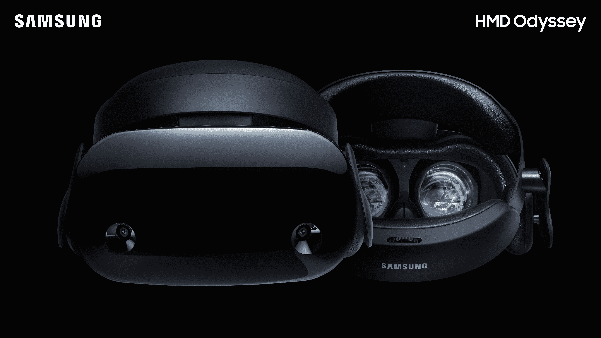
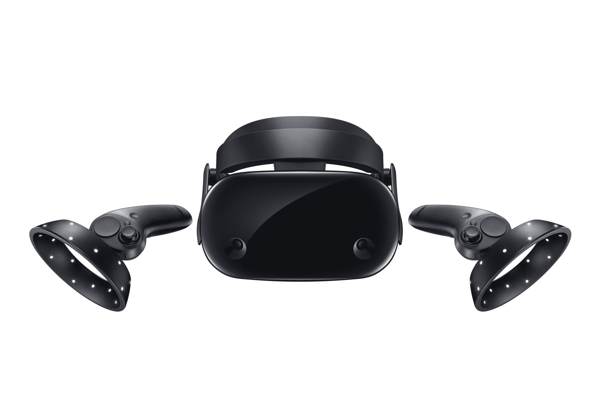
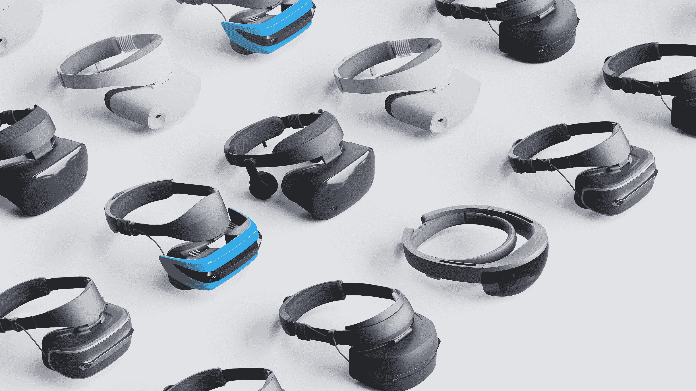

# 三星为 Windows 10 TechCrunch 推出了新的高端耳机，加入了微软的虚拟现实游行

> 原文：<https://web.archive.org/web/https://techcrunch.com/2017/10/03/samsung-joins-microsofts-vr-parade-with-its-new-hmd-odyssey-headset-for-windows-10/>

# 三星带着新的高端 Windows 10 耳机加入了微软的虚拟现实游行

微软正准备在 10 月 17 日发布视窗 10 的下一个主要更新，秋季创造者更新。此次更新的部分内容包括对[视窗混合现实](https://web.archive.org/web/20221207125314/https://developer.microsoft.com/en-us/windows/mixed-reality)的全力支持，这是该公司在增强现实和全虚拟现实之间的连续统一体的名字。在获得宏碁、戴尔、惠普和联想等合作伙伴的支持和耳机后，微软今天还宣布，三星将把一款适用于 T4 房间级虚拟现实的虚拟现实耳机带到其平台上。

微软今天在旧金山的一个小型新闻发布会上宣布了这一消息。

三星 HMD 奥德赛将全力支持微软的混合现实平台，并配有两个 AMOLED 显示屏、自内而外跟踪、内置麦克风(用于 Cortana 支持)和常用的 Windows 运动控制器。展示将提供 110 度的视野，这与 Oculus 裂谷相当。不过，让奥德赛与众不同的是，它的两个 3.5 英寸显示屏的每眼分辨率为 1440×1600，刷新率为 90Hz，这明显高于竞争对手的耳机。

这里另一个有趣的特点是，三星已经与奥地利耳机和麦克风制造商 [AKG](https://web.archive.org/web/20221207125314/https://www.akg.com/home) 合作提供内置耳机。

“当我们开始与微软一起设计和制造三星 HMD 奥德赛时，我们心中只有一个目标，创造一款高性能的耳机，它易于安装，可以将人们带到令人难以置信的虚拟现实世界，”三星电子美国副总裁兼总经理岚娜·科顿今天写道。“三星致力于跨平台开发尖端技术，我们很高兴能与微软合作塑造虚拟现实的未来。”

考虑到它的规格，这显然是一款优质耳机——很可能是当前混合现实阵容中最好的一款。不过，它也会以高价出售。整套耳机和动作控制器的价格为 499 美元，将于 11 月 6 日在 T4 发货，从今天开始接受预订。这与 Oculus Rift 的价格相同。

同样值得注意的是，三星在这里一意孤行。其他大多数混合现实耳机都配有微软的参考规格和 LCD 屏幕，刷新速度不如三星在这里使用的 AMOLED 显示器。内置耳机也是三星耳机独有的。

以下是今秋你有望在商店看到的最新耳机系列:

*   宏碁 Windows 混合现实耳机
*   戴尔遮阳板
*   惠普 Windows 混合现实耳机
*   联想浏览器
*   三星 HMD 奥德赛

第一批混合现实耳机的预购从今天开始。

