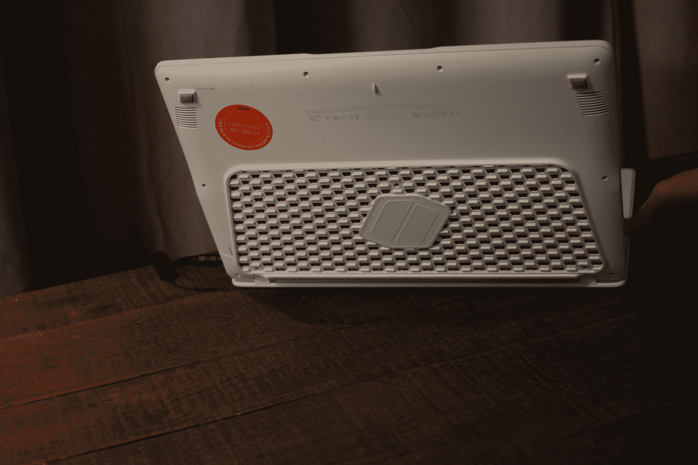

# 三星凭借 Odyssey TechCrunch 重返笔记本电脑游戏市场

> 原文：<https://web.archive.org/web/https://techcrunch.com/2017/01/04/samsung-odyssey/>

# 三星凭借奥德赛重返笔记本游戏市场

大约五年后，三星重新进入游戏领域。今天在 CES 上，硬件巨头宣布了 Odyssey，这是一款便携式游戏笔记本电脑，有 17.3 英寸和 15.6 英寸两种配置，都配备了中等大小的 1,920 x 1080 显示屏，最高亮度为 300 尼特，具有 HDR 视频功能。

这两款机型都配备了第七代英特尔酷睿 i7 处理器，15.6 英寸的显卡采用了 NVIDIA GTX1050 显卡(较大型号仍为 TBD)。RAM 和存储最高可分别配置为 64GB 和 1TB。

这款笔记本电脑的冷却系统是其更有趣的功能之一——一种颜色鲜艳的通风技术，称为 HexaFlow，位于设备的底部。这也可以打开访问存储和内存，用于购买后升级。

就规格而言，这没有什么可写的，但与该公司的其他笔记本产品一样，奥德赛具有(相对)便携性，两个单元中较大的一个具有 37.7 毫米的厚度和 8.4 毫米的重量。