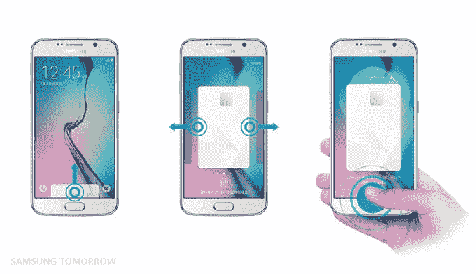

# 三星开始在韩国试用其支付服务 

> 原文：<https://web.archive.org/web/https://techcrunch.com/2015/07/16/samsung-pay-korea/>

# 三星开始在韩国试用其支付服务

三星本周开始在韩国推出苹果支付的解决方案。

这项服务名为 Samsung Pay，由总部位于 T2 的 LoopPay 提供支持，该公司于今年早些时候被三星收购。它将首先在韩国和美国推出，然后在全球范围内扩张，但[三星已经推动它采取行动](https://web.archive.org/web/20221207002918/http://global.samsungtomorrow.com/samsung-pay-trial-service-launched-in-korea/)，在本国的 Galaxy S6 和 S6 Edge 用户中开展了预发布试点计划。

它们看起来几乎相同，但与 Apple Pay 相比，Samsung Pay 有几个不同之处。虽然两者都支持 NFC，但三星的服务更进一步，在现有的销售点设备中支持磁性安全传输(MST)技术。这对不需要升级终端来支持它的零售商来说很方便。

像苹果一样，三星的顾客通过将他们的设备放在商店的支付终端附近来支付，并通过指纹或输入代码来验证支付。Samsung Pay 应用程序允许用户存放一系列信用卡以供使用，但实际数据既不会存储在设备上，也不会在交易过程中发送。三星表示，它使用“各种安全技术和高级加密系统”来保护数据安全。

这家韩国公司今年早些时候关闭了钱包服务，解释说“使用率没有达到任何人的预期。”然后，该公司开始支付 LoopPay 的费用。Apple Pay 仍处于早期阶段，[于本周扩展到英国](https://web.archive.org/web/20221207002918/https://beta.techcrunch.com/2015/07/13/apple-pay-has-officially-launched-in-the-uk/)，看看三星的反应会产生什么样的影响将是有趣的——无论是在零售方面还是在现有三星客户的参与/保留方面。