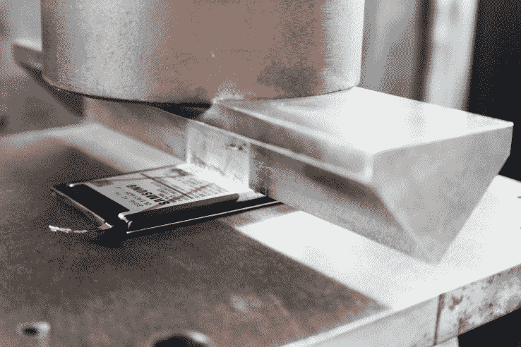

# 三星将 Note 7 的灾难变成了 S8 的特色 

> 原文：<https://web.archive.org/web/https://techcrunch.com/2017/03/30/samsung-turned-the-note-7-disaster-into-an-s8-feature/>

三星有史以来最大的伎俩是把它最大的失败变成一部电影。而且就发生在我们眼皮底下。事实上，该公司不仅在众目睽睽之下完成了转型，还利用了其最受瞩目的平台。昨天的大银河 S8 事件标志着最后的收尾工作。

在新闻发布会的盛况中，深埋着这样的断言:曾经是公关灾难的 [Note 7s 电池问题](https://web.archive.org/web/20220930160152/https://beta.techcrunch.com/timeline/the-rise-and-fall-of-the-galaxy-note-7/)，现在是该公司一个新功能的基础。没有杀死该公司的东西只会让它变得更强大，在该公司争先恐后地扑灭众所周知的火灾时安装的八点电池现在是它可以与其 Infinity 显示屏和智能助手一起推广的东西。

这是一个微妙的转变。这是在多次高调的新闻发布会上上演的一幕。在 CES 和世界移动通信大会上，该公司都在活动的顶部留出时间来解决这种情况。它谦卑地道歉，并承诺做得更好。1 月下旬，该公司召开新闻发布会，详细介绍了多家第三方调查机构的调查结果，并概述了其新的安全流程。

到了二月份，该公司在 S8 发布之前开始了一场积极的广告宣传活动。其中一个电视广告以世界“三星的质量保证”开场，为 O 'Jays ' 1975 年的经典作品“给人们他们想要的东西”做了打击乐介绍。广告的其余部分以压力测试的性感镜头为特色，展现了恐惧灵魂民粹主义的赌博与愤怒。

https://www.youtube.com/watch?v=Hkmp8SmtXSg

MWC 新闻发布会以这个广告开场，因为该公司在继续调整其策略。专家们长期以来一直将该公司下一代手机的发布与某种救赎观念联系在一起，而该公司也愉快地遵守了这一点。在 Galaxy S8 发布之前，该公司邀请媒体到其韩国工厂观看安全过程。该公司巧妙地将有关安全的话题与吹嘘其即将推出的手机结合起来。

然而，昨天的活动是由一家公司主办的，该公司已经付出了代价，准备继续前进。对这个问题有简短的提及，一些最后的默认承认，但围绕电池问题的谈话主要是为了支持这些新的安全检查。该公司的一名代表在活动开始前很好地总结了问题，他说:“一些关键的学习收获是，尽管我们在产品和服务方面进行了创新，但我们也需要在安全方面进行创新。”

在新闻发布会上，当 SVP·贾斯汀·丹尼森上台运行手机内部规格清单时，新安全标准得到了初步认可。谈完无线充电后，这位高管说:“我们致力于创新。从硬件到软件，再到让您的生活更轻松的核心功能和附件。我们还致力于质量和安全方面的创新。”

就像这样，作为去年多次召回的结果而产生的广泛测试是你在规格之间发射的那种珍闻。“质量和安全一直是我们的首要任务，”他继续说道。“我们对安全的承诺也延伸到了安保领域。”就这样，该公司转向了生物识别手机解锁。

因此，该公司似乎已经成功地将 Note 7 的惨败抛在脑后，无论是象征性的还是字面上的。除了一些偶然的爆炸笑话和空乘人员之间的一些挥之不去的记忆，该公司似乎基本上毫发无损地走出了这个问题。或者，可以说，甚至比以前更强，在其智能手机功能列表中添加了业内最严格的安全检查流程之一。