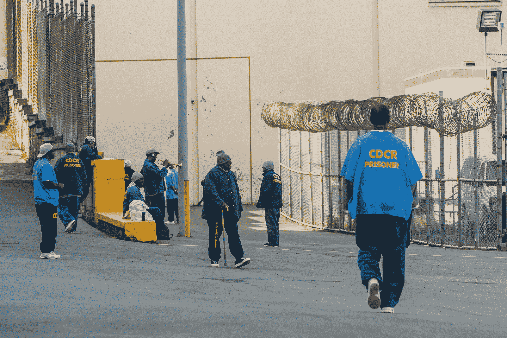
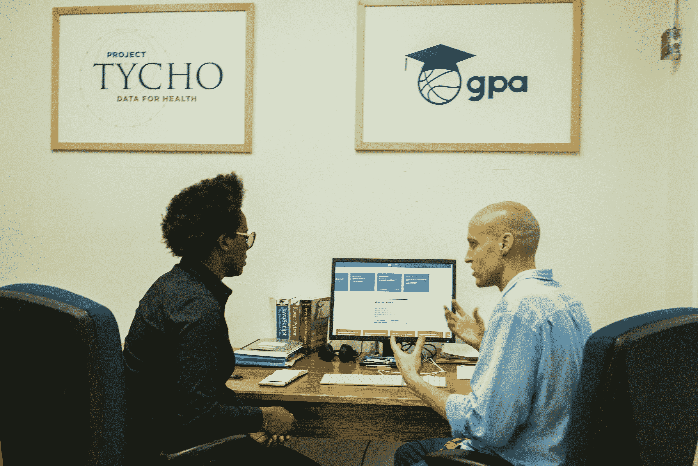

# 圣昆廷编码学校的情况 

> 原文：<https://web.archive.org/web/https://techcrunch.com/2017/03/24/san-quentin-coding-school-the-last-mile/>

在旧金山的北部，沿着水边有一座欧式的堡垒，是 3000 多名囚犯的“家”。周围环境很美，但是加州最古老的监狱圣昆廷监狱的高墙让你几乎不可能从监狱的院子里欣赏到任何美景。

当我第一次进入该设施时，一名媒体陪同人员说天堂在我们的右边，地狱在我们的左边。我的右边是一个小教堂，是穆斯林、犹太人、基督徒和新教徒的礼拜场所。我的左边是调节中心，这里关押着圣昆廷更多的暴力罪犯。那是离加州唯一的死囚区最近的一面。

下山，穿过院子——一名囚犯在那里吹小号，一些人打篮球，另一些人慢跑——就是最后一英里的代码。7370。这里曾经是一个印刷厂，现在是圣昆廷最具创新元素的总部。这是被监禁的人学习创业技能，如何编码和网页设计元素的地方。

一个被监禁的人在圣昆廷的院子里吹小号。

昨天，[的最后一英里](https://web.archive.org/web/20221208121755/https://thelastmile.org/)，与加州监狱工业管理局和加州惩教改造部合作，在圣昆廷为程序员和设计师举办了第三届毕业和演示日。

通过两个课程，以及 Code.7370 中的一个设计课程，被监禁的个人可以学习 HTML、JavaScript、CSS、Python、web 和徽标设计、数据可视化和用户界面/用户体验。总共有 18 名被监禁者庆祝他们的法典完成。

“这些人大多比街上的人知道得多，”CALPIA 执行官查尔斯·帕蒂洛说。“比我还多。”

在进入由印刷厂转变为编码学校后不久，最后一英里的联合创始人克里斯·雷德利兹向我介绍了史蒂夫·拉塞达，他已经在监狱里呆了 11 年，三个月后将获得假释。拉塞达是[最后一英里工程](https://web.archive.org/web/20221208121755/https://tlmworks.org/)的一部分——这是一个与 Airbnb 和公共安全联盟[等](https://web.archive.org/web/20221208121755/http://www.coalitionforpublicsafety.org/)[组织合作完成项目的合资项目。](https://web.archive.org/web/20221208121755/https://tlmworks.org/project/social-media-analytics-dashboard/)

通过 TLM 工厂，拉塞达[和其他几个囚犯一起为皇家检察署建立了一个网站](https://web.archive.org/web/20221208121755/https://cps.tlmworks.org/)。拉塞达和他的队友在没有互联网的情况下完成了这一切。当他被假释时，拉塞达告诉我他想继续学习计算机编程。

史蒂夫拉塞达向我介绍了他为 CPS 开发网站的过程。

这一天，几个人谈到了最后一英里的重要性，包括 Redlitz，TLM 校友 Kenyatta Leal 她从 Rocketspace 的带薪实习生到校园经理，很快成为内部销售团队的一员-以及 Sirius XM 制片人 Sway Calloway。

“这些人不仅仅是囚犯，”卡洛威说。“他们也是儿子、侄子、律师、机械师和程序员。他们是我们在门外的每个人。”

托马斯·温弗瑞，大约 20 年前被判无期徒刑入狱，是昨天唯一完成 Code.7370 第二轨和设计项目的毕业生。

五年前，他被 TLM 创业项目录取。在过去的六个月里，温弗瑞同时学习了编码和设计课程。这意味着他的工作量是其他选修一门课而不是两门课的学生的两倍。

当我问温弗瑞是什么驱使他同时拿两者时，他告诉我:“也许我是个超常发挥者或者什么的。”。“我真的很喜欢做东西，我认为它们是搭配在一起的。他们自然会互相帮助。”

虽然设计对温弗瑞来说更自然一点，但对编码来说就不一样了。

“我对设计有天生的吸引力，因为我是一个视觉型的人，”温弗瑞告诉我。“我创造艺术——我画画，我画画——但我也喜欢在代码中接受挑战。这对我绝对是一个挑战。”

托马斯·温弗瑞完成了代码 7370 的第二轨和设计程序。

尽管温弗瑞被判终身监禁，但他将有机会在监狱外追寻自己的梦想。一月份，假释委员会发现他“适合释放”，可能在五月中旬。这意味着他将能够启动他的业务，[TommyWinfreyArt.com](https://web.archive.org/web/20221208121755/https://tommywinfreyart.wordpress.com/)，目前由他在监狱外的朋友经营，他们不像温弗瑞，可以上网。他还想在设计行业找份工作。

温弗瑞说，TLM 在他能够去假释委员会并说服陪审团释放他的过程中发挥了巨大的作用。

“最后一英里推着我，”温弗瑞说。“这让我变得引人注目，让我有信心接受自己，这没什么。如果我真的让人们看到我是谁，他们不会为我感到羞耻或害怕，而最后一英里给了我这种能力。”

在他的听证会上，温弗瑞谈到了他一生中犯过的最糟糕的错误，以及他做过的最糟糕的决定，他告诉我。他相信他能够让他们相信他可以安全离开。“我让他们看到了我。”

[gallery columns = " 4 " ids = " 1468445，1468508，1468510，1468512，1468513，1468514，1468515，1468517，1468518，1468519，1468520"]

###### ***图片:约翰·穆里略***